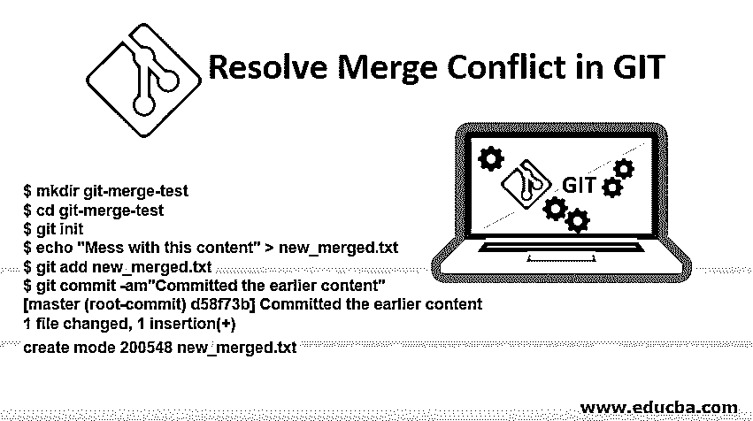

# 解决 GIT 中的合并冲突

> 原文：<https://www.educba.com/resolve-merge-conflict-in-git/>




## GIT 中解决合并冲突的介绍

下面的文章提供了解决 GIT 中合并冲突的概要。管理贡献以解决多个分布式开发人员之间的冲突是版本控制系统的主要工作之一。要解决合并冲突，我们首先需要理解它到底是什么。它在合并同一代码的不同版本时出现，由版本控制系统管理，主要是当一个开发人员删除了一个文件而其他开发人员仍在修改它时，或者当多人试图更改文件中的同一行时。在本文中，我们将了解更多关于 Git 合并冲突的知识，导致冲突的原因，以及如何解决冲突。

### 什么是 GIT 中的合并冲突？

Git 使合并变得非常容易，因为它使用 git merge 命令自动集成新的更改。但是在冲突的情况下，只有正在合并的开发人员知道冲突，而其他人不知道。所以 Git 所做的是暂停合并过程，并将文件标记为有冲突。然后开发人员发现并解决冲突。

<small>网页开发、编程语言、软件测试&其他</small>

合并期间的冲突可能以下列方式发生:

*   **无法开始合并:**如果当前项目的工作目录中有挂起的更改，合并可能会失败，因为它们可能会在合并时被提交覆盖。但是可以使用各种 git 命令来稳定它，比如 git checkout/stash/reset/commit。

*   **合并失败:**如果合并失败，说明正在合并的分支和当前分支有冲突。[尽管 Git 试图](https://www.educba.com/git-cherry-pick/)合并文件而不产生冲突，但如果不能这样做，它将留给您手动解决。

### 如何在 GIT 中创建文件合并冲突？

让我们举一个例子，使用命令行 Git 接口显示/解决 GIT 中的合并冲突。

**代码:**

```
$ mkdir git-merge-test
$ cd git-merge-test
$ git init
$ echo "Mess with this content" > new_merged.txt
$ git add new_merged.txt
$ git commit -am"Committed the earlier content"
[master (root-commit) d58f73b] Committed the earlier content
1 file changed, 1 insertion(+)
create mode 200548 new_merged.txt
```

让我们一行一行地看看上面的命令片段中发生了什么。

*   Git-merge-test 创建一个新目录并初始化一个新的 Git 存储库。
*   接下来，创建一个名为 new_merged.txt 的文本文件，在上面写一些东西。
*   将新生成的文本添加到 repo 中，然后提交它。

我们现在有了一个新的存储库，它有一个主分支和一个 new_merged.txt 文件，其中有一些内容。然后，我们创建另一个与合并相冲突的分支。

**代码:**

```
$ git checkout -b newbranch
$ echo "New content" > new_merged.txt
$ git commit -am"Same named file is edited to cause a conflict"
[newbranch 6282319] Same named file is edited to cause a conflict
1 file changed, 1 insertion(+), 1 deletion(-)
```

给你分解一下，上面几行:

*   创建并签出名为 newbranch 的 newbranch。
*   覆盖 new_merged.txt 文件的内容。
*   最后，它提交新创建的内容。

对于名为 one branch 的新分支，创建了一个覆盖 new_merged.txt 中内容的提交。

**代码:**

```
$ git checkout master
Switched to branch 'master'
$ echo "Append" >> new_merged.txt
$ git commit -am"Content appended new_merged.txt"
[master 24fbe3c] Content appended new_merged.txt
1 file changed, 1 insertion(+)
```

上面的命令序列不仅检查主分支，将内容添加到 new_merged.txt，而且最后提交它。现在我们的例子有两个新的提交。一个在 master branch，还有一个在 newbranch。现在 git 合并 newbranch，看看会发生什么。

**代码:**

```
$ git merge newbranch
Auto-merging new_merged.txt
CONFLICT (content): Merge conflict in new_merged.txt
Automatic merge failed; fix conflicts and then commit the result.
```

Git 向我们表明冲突已经出现。

### 解决 GIT 中的合并冲突

编辑冲突的文件是消除合并冲突的方法之一。只需在编辑器中打开有冲突的文件，并逐个删除冲突分隔符。编辑完成后，可以使用 git add <file_name>来添加修改后的内容。可以通过执行以下命令来创建新的提交:</file_name>

**代码:**

```
git commit -m "merged and resolved the conflict in <file_name>"
```

Git 确保解决冲突，从而创建一个新的提交合并来完成它。有助于解决合并冲突的一些 Git 命令是:

**代码:**

```
git log --merge
```

通过 git log 命令传递的 merge–abort 会生成一个合并分支之间冲突的提交列表。

**代码:**

```
git status
```

它有助于识别冲突的文件。

**代码:**

```
git diff
```

它有助于发现存储库或文件状态之间的差异。它用于预测和防止合并冲突。当开始合并失败时，会使用下面给出的一些工具。

**代码:**

```
git reset --mixed
```

它用于撤消对当前目录所做的更改。

**代码:**

```
git checkout
```

它用于撤销对文件的更改，或者更常用于更改分支。当合并过程中出现冲突时，会使用下面给出的一些工具，

**git reset:** 用于在合并冲突时重置冲突的文件。

**代码:**

```
git merge --abort
```

使用 git merge 传递–abort 参数可以退出合并过程，并将分支返回到原始状态。

### 解决 GIT 合并冲突的优势

下面是提到的优点:

*   它用于无冲突地创建、修改、删除分支、文件或存储库。
*   它可以用来合并不同版本的代码。
*   它还有助于对远程分支进行更改和签出，同时避免冲突。
*   它有助于管理和处理没有冲突的发布。
*   保持存储库和流程的整洁和可读性。

### 结论

Git 有许多用途，被开发人员、产品经理和数据科学家广泛使用。Git 命令非常有效，可能非常有用。当两个不同的分支试图编辑一个文件中的同一行，或者一个文件在一个特定的分支中被删除，但在另一个分支中被编辑时，git 中就会出现冲突。Git 通过其合并特性成功地处理了大多数合并，但是也可以使用诸如 git status、git reset、git checkout 和 Git log 之类的工具手动解决。

### 推荐文章

这是一个解决 GIT 中合并冲突的指南。在这里，我们将讨论如何创建 git 合并冲突，如何使用各种命令有效地解决冲突，以及它的好处。您也可以浏览我们推荐的其他文章，了解更多信息——

1.  [Git 替代品](https://www.educba.com/git-alternatives/)
2.  [去工具](https://www.educba.com/git-tools/)
3.  [去推](https://www.educba.com/git-push/)
4.  [Git 远程命令](https://www.educba.com/git-origin-master/)


