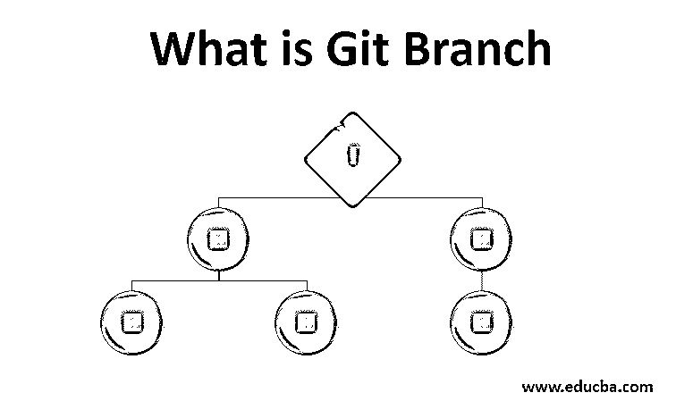
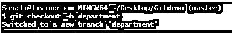
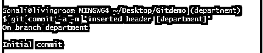
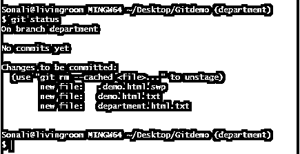
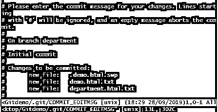
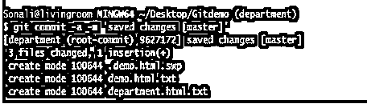
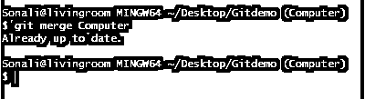
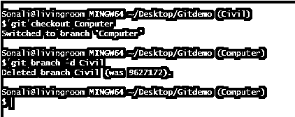

# 什么是 Git 分支？

> 原文：<https://www.educba.com/what-is-git-branch/>

## Git 分支概述

主要在 git 结构中，程序员在他们的 git 存储库中保持他们的主分支干净。然后，他们创建一个主分支的副本，在那里他们可以轻松地存储他们最后更新的代码，修复 bug，提交它，以及做更多的事情。这个过程无非是 git 结构中的分支。使用 git Branch 命令，可以生成、删除、列出和更改分支的名称。分支是 git 用来维护代码版本控制的最新特性之一。它指示您最近更新的代码，而不影响主分支。

### 如何创建 Git 分支？

*   创建 git 分支是一个概念，用于在不改变现有代码的情况下处理最新的更新。
*   如今，git 和许多其他不同版本的控制工具使用分支来实现更有效的软件开发过程。
*   在开始在我们的代码中创建任何新的分支之前，我们希望提取代码以获得最新的更新代码。
*   然后，通过调用以下命令，可以看到 git 中所有现有分支的列表:

`git branch`

<small>网页开发、编程语言、软件测试&其他</small>

*   它将显示 git 存储库中存在的所有分支。
*   HEAD 用于显示用户当前工作的分支的状态。
*   所以，它和头完全不同。这是一个指向您当前工作的本地分支的指针。
*   Git log 是一个简单的命令，用于检查程序员当前正在哪个分支上工作。
*   如果一个程序员想从一个分支转移到另一个分支，那么他可以点击如下命令:

`git checkout (branch-name)`

*   所有这些过程完成后，您需要将代码放入 Git 存储库，这样就可以调用如下命令:

`git push origin <newly-created-branch-name>`

*   当您想要提交您最新更新的代码时，您必须首先从任何其他分支打开主分支，然后使用 git checkout master 只提交您最新的代码[。](https://www.educba.com/git-checkout-tag/)

### 如何创建新的 Git 分支？

使用 Git 创建新分支有多种方法。我们将逐一看到，如下所述:

1)使用以下命令创建新分支的最基本方法:

`git checkout –b <branch-name>`

这是从最近的分支创建到您的分支的最常用的方法，并且它将通过使用单个命令本身改变到您的分支。

2)创建分支的另一种方法是在命令中指定特定的分支名称，如下所示:

`git checkout –b new branch <branch-name>switched to branch <new-branch-name>`

在上面的场景中，您可以定义不同的分支，通过这些分支可以创建另一个分支。

3)创建分支的一个简单方法如下所示:

`git branch <branch-name>`

通过使用这个最简单的命令，可以很容易地在 git 中创建新的分支。在这种情况下，签出将在后台进程中完成。

所有来自上述步骤的分支都不能自动允许我们转移到一个新创建的分支。最初，它把我们放在我们的主分支上，就像:

`git branch
* master
git branch Branch_1
git branch
* master
Branch_1`

如果您想要在新创建的分支上手动更新，使用 checkout 命令打开这个分支。

`git checkout Branch_1`

切换到分支 Branch_1。

4)通过提交创建分支:

这是在 git 中创建分支的另一种方法，通过用它的散列定义 commit:

`$ git branch <branch-name><hash>`

在 hash git 的帮助下，它指定了其中的一些字符。

`git branch
* master
git branch commit-branch 635d5b3
git branch
commit-branch
*master`

这一个命令执行创建和签出分支的任务。

5)从标签创建分支:

*   我们知道，使用提交创建分支，与使用标记创建分支是一样的。
*   它用于指向项目代码历史中的某些内容。
*   这里标签是作为一个标识符工作的。

下面是使用标签创建分支的语法，如下所示:

`git checkout –b <branch-name> <tax>
git branch tag-branch v0.2.23
git branch
tag-branch
*master`

### 例子

让我们考虑我们正在更新提交的一些项目上工作，并且我们在主分支上。假设我们想根据需求在我们的最新代码中做一些改变，所以我们不会直接改变主分支。

我们将创建一个新分支，并直接切换到新创建的分支:

`git branch department`

`git checkout department`

您处理代码并将文件保存到部门分支。

`$ git commit –a –m ‘inserted header [department]’`

*   稍后，将所有更改保存在一个文件中并检查状态:

`$ git status`

*   所有更改都已成功保存。接下来，让我们提交代码:

`$ git commit`

*   如上面的代码所示，我们提交了新创建的分支部门的所有变更。
*   一旦清楚了，一切都好了，现在是时候提交主分支上的所有代码了:

`$ git commit –a –m ‘saved changes [master]’`

*   通过执行上面的命令，我们可以将所有最新的代码保存到 git 存储库的主分支。

**输出:**

*   合并分支代码的变更:它将显示最新的更新。

`Git merge [branch-name] = git merge Computer`

*   假设我们的项目中存在一些不必要的分支，我们想从 git 存储库中删除这些分支。
*   因此，这可以在删除分支选项的帮助下发生，如下所示:

`git branch –d [branch-name] git branch –d Civil`

### 结论

*   git 中的分支用于在将代码提交到主分支之前维护代码。
*   在它的帮助下，可以验证分支列表，创建新的分支，删除不必要的分支，以及更多与此功能相关的操作。
*   在这里，我们已经看到了通过 checkout 命令创建分支的不同方法，指定分支名称、提交、创建标签等等。

### 推荐文章

这是 Git 分支指南。这里我们讨论什么 Git 分支？以及如何用不同的例子来创建它。您也可以阅读以下文章，了解更多信息——

1.  [Git 替代品](https://www.educba.com/git-alternatives/)
2.  [GIT 简介](https://www.educba.com/introduction-to-git/)
3.  [GIT 面试问题](https://www.educba.com/git-interview-questions/)
4.  [GitHub 命令](https://www.educba.com/github-commands/)
5.  [GIT 版本控制系统](https://www.educba.com/git-version-control-system/)
6.  [去推](https://www.educba.com/git-push/)

