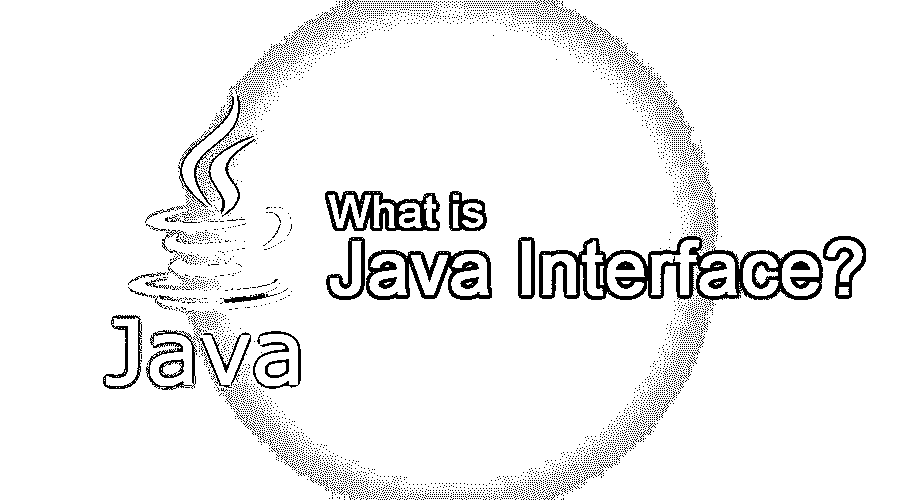

# 什么是 Java 接口？

> 原文：<https://www.educba.com/what-is-java-interface/>




## 什么是 Java 接口？

接口的定义类似于类。虽然没有包含访问说明符，但是接口附带的访问默认结果只能由声明中的其他包成员访问。然而，它是一个公共声明，接口的使用可以与一些其他代码一起使用。这应被视为方法声明没有正文。此外，它们还在参数列表后以分号结束。它们是典型的抽象方法，在一个接口中不可能有其他提到的方法的默认执行。接口声明中的变量声明。Class Blueprint 是一个 Java 接口，因为它有抽象方法和静态常量。此外，接口是完成抽象的过程或机制；Java 接口中只有抽象的方法，而没有方法的主体。它还可以在 Java 中实现抽象的众多继承。

### 理解 Java 接口

然而，一旦定义了接口，不止一个类可以执行该接口。对于一个接口的执行，程序员需要利用实现类定义中的子句，然后构建接口所描述的过程。如果一个类的执行超过一个接口，并且用逗号分隔。虽然使用一个类来执行两个接口，但是在客户使用任何接口使用类似的方法之后，两个接口将声明类似的过程。

<small>网页开发、编程语言、软件测试&其他</small>

### 解释 Java 接口

[Java 接口](https://www.educba.com/what-is-java-interface/)与一个类相关；然而，接口体只包含抽象过程和最终字段的常量。通过为通过接口声明的每个方法提供代码，将类作为接口执行。接口方法中的一切都被认为是抽象和公共的。要执行一个接口，一个类应该实现两件事:它应该在类的声明中提到一个 implements 子句。它还应该给出接口声明的每个方法的执行。

### 它是如何工作的？

每个类执行可播放接口的接口声明应该执行一个过程，即不接收参数，不返回值的 play。注意，可播放界面名称是一个属性，因为大多数界面都用形容词而不是名词来标识。这是因为它们很少描述执行接口的类的附加功能或质量。因此，执行接口(Playable)的类描述了可以播放的对象。在 distinct 注释中，您可以声明可以有抽象和变量方法而没有主体方法的接口。

而且在 IS-A 连接中也有描述。实例化不能和抽象类一样。反映出 [Java 8](https://www.educba.com/java-8-interview-questions/) 在一个接口中可以有方法和默认的 static，就像私有方法在 Java 9 的一个接口中一样。通过使用 Interface 关键字进行接口声明。它还提供了完整的 absolution，暗示所有的接口方法都用空体声明，所有的字段默认都是 final、public 和 static。接口中的类实现可以在接口中声明的所有方法中执行。

### Java 中为什么要用接口？

应该使用 Java 的接口，因为 Java 有各种各样的已解决的问题，包括各种继承，通过形成接口。接口在 Java 中对每个人都有好处，因为它允许对象只执行一个或多个接口；同样，你的对象对应于各种各样的蓝图，就像接口实际上一样。为增加一个接口而声明一个接口；但是，如果您需要执行多个，只需添加用逗号分隔的接口。这个实现非常简单，因为它意味着 cat 类应该执行动物中定义的每个方法和四条腿的动物对象中的所有进程。这是接口定义的作用，给程序员一个你形成对象的轮廓。

**例子**

通过这个例子，你可以看到执行在 A6 类中给出的可打印接口只有一个方法。

```
interface printable{
void print();
}
class A6 implements printable{
public void print(){System.out.println("Hi");}
public static void main(String args[]){
A6 obj = new A6();
obj.print();
}
}
```

### 为什么要用 Java 接口？

使用接口的三个主要原因如下:

1.  它被用来完成抽象。
2.  接口支持的各种继承的功能。
3.  它也可以用来实现松散耦合。

### 如何声明一个接口？

interface 关键字利用了接口的声明。它还提供了完整的抽象，意味着接口声明中的每个方法都有一个空的主体，并且默认情况下每个字段都是 final、public 和 static。接口的类实现应该执行接口中的每个进程。

### 为什么接口很重要？

每个系统工程师在工作中管理接口的主要方面。我建议在项目开始时，[软件工程师](https://www.educba.com/careers-as-a-software-engineer/)指定一个人负责接口。该负责人将处理与界面相关的所有事情，并管理整个产品生命周期的开发。这个角色只是产生一个成功的胜利者的一个基本方面。由于接口开发规范的重要性，活动管理、识别和定义是业务分析、项目系统工程师、首席软件工程师或任何与开发条件有关的人的基本关注点。

### 开发产品时要考虑的接口方面

系统由附加系统组成，这些附加系统与子系统一起构建，并与同一结构层上的所有其他系统通信，更好地与 SOI(感兴趣的系统)层通信。这隐含在简单和复杂的系统、软件系统、混合系统和硬件系统中。您的系统与其他接口之间的这些通信。

#### 1.识别接口有助于您确定系统限制

接口标识进一步帮助您理解系统的依赖者。没有认识到接口可能会对你的项目产生令人厌恶的后果，并且是产品不能满足消费者期望的一个普遍原因。缺少或错误描述的界面通常是成本增加和产品故障的重要原因。

#### 2.识别接口有助于确保适应性

您可以查看您的系统与您需要与之通信的其他系统之间的兼容性。一些项目忽略了识别和控制接口，直到测试。当人们发现他们不能将测试材料与他们的系统联系起来进行测试时，与这种忽视的结果的最初对抗经常发生。非常糟糕的是，当您将系统更改为 operations 时要考虑这些问题，并且缺少一个接口，就像您的系统无法执行或任何其他系统依赖于您的系统一样。通过预先识别和管理您的外部接口，您将认识到在您的系统需求中应该接近的产品的主要驱动因素。

#### 3.识别接口有助于揭示可能的问题区域和危险

项目风险识别，因为它们是经常使用的系统，你应该有一个接口，不能改变，而且它们是固定的。这对你来说可能会很棘手，也可能不会；但是，你应该知道。可能会有一些系统，您可能不得不与不存在的系统进行交互，这些系统与您自己的项目同时处于开发阶段。你可以用它来为你的系统创造必需品，而你却不知道你的接口或者这些接口的特性。您需要从一开始就确定与您正在开发的接口相关的所有问题，以确保它与当前系统兼容，或者与各种系统一起描述接口，因此它是兼容的。

由于与系统接口相关的固有危险，严重的问题可能并且确实出现在接口处。由于接口描述了外部失控的系统，系统在接口处不受保护。如果一个接口没有被完全理解，没有被描述，或者被修改，系统就会受到影响。还有一种警告，即系统外部有人有意或无意地影响系统的性能。根据一个古老的说法，暗示你需要摧毁某人的系统，它应该在一个界面上完成。

### 优点和缺点

在 Java 中使用它们的主要好处或优势是:

*   最主要的属性至少使你能够进行众多的 [Java 继承](https://www.educba.com/what-is-java-inheritance/)。
*   在 SDI (Spring Dependency Injection)中，对运行时注入的大量强执行接口的利用是非常占优势的。通过利用接口的属性，而不是它们的类的强执行，有助于减少连锁反应，因为接口属性的消费者不必担心基本实体执行中的变更。
*   接口是契约声明的一种方式，用于执行类，以满足构建抽象和设计的基本媒介，在生产者和消费者之间解耦。
*   例如，您可以通过执行来保护 NoSQL 和 RDBMS 的[数据库中的员工信息。假设您从未使用过该接口，那么执行雇员注册服务可能有两个目的。](https://www.educba.com/what-is-nosql-database/)

在 Java 中获得或使用它们的主要缺点是:

*   Java 的接口比其他的都慢，而且受到更多的限制。
*   除了拥有它们几乎没有任何用处之外，接口必须在不同的时间被利用。
*   如果您向不在您权限下的外部编码人员发布接口，并且描述一个以后很难更改的公共约定。你不明白是谁在外部利用接口，破坏了当前消费者的准则。相比之下，如果你可以使用一个抽象或强类，你只能结合最新的强方法学，一般不会有问题。
*   这是一种可能性，通过构建最新的接口，在初始接口的基础上添加新的接口，并修改健壮的执行来执行最新的接口，或者是旧接口的扩展。通过这种方式，您不会违反当前的客户端代码。它通常是额外的工作，而不是结合一个类的方法；然而，这似乎是合理的。

此外，缺点并不是丢弃接口的原因；然而，在当前版本中发布最新的接口之前，应该谨慎地创建接口并慎重考虑。花一点额外的时间彻底地创造可以保存你以后可能会有困难的东西。

### 这项技术将如何帮助你的职业发展？

对于成为 Java 开发人员的人来说，职业发展的可能性是惊人的。也要看经验、资历、兴趣；你可能有能力晋升到管理职位或高级技术职位，例如，作为首席架构师或技术架构师。请记住，开发人员的职位不仅仅包括简单的编码；开发是工程程序的重要组成部分，因此在工作岗位上有很多学习的可能性和机会。考虑 Java 界面开发的独特原因可能有助于您确定这是适合您的职业选择，这些原因如下所述:

*   这是应用最广泛的方法之一。
*   它是 Java 编码中不可或缺的元素。
*   它对现实世界有用处。

### 结论

努力在编码中利用 Java 接口。它可以帮助您主要构建对象，在此期间您不确定确定它们的方式，因为必须执行接口。

### 推荐文章

这是一本关于什么是 Java 接口的指南？。在这里，我们讨论了 Java 界面的基本概念、用途、工作原理、职业发展、优点和缺点。您也可以阅读以下文章，了解更多信息——

1.  [Java 中的设计模式是什么？](https://www.educba.com/what-is-design-pattern-in-java/)
2.  [Java 面向对象编程](https://www.educba.com/object-oriented-programming-in-java/)
3.  [什么是 C？](https://www.educba.com/what-is-c/)
4.  [在 Java 中设置接口](https://www.educba.com/set-interface-in-java/)


