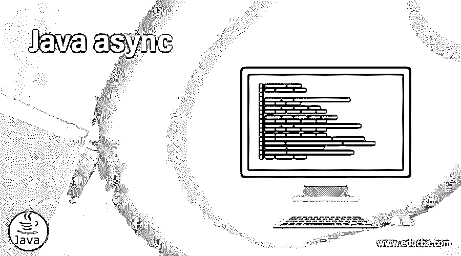

# Java 异步

> 原文：<https://www.educba.com/java-async/>




## Java 异步简介

在 Java 编程语言中，async 被定义为一个调用或一个函数，它可以在另一个函数中定义或作为另一个函数中的参数传递，通常在需要执行程序而不阻塞程序时声明，这是在调用从事件返回并返回到回调函数时完成的。在 java 中，这被定义为在新创建的线程中调用的回调方法。因此，一般来说，异步编程只不过是编写一个非阻塞代码，即通过通知主线程关于线程执行完成或失败的性能进度，在单独的线程上运行的程序。

### java 中异步的工作原理

在本文中，我们将讨论一个回调方法，在 java 中称为异步函数。这个函数在 java 中也被称为 await。在 java 中，通过使一个新线程本身异步来启动它，从而进行或编写异步编程。异步回调仅在任务不相互依赖时使用，这可能需要一些时间来执行。因此，一般来说，异步调用可以通过一个在线购物的例子来解释，当我们选择一些商品并将其添加到购物车中时，该商品不会被阻止，因为它也可以被其他人使用，其他人不需要等待该商品的订单完成。因此，无论何时我们想要运行任何可以在不阻塞其执行的情况下执行的程序，都可以使用异步编程来完成。

<small>网页开发、编程语言、软件测试&其他</small>

在 Java 中，有许多用于编写非阻塞代码的特性，比如使用线程、期货、流等。，因为对非阻塞代码有许多需求，其中需要异步编程来异步执行代码。所以让我们讨论一下如何实现异步编程的几种方法，比如 jcabi aspects、cactoos、guava、completeableFutures、FutureTask、EA Async 等。

#### 1.完全可预见的未来

completeableFutures 是 javascript promises 的 java 版本，称为 completeableFutures，它可以实现 Future 和 CompletionStage 等两个接口，这两个接口的组合完成了编写或使用异步编程的功能。该特性提供了许多方法，如 supplyAsync、runAsync 等。这些方法用于启动代码的异步部分，因为当我们对结果做一些事情时会使用 supplyAsync 方法，如果我们不想要任何东西，我们可以使用 runAsync 方法。在 completeableFutures 中还有其他不同的方法，例如 thenCompose，如果我们想要一个接一个地使用多个 completeableFutures，或者在 simple 中，如果我们想要使用嵌套的 completeableFutures，并且如果我们想要组合两个 completeableFutures 的结果，那么有一个方法叫做 thenCombine 方法。因此，所有这些方法都在可完成的将来处理，而可完成的将来又有保存所有这些方法的完成阶段方法。

示例示例:通过以下语法使用无参数构造函数创建 completeableFuture:

```
CompleteableFuture <String> completeableFuture = new CompleteableFuture <String>();
```

所以为了得到结果，我们必须使用 get()方法。所以我们可以把它写成

string result = completeablefuture . get()其中 gets()方法将一直阻塞到 Future 完成，但是这个调用将永远阻塞它，因为 Future 永远不会完成。所以我们必须通过调用下面的方法来手动完成它。

```
completeableFuture.complete("Result")
```

因此，客户端会忽略后续调用而获得指定的结果。该程序可能如下所示。

```
CompletableFuture<Long> completableFuture = CompletableFuture.supplyAsync(() -> factorial(number));
while (!completableFuture.isDone()) {
System.out.println("CompletableFuture is not finished yet...");
}
long result = completableFuture.get();
```

#### 2.EA 异步

这是 java 中顺序编写异步代码的另一个特性，这自然提供了简单的编程和伸缩。这是通过 ea-async 库提供给 java 生态系统的 async-await 特性。这个特性转换运行时代码并重写对 await 方法的调用，其工作方式类似于 completableFuture。因此，我们可以通过调用 Async.init 方法来初始化异步运行时，使用 EA-sync 方法(称为 await 方法)来实现上述 completeableFuture 代码。

因此，让我们考虑一个同时使用 completeableFuture 和 EA sync 的数字阶乘的例子。

```
CompletableFuture <Double> completableFuture = CompletableFuture.supplyAsync(() -> factorial(number));
while (!completableFuture.isDone()) {
System.out.println("The completeableFuture is not completed...");
}
double res = completableFuture.get();
```

因此，通过对上面的代码使用 await 方法，可以在 EA sync 特性中使用上面的代码；我们不使用 get()方法，而是使用 await()方法，这样上面的代码可以只使用最后一行进行更新，我们必须在静态块中通过异步的 init 方法进行初始化，其余的代码保持不变。

```
static { Async.init(); }
public func_name(){….. same as above code of completeableFuture…
double res Async.await(completableFuture);
```

从上面的示例代码来看，它是 completeableFuture 代码的转换代码，使用静态块来初始化异步运行时，以便异步可以在运行时转换 completeableFuture 代码的代码，然后转换到 await 方法，它可以重写调用，现在 EA async 的行为类似于使用 completeableFuture 或 Future.join 方法链的行为。所以现在，当任何方法的异步执行完成后，Future 方法的结果被传递给另一个方法，该方法使用 CompleteableFuture.runAsync 方法进行最后一次执行。

如上所述，在 Java 中，有许多不同的方式来使用各种其他方法编写异步编程。

### 结论

在本文中，我们讨论了 java async，其中它被定义为一个回调方法，通过将调用返回给回调函数来继续执行程序而不会阻塞。本文展示了如何使用不同的特性(如 CompleteableFutures、EA async、Future Task、Guava 等)用 java 编写异步编程。在本文中，我们看到了这些特性中的两个，它们通过使用给定的各个特性提供的各种方法来使回调函数异步。

### 推荐文章

这是 Java 异步的指南。这里我们讨论如何使用不同的特性，如 CompleteableFutures、EA async、Future Task、Guava 等，用 java 编写异步编程。您也可以看看以下文章，了解更多信息–

1.  [JavaScript elseIf](https://www.educba.com/javascript-elseif/)
2.  [JavaScript onkeyup](https://www.educba.com/javascript-onkeyup/)
3.  [JavaScript encodeURI()](https://www.educba.com/javascript-encodeuri/)
4.  [卸载 JavaScript](https://www.educba.com/unshift-javascript/)


