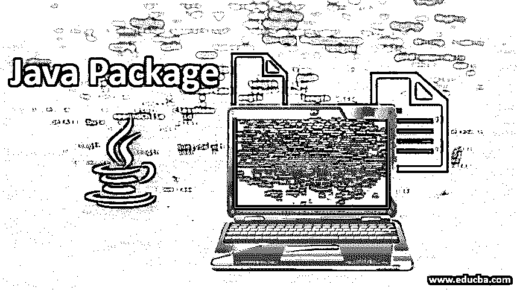

# Java 包示例

> 原文：<https://www.educba.com/java-package-example/>




## Java 包介绍

Java 中的包有很多种。首先在 Java 中引入一个包，以确保与该包相关的功能或基本操作非常顺利地执行，因此使用[各种 Java 工具](https://www.educba.com/java-tools/)和功能来实现这些操作。Java 中的包是一组相互关联的类，它们用于 Java 编程语言中的一些功能。Java 中的每个包都有一个单独的命名约定，然后它们被细分为名称空间和约定，这些名称空间和约定用于执行不同类中的函数。包基本上用于 Java 编程语言中的几个函数。下面列出了使用软件包的一些原因:

*   防止命名错误，例如两个类可以有相同的名称，但是它们的功能可能不同。
*   使编程语言中使用的类的搜索、使用和[注释变得更加容易。](https://www.educba.com/hibernate-annotations/)
*   包被认为是数据封装或数据隐藏。
*   提供对类的受控访问，默认情况下，这些类是受保护的或私有的。受保护类和私有类不允许轻易访问其他类的变量，因为它们是该类的私有变量，因此它们不能被所有类的成员函数访问。

### Java 包的工作

包名和目录名具有相同的工作结构。如果包名是学校。老师。数学在名为学校的包下有称为教师和数学的子包。这些课程很容易找到；这就是为什么包的命名约定类似于目录的命名约定的基本原因。包内的包称为子包。默认情况下，它们不可访问。但是，必须单独调用它们，以确保在创建对象时调用它们。

<small>网页开发、编程语言、软件测试&其他</small>

下面给出了一个在 java 包中创建的 Java 子包的例子。

**代码:**

```
import java.util.*;
```

**代码解释:**在上面一行代码中，我们导入或者调用了 Java 包。在 java 包中，我们有 util 子包，也称为。util 的完整形式是 util。并且调用包内的所有类以及子包，以确保程序的基本功能得以实现。有许多包和子包在对象创建时被调用。在本文中，我们看到了一个被调用的 Java 包的例子。

Java 编程语言内部有内置包和用户自定义包。下面列出了一些现有的内置软件包:

*   **Java.lang:** 包含实现语言操作的类。
*   **Java.io:** 包含支持输入输出操作的类。
*   **Java.util:** 包含支持链表、栈、队列等的类。
*   **Java.applet:** 包含用 Java 实现[基本小程序的类。](https://www.educba.com/applet-life-cycle/)
*   **Java.awt:** 包含用于访问按钮、菜单等的类。
*   **Java.net:** 包含支持网络应用的类。

Java 编程语言中也有用户定义的包。这里，我们首先创建一个目录，然后在编程树中实现包的工作。

首先，我们创建目录的名称，然后键入需要创建的包的名称。一旦创建了包，我们也可以在创建的包中创建子包的名称。这构成了调用 Java 编程语言中不同类的基础。

### Java 包的编码示例

在编码示例中，我们将看到一个简单的程序及其输出，这将帮助我们理解 Java 编程语言中存在的包的导入。在这个程序中，我们将只用一个函数来计算一个数的简单阶乘。一个数的阶乘是该数乘以小于它本身的所有位数，直到 1。数字阶乘的一个例子是

3!= 3*2*1= 6
4！=4*3*2*1= 24
以此类推…..
只调用导入 java.io.*包。它用于调用帮助输入/输出操作的类。

**代码:**

```
import java.io.*;
class Factorial {
public static void main(String args[]) throws IOException {
BufferedReader stdin = new BufferedReader (new InputStreamReader(System.in));
System.out.println("Enter any number : ");
int N = Integer.parseInt(stdin.readLine());
int i;
double fact = 1;
i = 1;
while (i <= N)
{
fact = fact * i;
i++;
}
System.out.print("The factorial of " + N + " is " + (double)fact);
}
}
```

**输出:**


**代码解释:**在示例输出中，我们看到 7 的阶乘，它等于 5040。我们还可以计算高达 100 或任何其他数字的阶乘和。但是，每当计算大于 5 的数的阶乘和时，该数的阶乘和的最后一位总是 3。一个求和的例子，我们计算阶乘的和的最后一位直到 8 阶乘。

1 的总和！+ 2!+ 3!+ 4!+ 5!+ 7!+ 8!。我们想找到总和的最后一位数。现在，我们计算阶乘的和最大为 5！因为在那之后，最后一位数是 0。所以总和是 1(1！) + 2(@ !) + 6(3 !) + 24( 4!).所以最后一位数是 3。这是数系中一个非常重要的概念。

### 结论

在本文中，我们看到了不同种类的用户定义包以及 Java 编程语言中的内置包。我们还看到了一段代码的例子。Io。*包已实施。java.io.*的基本功能是确保调用用于实现输入/输出操作的类，这将确保平稳地接收来自用户的数据作为输入。Java 中的包有各种类型。在 Java 编程语言中可以调用大量的包来实现各种函数和类。

### 推荐文章

这是一个 Java 包示例的指南。在这里，我们讨论 java 包的基本概念、工作原理以及示例和代码实现。您也可以阅读以下文章，了解更多信息——

1.  [Java 中的正则表达式](https://www.educba.com/regular-expressions-in-java/)
2.  [JLabel in Java](https://www.educba.com/jlabel-in-java/)
3.  [JTabbedPane Tab](https://www.educba.com/jtabbedpane-in-java/)
4.  [Java InetAddress](https://www.educba.com/java-inetaddress/)


