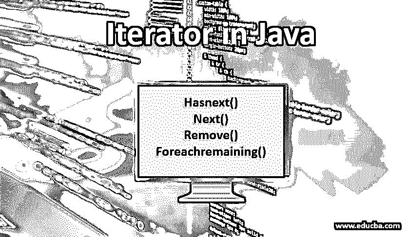
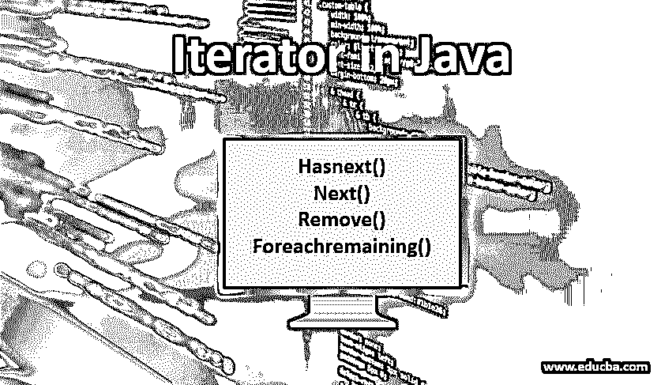
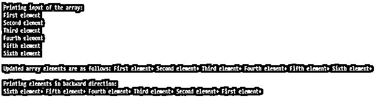

# Java 中的迭代器

> 原文：<https://www.educba.com/iterator-in-java/>




## Java 迭代器简介

迭代器是一个接口，用于在集合中一个接一个地获取元素。它在名为 Java 的 Java 包中可用。util 包。集合 API 实现 iterator()方法，因此可以从 Map、List、Queue、Deque 和 Set 等接口中检索数据，这些接口都是从集合框架中实现的。顾名思义，Java 中的迭代器遍历对象集合。

**语法:**

<small>网页开发、编程语言、软件测试&其他</small>

```
Iterator<E> iterator()
```

迭代器下面是调用集合接口的 iterator()方法创建的对象名。“集合”是集合对象的名称。

```
Iterator iter = collection.iterator();
```

### Java 中的迭代器方法

Java 中的迭代器有 4 个[方法，用于遍历集合并检索所需的信息。它们如下:](https://www.educba.com/methods-in-java/)

*   **hasNext():** 这是一个方法，如果迭代有下一个元素，则返回布尔值 true，如果没有下一个元素，则返回布尔值 false。
*   **next ():** 该方法返回即将到来的迭代中出现的元素值。假设在下一次迭代中没有返回元素，那么抛出“NoSuchElementException”。
*   **remove():** 这个方法从集合中移除迭代器返回的当前元素。如果在调用 next()方法之前调用这个方法，它会抛出“IllegalStateException”
*   **forEachRemaining():** 这个方法执行集合中所有剩余的元素，直到它们被处理完或者抛出异常。此外，这是 Oracle 公司在其 Java SE 8 版本中新引入的一种方法。

### Java 中迭代器的例子

下面是 Java 中迭代器的例子:

**代码:**

```
import java.io.*;
import java.util.*;
public class IteratorExample {
public static void main(String[] args)
{
ArrayList<String> val = new ArrayList<String>();
val.add("Iteration started");
val.add("Printing iteration1");
val.add("Printing iteration2");
val.add("Printing iteration3");
val.add("End of iteration");
// Iterates through the list
Iterator iter = val.iterator();
System.out.println("The values of iteration are as follows: ");
while (iter.hasNext())
System.out.println(iter.next() + " ");
System.out.println();
}
}
```

**输出:**




### 迭代器方法抛出异常

在元素列表中，迭代器只能获取现有元素的信息。因此，如果试图访问下一次迭代中不存在的元素，它将崩溃或抛出异常。在这里，我们将了解在实现迭代器方法时我们得到的不同种类的异常。

#### 1.next()方法

同时遍历一组元素并通过该方法获取它们。

*   **NoSuchElementException:** 如果 next()试图检索当前列表中不存在的元素，就会出现这种情况。因此，在调用 Next()之前，必须使用 hasNext()。

#### 2.移除()方法

这里可能会出现两种异常:

*   **IllegalStateException:** 如果 remove()方法在 next()方法之前被调用，那么就会抛出这个异常。这是因为该方法试图移除尚未由 next()方法指定的元素，因此会失败。要解决这个异常，必须调用 next()来引用第一个项目，然后调用 remove()从列表中移除相同的项目。
*   **UnsupportedOperationException:**该异常通常在通过添加或移除不支持修改的操作来修改列表对象时抛出。例如，当一个数组试图通过 Arrays.asList 转换为 list 时，会引发此异常。这是因为当包装器从 ArrayList 创建 List 对象时，它的大小是固定的，因此不允许修改。要解决此问题，请先将 Arrays.asList 转换为 ArrayList 或 LinkedList 对象，然后再对其执行任何操作，如添加/移除。

**语法:**

```
//ArrayList is created from the list having fixed size
list = new ArrayList<String>(list);
Iterator<String> iter = list.iterator();
while(iter.hasNext()){
if( iter.next().equals("First iteration") ){
iter.remove();
}
}
```

### 列表迭代器的方法

这些方法允许迭代器在集合对象的两个方向上遍历。以下是其中的一些:

*   **add():** 该方法插入给定的对象值，并在调用 next()方法时返回。
*   **hasNext():** 该方法与迭代器类型中提到的方法相同，根据下一个元素是否有值返回布尔值 true/false。
*   **hasPrevious():** 该方法与 hasNext()相反，如果列表中有 Previous 元素则返回布尔值 true，反之亦然。
*   **next():** 这个方法从给定的列表中获取下一个元素。
*   **previous():** 这个方法从列表中获取前一个元素。
*   **remove():** 从列表中删除当前元素。当在 next()或 previous()函数之前调用此方法时，它会引发“IllegalStateException”。

### ListIterator 示例

下面是 ListIterator 在 ArrayList 中的一个例子。

**代码:**

```
import java.util.*;
public class IteratorExample {
public static void main(String args[]) {
// Creating an array list
ArrayList array = new ArrayList();
// add elements to the array list
array.add("First element");
array.add("Second element");
array.add("Third element");
array.add("Fourth element");
array.add("Fifth element");
array.add("Sixth element");
// Displaying elements of an array
System.out.println("Printing input of the array: ");
Iterator iter = array.iterator();
while(iter.hasNext()) {
Object value = iter.next();
System.out.println(value + " ");
}
System.out.println();
// To update the elements of iteration
ListIterator listiter = array.listIterator();
while(listiter.hasNext()) {
Object value = listiter.next();
listiter.set(value + "+");
}
System.out.print("Updated array elements are as follows: ");
iter = array.iterator();
while(iter.hasNext()) {
Object value = iter.next();
System.out.print(value + " ");
}
System.out.println("\n");
// To display the contents in backward direction
System.out.println("Printing elements in backward direction: ");
while(listiter.hasPrevious()) {
Object value = listiter.previous();
System.out.print(value + " ");
}
System.out.println();
}
}
```

**输出:**




### Java 中迭代器的优势

以下是迭代器的优点:

1.  它支持集合接口下的所有类。
2.  迭代器的方法非常简单，易于理解和实现。
3.  使用迭代器可以很容易地修改(添加/删除)[集合的元素。](https://www.educba.com/iterators-in-python/)
4.  通过迭代器访问元素不会导致运行时异常。
5.  数据处理是高效的。
6.  通过分别保存每个变量的迭代状态，它可以同时迭代多个变量。

### Java 中迭代器的局限性

以下是迭代器的局限性:

1.  Java 迭代器只能单向迭代，即正向迭代。
2.  它不能用于同时在两个[不同的数据结构](https://www.educba.com/arrays-in-data-structure/)之间迭代。
3.  它不能用于回溯元素。
4.  它不允许修改被迭代的元素的结构，因为它存储它的位置。
5.  在某些情况下，直接遍历元素可能效率较低。

### 结论

迭代器是从集合接口中检索元素最常用的方法。它被称为通用 Java 游标，因为它适用于所有集合类。

### 推荐文章

这是 Java 中迭代器的指南。这里我们讨论 Java 中迭代器的方法和例子，以及它的局限性和优点。您也可以浏览我们推荐的其他文章，了解更多信息——

1.  [在 Java 中覆盖](https://www.educba.com/overriding-in-java/)
2.  [c#中的迭代器](https://www.educba.com/iterators-in-c-sharp/)
3.  [Java 集合面试问题](https://www.educba.com/java-collection-interview-questions/)
4.  [Java 迭代图](https://www.educba.com/java-iterate-map/)


