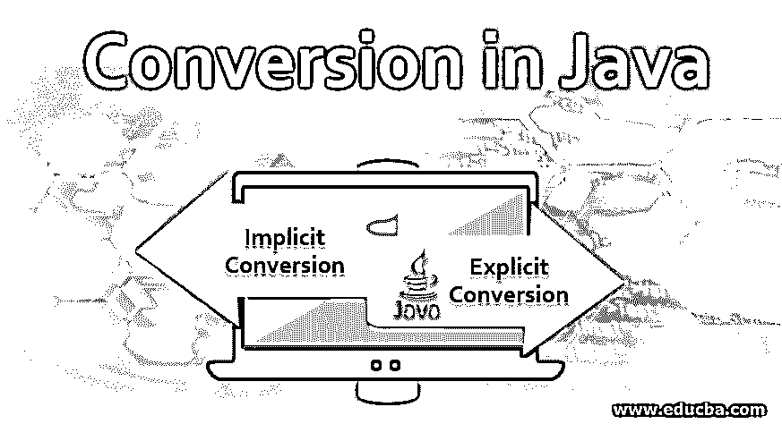
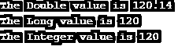

# Java 中的转换

> 原文：<https://www.educba.com/conversion-in-java/>




## Java 中的转换介绍

Java 中的转换是一种现象，其中变量可以被声明为某种数据类型，并且为了成功执行特定的操作/函数，它被转换为不同的数据类型。这种数据类型转换适用于所有八种数据类型:int、char、long、boolean、float、double、byte 和 short。转换的类型可以分为隐式转换和显式转换。当两种数据类型兼容或者目标数据类型大于源数据类型时，可以实现隐式转换方法。字符串的显式转换方法是通过许多方法实现的，如“字符串到整数”、“字符串到长整型”、“字符串到浮点型”、“字符串到布尔型”，日期转换是通过“字符串到日期”和“日期到字符串”实现的。

### java 中的转换类型

根据变量从哪种数据类型转换到哪种数据类型，我们可以将其分为两类:

<small>网页开发、编程语言、软件测试&其他</small>

#### 1.隐式转换

它也称为自动转换，因为转换过程不需要任何显式代码，并且与将另一个数据类型值赋给变量一样简单。一个非常基本的例子是将一个整数值赋给一个长整型变量。让我们用例子来演示简单的隐式转换。

**样本代码:**

```
public class con_java {
public static void main(String[] args) {
int a = 22;
long b = a;
System.out.println("Converted Value is : " + b);
}
}
```

在上面给出的例子中，我们简单地为 long 变量提供了一个整数值，它工作起来非常有效。Int 和 Long 都是数字数据类型，它们可以很好地相互兼容。

**代码解释:**在一个简单的 main 类中，我们声明了一个值为 22 的整型“a”变量，然后声明了一个长型变量“b”。这里我们将 a 的整数值赋给 b，b 是长数据类型。通过打印行，打印长数据类型 b 的值。作为隐式转换，不需要额外的代码。

**输出:**


对于隐式转换，有两个基本规则。只有当这些属性得到满足时，转换才会顺利执行。

**答:两种数据类型必须兼容**

*   如果任何一种数据类型与另一种数据类型不兼容，转换就不会发生。如果源数据类型是数字类别，目标数据类型也必须是相同的类别。
*   数字数据类型相互兼容，并且易于转换。但是这些相同的数字数据类型不容易转换成 char 类型或 boolean 类型。
*   Byte、Short、Int、Long、Float 和 Double 是数字数据类型。

**b .目标数据类型必须大于源数据类型**

*   这仅仅意味着我们试图转换的数据类型必须是更大的位长。
*   例如，我们将一个 int 值赋给一个 long 变量。这里，int 的比特大小是 32 比特；相反，long 的比特长度是 64 比特。也就是说，64 位的长度比 32 位的整数更有价值。

满足上述规则后，会发生一个简单的隐式转换。现在，让我们来理解显式转换。

隐式转换的第二个要求是低位数据类型只能转换为高位数据类型，这不会导致转换中的数据丢失。但是，如果我们需要将较大位大小的数据类型转换成较小的数据类型呢？这里数据丢失是不可避免的， [java 编译器将抛出](https://www.educba.com/java-compilers/)一个错误“UserWarni:转换时可能的精度损失”或另一个错误，这取决于代码。当我们知道转换属性和它抛出的错误时，我们使用显式转换。

#### 2.显式转换

实现显式转换就是通过根据需求显式定义我们的自定义临时数据类型来覆盖 java 的默认类型转换。当我们显式提供类型转换时，值的数据类型在短期内会被更改为所需的数据类型。显式转换也称为缩小类型。类型转换的语法是:

```
Vaiable2 = (type) Variable1;
```

这里，变量 2 是变量 1 必须转换成的不同数据类型的目标变量。(type)是 Variable1 转换为的数据类型的规范，并将其分配给 Variable2。

显式转换非常有用，在执行计算时，会保留一小部分数字。显式转换的应用程序可以是一个简单的计算器，其中必须计算学生的百分比。为了演示显式转换的工作原理，我们来看一个例子。

**样本代码:**

```
public class exp_con_java {
public static void main(String[] args) {
double dou_Variable = 120.14;
long long_Variable = (long) dou_Variable;
int intVariable = (int)long_Variable;
System.out.println("The Double value is "+dou_Variable);
System.out.println("The Long value is "+long_Variable);
System.out.println("The Integer value is "+intVariable);
}
}
```

**输出:**




下面是 Java 中可能的转换列表:

*   String 到 Int(使用 **Integer.parseInt()** 返回原始 int)
*   字符串转换为长整型(使用返回原始长整型的 **Long.parseLong()**
*   [String to float](https://www.educba.com/javascript-string-to-float/) (使用 **Float.parseFloat()** ，返回原始 float)
*   String 到 Boolean(使用 **Boolean.parseBoolean()** ，它返回原始 Boolean，TRUE 或 FALSE)

SimpleDateFormat():是一个 Java 类，帮助格式化和解析数据。它只是允许我们将一个简单的字符串转换成一个日期对象。

*   字符串到日期(使用 **parse()** ，它将字符串的值转换成日期对象)
*   日期转换为字符串(使用 **format()** ，简单地将日期转换为字符串)

上面列出了可能的转换类型和所需的方法，以及它返回的输出。

### 结论

Java 或任何其他语言中的类型转换是利用其功能并获得所需输出的更好方式。我们已经了解了基于属性和数据类型的两种类型的转换。隐式转换不需要任何额外的努力，但必须遵循两个属性。为了覆盖 Java 的默认转换，必须显式定义显式转换。我们已经通过程序例子理解了这两种类型。

### 推荐文章

这是一个 Java 转换指南。这里我们讨论 java 中的转换类型，比如隐式和显式，以及这个例子和它的实现。您也可以阅读以下文章，了解更多信息——

1.  [用 Java 打印 2D 数组](https://www.educba.com/print-2d-array-in-java/)
2.  [Java 中的最终关键字](https://www.educba.com/final-keyword-in-java/)
3.  [Java 中的 2D 图形](https://www.educba.com/2d-graphics-in-java/)
4.  [要浮动的 Java 字符串](https://www.educba.com/java-string-to-float/)


