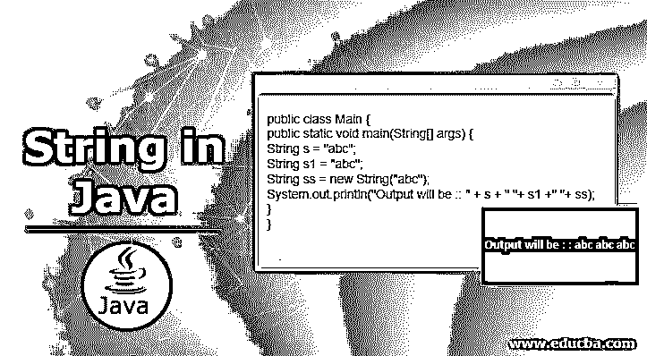
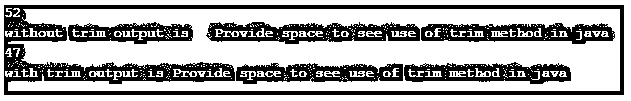

# Java 中的字符串

> 原文：<https://www.educba.com/string-in-java/>




## Java 中的字符串介绍

字符串基本上是一系列字符，但是在 java 中，它们被当作对象对待，本质上是不可变的；java 为 java.lang.String 包提供了不同的方法来对字符串执行操作，但是我们也可以在 java 中创建可变字符串。

### Java 中如何定义字符串？

我们可以通过使用字符串和新的关键字来定义它。但不同之处在于 literal 不会创建新对象，除非它在字符串池中不可用，但 new 关键字总是会创建新对象，而不考虑字符串常量池，因为它在堆区域创建一个字符串。

<small>网页开发、编程语言、软件测试&其他</small>

*   可变字符串
*   不可变字符串

### 如何用 Java 创建字符串？

在 java 中，我们可以用如下两种方法定义字符串:

*   通过使用字符串文字
*   通过使用新的关键字

#### 1.字符串文字

我们使用 literal 创建的字符串直接进入字符串常量池。这意味着如果所请求的字符串已经存在于字符串池中，那么现有的字符串将被返回。如果所请求的字符串不存在，那么只有一个新的字符串实例将被创建并放入池中以供将来参考。JVM 执行所有这些事情。

**语法:**

```
String s="abc";
String s1 = "abc" ;
```

在上面的场景中，在字符串池中将只创建一个对象，因为 JVM 将无法找到所请求的对象，所以它将创建该对象并将其放入池中，s1 将指向该引用以备将来使用。所以 string literal 也通过不再创建相同的实例来节省内存。因此，他们使我们的代码内存有效。

#### 2.新关键字

在 java 中，我们使用 new 关键字来创建一个新对象。每当我们使用一个新的关键字，它就会为我们创建一个新的对象。同样，使用 new 关键字创建的对象被放入堆内存区域。

**语法:**

```
String s = new Stirng("abc");
```

在上面的例子中，这个对象将被放入堆内存区中，而不是字符串池中，因为我们是使用 new 关键字创建它的。

**举例:**

```
public class Main {
public static void main(String[] args) {
String s = "abc";
String s1 = "abc";
String ss = new String("abc");
System.out.println("Output will be :: " + s + " "+ s1 +" "+ ss);
}
}
```

**输出:**


### Java 中字符串的规则和规定

它是不可变的，这意味着一旦它被赋值，我们就不能改变它的值。所以为了创建一个可变的字符串，我们需要使用一个字符串缓冲区。

有几点需要记住:

*   在定义字符串时，确保它总是用双引号引起来。
*   它们是不可变的，即一旦赋值就不能改变。
*   我们可以使用'+'运算符来连接两个或多个字符串。
*   我们可以直接将字符串赋给一个变量，而不用调用它的构造函数。

### Java 中字符串类的方法

可用的各种方法如下:

*   修剪()
*   toUpperCase
*   toLowerCase
*   内部值(int value)
*   toLowerCase(区域设置 l)
*   实习生()
*   indexOf(int ch)
*   indexOf(String substring, int fromIndex)
*   indexOf(String substring)
*   split(字符串正则表达式，整数限制)
*   concat(String str)
*   indexOf(int ch, int fromIndex)
*   长度()
*   等于(对象另一个)
*   join(字符序列分隔符，可迭代的 extends CharSequence>元素)
*   isEmpty()
*   替换(旧字符，新字符)
*   equalsIgnoreCase(另一个字符串)
*   split(字符串正则表达式)
*   toUpperCase(本地 l)
*   包含(字符序列)
*   字符(整数索引)
*   替换(旧字符序列，新字符序列)
*   join(CharSequence 分隔符，CharSequence…元素)
*   substring(int beginIndex)
*   substring(int begin index，int endIndex)
*   [Java 中的字符串类实现了](https://www.educba.com/string-class-in-java/)名为
*   可序列化
*   可比较的
*   字符序列

另外，string 类还实现了一个接口，即 CharSequence 接口；StringBuilder 和 String Buffer 也实现了这个接口。 [StringBuffer 和 StringBuilder](https://www.educba.com/stringbuffer-vs-stringbuilder/) 用于在 java 中创建可变字符串。

#### 示例–使用 StringBuffer

**代码:**

```
public class Demo{
public static void main(String[] args) {
StringBuffer sb=new StringBuffer("creating string ");
sb.append("executed");//original string will get chnage
System.out.println("Result is " +sb);//it will print creating string executed
}
}
```

**输出:**


#### 示例–使用 StringBuilder

**代码:**

```
public class Main{
public static void main(String[] args) {
StringBuilder sb=new StringBuilder("Creating string");
sb.append(" using string Builder");//original will get change
System.out.println("Result is "+sb);
}
}
```

**输出:**


### 例子

以下是一些例子:

#### 示例#1

**代码:**

```
public class Main{
public static void main(String[] args) {
String s1="demoforsting";
System.out.println("String is " +s1.substring(2,4));
System.out.println( "with one parameter " +s1.substring(2));
}
}
```

**输出:**


#### 示例 **#2**

**代码:**

```
public class Demo{
public static void main(String[] args) {
String s1="abc";
String s2="abc";
String s3="ABC";
String s4="java";
System.out.println("Result is " +s1.equals(s2));//true
System.out.println("Result is " +s1.equals(s3));//false
System.out.println("Result is " +s1.equals(s4));//false
}
}
```

**输出:**


#### 实施例 3

**代码:**

```
public class Demo{
public static void main(String[] args) {
String s1="convert it into uppercase";
String upper=s1.toUpperCase();
System.out.println("result is "+upper);
}
}
```

**输出:**


#### 实施例 4

**代码:**

```
public class Demo{
public static void main(String[] args) {
String s1="CONVERT IT INTO LOWER CASE";
String s1upper=s1.toLowerCase();
System.out.println("result is "+s1upper);
}
}
```

**输出:**


#### 实施例 5

**代码:**

```
public class Main{
public static void main(String[] args) {
String name="Demo to check contains method";
System.out.println("Result for conatins mehtod is " +name.contains("check"));
System.out.println("Result for conatins mehtod is " +name.contains("method"));
System.out.println("Result for conatins mehtod is " +name.contains("move"));
}
}
```

**输出:**


#### 实施例 6

**代码:**

```
public class Main{
public static void main(String[] args) {
String str1 = "Demo for";
String str2 = "Concat";
String str3 = "Method";
// doing for string one
String str4 = str1.concat(str2);
System.out.println("Result is "+str4);
// for multiple string
String str5 = str1.concat(str2).concat(str3);
System.out.println("Result is "+str5);
}
}
```

**输出:**


#### 实施例 7

**代码:**

```
public class Main {
public static void main(String[] args) {
String s1 =" Provide space to see use of trim method in java ";
System.out.println(s1.length());
System.out.println("without trim output is "+s1); //Not using trim here
String tr = s1.trim();
System.out.println(tr.length());
System.out.println("with trim output is "+tr); //using trim here
}
}
```

**输出:**




### 结论

因此，java string 是一个本质上不可变的对象，它在各个方面提供安全性，如 URL 读取、数据库用户名和密码、端口以及许多其他方面。但是如果我们想创建一个可变的字符串，我们应该使用字符串缓冲区和生成器。

### 推荐文章

这是 Java 中字符串的指南。这里我们讨论一下入门，方法，例子，以及如何在 Java 中创建 String？您也可以看看以下文章，了解更多信息–

1.  [Java 中的 StringBuilder 类](https://www.educba.com/stringbuilder-class-in-java/)
2.  [Java 流过滤器](https://www.educba.com/java-stream-filter/)
3.  [Java 瞬态](https://www.educba.com/java-transient/)
4.  [Java 动画](https://www.educba.com/java-animation/)


