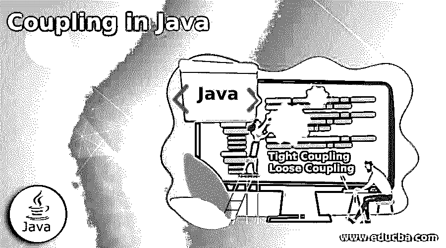

# Java 中的耦合

> 原文：<https://www.educba.com/coupling-in-java/>




## Java 中的耦合介绍

JAVA 中的耦合是在面向对象的环境中一个类对另一个类的依赖的指示器，T2 是一个指示器。开发人员为满足最终用户的需求而跨不同类更改代码的灵活程度， **c.** 一个类的功能被另一个类使用的方式:直接使用或借助外部接口， **d.** 投入使用后维护代码所需的工作， **e.** 创新软件技术(如控制反转和依赖注入)被用来在代码的编码和测试中注入更多灵活性的方式。

### **Java 中的耦合类型**

Java 中有两大耦合，我们来详细分析一下。

<small>网页开发、编程语言、软件测试&其他</small>

#### 1.紧密结合

在面向对象的应用程序设计中，总是需要利用在某个类中开发的逻辑来重用已经投入的工作，避免重新发明轮子。

类之间的直接协作导致了紧密耦合，它的特性是

*   被调用类中可用的业务逻辑是作为调用类中的对象创建的。
*   这样创建的对象在调用类中执行，以实现所需的功能。因此，调用程序知道被调用类中可用的业务逻辑的全部功能。
*   被调用类中编码的业务逻辑的任何变化都会影响被调用类的结果
*   如果在被调用的类中改变是不可避免的，那么在调用类中也必须进行适当的改变。
*   因此，类是高度相互依赖的

**紧耦合示例**

本例中的两个协作类“Ordervalue”和“order”是相互依赖的。调用类“Ordervalue”知道被调用类“order”中编码的业务逻辑相应地，调用类中的代码是结构化的，被调用类的任何改变都会打乱程序的结果。

因此可以得出结论，类“Ordervalue”和“Order”是紧密耦合的。

**代码:**

```
// Tight Coupling - Sample program
public class ordervalue // Calling class
{
public static void main(String args[]) // method in the class
{
order b = new order(600,5); // creating object for the called class
System.out.println("value of the order is");
// order and execute it
System.out.println(b.value); // Prints the order value computed by
} // the called class
}
class order // Called class
{
public int value; // method in the class
order(int orderquantity, int rate) // business logic
{
this.value = orderquantity * rate; // computing the value
}
}
```

**输出:**


#### 2.松耦合

在这个概念中，需要协作来共享 OOPS 中的业务逻辑和公共功能的类是通过外部源耦合的。因此，它们松散地或间接地连接在一起。

松散耦合的主要属性是

*   类、代码组件和模块之间的依赖性很低。
*   如果依赖是不可避免的，那么它们通过像接口这样的外部组件连接起来。
*   使用接口的连接保持最小化，以获得松耦合的好处。
*   不需要在一个类中的其他类周围定义对象，对象将是独立的。
*   在这种耦合中，每个类对其他类所知甚少。最好的情况是，每个类都知道其他模块所暴露的接口。
*   一个类中代码的任何变化都不会影响其他类，它们也不需要更新。
*   它为开发人员提供了极大的灵活性，可以轻松地更改代码并适应新的业务变化。
*   维护程序的时间和精力大大减少
*   Spring 框架的概念，如控制反转和依赖注入，正被用来克服紧耦合。

**控制反转(IOC)**

这是一个将程序模块或对象的控制转移到容器框架的概念。这个概念经常在 OOPS 中使用。容器框架接管控制和调用代码，而不是程序代码调用库。相对于创建依赖关系的对象，依赖关系被注入到对象中。

这个概念有助于编程中的松散耦合和模块化。

**依赖注入(DI)**

DI 是 IOC 概念投入使用的工具，控制转移发生在建立对象依赖关系的过程中。

**松耦合的例子**

在这个例子中，三个类“month1”、“month2”、“month3”是独立的模块，它们通过接口“iface”很少相互协作。因此，这些类对其他类所做的事情知之甚少。他们只知道所有的类都与一个接口交互。

这些类中没有使用其他类创建的对象，它们是松散耦合的典型例子。

**代码:**

```
// Loose Coupling in JAVA - Sample Program
interface Iface //Interface is defined
{
public void monthname(); //module within the interface
}
class month1 implements Iface { // Class interacts through
public void monthname() // interface
{
System.out.println("January");
}
}
class month2 implements Iface { // Class interacts through
public void monthname() // interface
{
System.out.println("Feburary");
}
}
class month3 implements Iface { // Class interacts through
public void monthname() // interface
{
System.out.println("March");
}
}
public class Subject { // Execution starts here
public static void main(String[] args)
{
Iface t = new month1(); // First class called thru
t.monthname(); // interface
Iface tx = new month2(); // Second class called thru
tx.monthname(); // interface
Iface tx2 = new month3(); // Third class called thru
tx2.monthname(); } // interface
}
```

**输出:**


### 结论

为了更好的可维护性和可服务性，应用程序的设计必须尽可能只支持松散耦合，并保持程序组件之间的相互依赖最小化。然而，如果相互依赖是必须的，那么组件只能通过接口连接。

### 推荐文章

这是一本关于 Java 中耦合的指南。这里我们讨论两种类型的耦合，java 中的紧耦合和松耦合，以及详细的解释和代码实现的例子。您也可以看看以下文章，了解更多信息–

1.  Java 中的[接口](https://www.educba.com/interface-in-java/)
2.  [Java 中的模板](https://www.educba.com/template-in-java/)
3.  [Java 中的排序字符串](https://www.educba.com/sort-string-in-java/)
4.  [Java 中的序列化](https://www.educba.com/serialization-in-java-2/)


