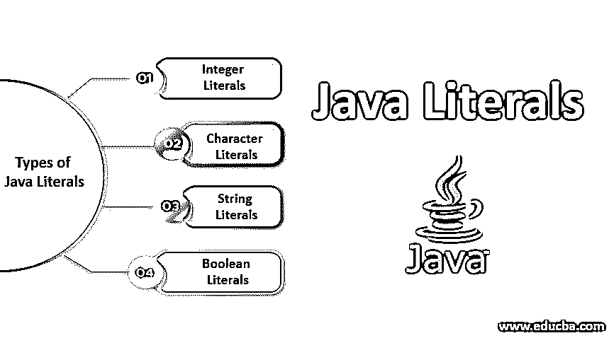
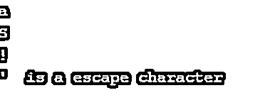

# Java 文字

> 原文：<https://www.educba.com/java-literals/>




## Java 文字的定义

文字是来自源的固定值的语法表示。在 Java 中，文字主要有四种类型:字符、布尔、数字和字符串。所以基本上，这些文字是一串字符，它们为任何变量存储一个常量值。这些文字具有不可变的特征，不能被改变。每当我们创建一个新的变量或常数，我们定义一个数据类型，然后分配特定的值。现在，当编译器读取常量变量的值时，它会读取这些值，[会将这些值解释为文字值](https://www.educba.com/c-plus-plus-literals/)。

比如 const int abc = 123 这里，abc 是我们的变量名，它是常量，赋值为 123。现在这个常量变量的值，123，是我们的字面量。在 Java 中，我们有 5 种主要的文字。整数、布尔、浮点、字符和字符串是的数据类型，用文本表示。当我们要把一个固定值传入程序时，我们实现文字。

<small>网页开发、编程语言、软件测试&其他</small>

### Java 文字的类型及其示例

我们现在将学习上面提到的每一个文字的解释，演示和输出程序。

#### 1.整数

八进制、二进制、十进制和十六进制数在中用作整数的文字值。允许基数为 2、8、10、16 的数字。

*   **二进制:** 0 和 1，
*   **八进制:**八进制
*   **十进制:**基数 10 和
*   **十六进制:**十六进制。

现在让我们用代码来演示这些整数文字。

**代码:**

```
public class literal_b {
public static void main(String args[]) throws Exception{
int m = 1010;
int n = 0110;
int o = 0x7e4;
int p = 0b101;
System.out.println(m);
System.out.println(n);
System.out.println(o);
System.out.println(p);
}
}
```

**代码解释:**在我们的公共类中，有我们的主类，并且声明了四个整型变量。我们的第一个 int 变量是值为 1010 的' m ',它是一个文字值的十进制形式。然后，我们有我们的第二个变量，' b '的文字值为 0110，这是在八进制值。接下来是带有六进制值 0x7e4 的“o”变量，最后是二进制形式的文字值 0b101，这是我们的“p”变量。如上所述，在执行时，各种整型变量的这些值将以各自的形式被编译和读取。

执行上述代码将返回整数值；请参考下面附加的屏幕截图，以获得正确的输出。

**输出:**


#### 2.字符文字

只要用单引号将任何单个字符括起来，它现在就是一个字符文字。用 char 指定文字有 4 种方法。

*   **简单 Char 文字:**Char ab = ' q '；这为字符数据类型指定了简单的文字。
*   整数文字:另一种指定文字字符的方法是通过整数文字。十进制、十六进制或八进制形式的 0 到 65535 之间的值可以指定为字符。
*   **Unicode:** char 文字可以用 Unicode 的形式表示，例如' \ uxxx '，这里这四个 x 是十六进制值。
*   **转义序列:**每个转义字符都可以作为字符文字传递。

既然我们已经理解了用 char 表示文字的上述方法，让我们来演示和执行代码。

**代码:**

```
public class literal_b{
public static void main(String args[]) throws Exception{
char ch1 = 'a';
char ch2 = 0123;
char ch3 = '\u0021';
System.out.println(ch1);
System.out.println(ch2);
System.out.println(ch3);
System.out.println("\'  is a escape character");
}
}
```

代码解释:就像其他代码一样，我们有自己的公共类和主类。然后，我们将三个 char 变量分别声明为 ch1、ch2、ch3 和值。后来三个打印声明。赋给这些变量的值不是简单的数字，而是编译器能够理解的代码，输出将与该值不同。

最后，我们有转义字符，这是一个单引号。参考下面附上的完整详细的输出截图。

**输出:**




#### 3.布尔文字

最简单的文字是布尔文字，真或假。这里，[文字表示逻辑值](https://www.educba.com/javascript-literals/):正如我们所知，对于任何布尔数据类型只有两个。我们知道，在 java 中，它真实地表示 1 的值，而 0 的值用 false 表示。让我们演示一个用于布尔值的文字的工作示例。

**代码:**

```
public class literal_b {
public static void main(String args[]) throws Exception{
boolean samlpeb1 = true;
boolean samlpeb2 = false;
System.out.println(samlpeb1);
System.out.println(samlpeb2);
}
}
```

代码解释:我们有自己的类和主类，然后用各自的值声明两个布尔变量。然后我们有打印语句，它将打印指定的布尔值。在执行时，上面的代码将打印 true 和 false。请参考下面附加的预期输出截图。

**输出:**


#### 4.线

双引号之间的任何内容，“文字”都是字符串文字。类似于 char，除了字符串可以由多个字符组成，并且用双引号括起来。

下面的代码以最简单的方式实现了字符串文字。

**代码:**

```
public class Main{
public static void main(String args[]) throws Exception{
String literalstr = "This is String Literal.";
System.out.println(literalstr);
}
}
```

**代码解释:**我们有了简单的类和主类，然后我们有了单个 most 字符串变量和分配给它的简单字符串值。打印时，它将简单地按原样打印字符串。双引号之间的任何内容都将被识别为字符串文字，并如实反映在输出中。

请参考下面附加的输出截图。

**输出:**


其中一个非常重要的方面是理解变量、常量和文字之间的区别:变量用于存储值以备将来使用。Int a = 2 是一个带有变量名的数据类型的例子，这里的值是 2。类似于变量，常量用来存储值，但常量变量的值一旦赋值就不能更改；const int a = 3 是常量的一个例子，a 的值是 3，不会被任何方法改变，以防试图改变这个值，编译器不会接受。现在，文字就是赋给这些变量和常量的值。像前面一样，a = 2 和 a = 3，值 2 和 3 是字面量。

### 结论

文字是赋给各种变量的值，这些变量以不同的形式存在。无论输入形式是什么，编译器都会理解代码，输出也将是预期的。我们理解了布尔、整数、字符形式的文字，并通过代码实现了这种理解。当我们要在代码中传递一个固定值时，这些文字最适用。

### 推荐文章

这是 Java 文字的指南。这里我们讨论 java 文字的定义和类型，包括整数、字符文字、布尔文字等。您也可以阅读以下文章，了解更多信息——

1.  [Java WindowListener](https://www.educba.com/java-windowlistener/)
2.  [Java 持续时间](https://www.educba.com/java-duration/)
3.  [C#文字量](https://www.educba.com/c-sharp-literals/)
4.  [C 文字量](https://www.educba.com/c-literals/)


