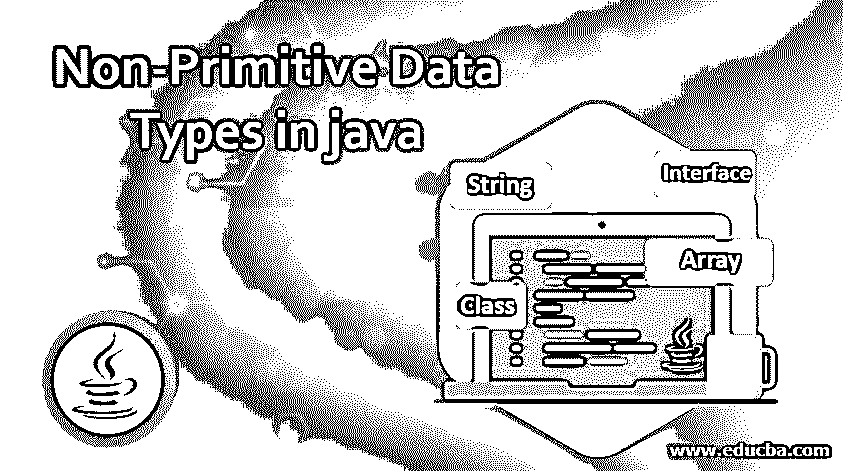
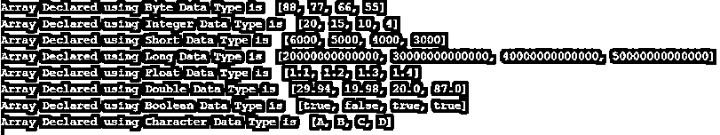

# java 中的非原始数据类型

> 原文：<https://www.educba.com/non-primitive-data-types-in-java/>




## Java 中非原始数据类型介绍

非原始数据类型是 java 中的那些数据类型，它们具有相同的大小，并提供额外的方法来执行某些操作；简而言之，java 中的非原语数据类型引用对象，也称为引用类型；java 中可用的非原始数据类型的例子包括数组、字符串、类和接口。

### 句法

下面的语法显示了在 java 中如何使用非基本数据类型:

<small>网页开发、编程语言、软件测试&其他</small>

**数组**:Java 中的数组使用如下:

```
int[] intArray;                     // declaring array of type int
byte[] byteArray               // declaring array of type byte
long[] longArray;                     // declaring array of type long
short[] shortArray               // declaring array of type short
float[] floatArray;                     // declaring array of type float
long[] longArray               // declaring array of type long
char[] charArray               // declaring array of type char
ClassName[] classArray    // declaring array a particular class
Object[]  objectArray      // declaring array of objects
```

从上面可以看出，我们可以创建不同数据类型的数组，甚至可以创建对象和类。请注意，在数组中，所有元素都应该是相同的数据类型。

**字符串:**Java 字符串的用法如下:

```
String str = "Edubca";         // declaring a string in java
```

**类:**下面是 java 类的创建方法:

```
package <package name>;     // declaring package of class
public class <ClassName>{
//contains data and methods
}
```

**接口:**下面是如何在 java 中创建接口:

```
package <package name>;     // declaring package of interface
public interface <InterfaceName>{
//contains unimplemented methods and data if needed
}
```

### Java 中的非原始类型

以下是 java 中可用的非基本数据类型:

*   **数组:**数组可以定义为具有固定大小的同质元素集合。数组可以存储一个或多个属于同一数据类型的值，并且可以通过索引访问数组的各个元素。这意味着数组遵循基于索引的方法来访问元素。
*   **字符串**:一个字符串可以定义为一个字符序列。java 中的字符串表示为 java.lang.String 类的对象。要在 java 中创建 string 的实例，我们需要创建一个 java.lang 的对象。
*   **类**:Java 类可以定义为用户定义的数据蓝图，用来创建对象。java 中的类定义了一组用于定义对象状态或行为的属性或方法。
*   **接口:**Java 中的接口用于提供对数据的抽象。类似于类，接口包含数据和方法，但是在接口内部声明的方法默认是抽象的。抽象方法是那些不包含任何人的方法；它们只包含方法签名。

### Java 中非原始数据类型的例子

下面提到了不同的例子

#### 示例#1

在本例中，我们将展示如何在 java 中使用数组和字符串:

```
import java.util.*;
public class DataTypeDemo {
public static void main(String[] args) {
byte[] byteArray= {88,77,66,55};                 //declaring byte Array
int[] intArray= {20,15,10,4};                    // declaring integer Array
short[] shortArray= {6000,5000,4000,3000};       //declaring short Array
long[] longArray = {20000000000000L,30000000000000L,40000000000000L,50000000000000L};  //declaring long Array
float[] floatArray= {1.1f,1.2f,1.3f,1.4f};            // declaring float Array
double[] doubleArray = {29.94d,19.98d,20,87d};       // declaring double Array
boolean[] booleanArray= {true,false,true, true};       //declaring boolean Array
char[] charArray = {'A','B','C','D'};            // declaring character Array
System.out.println("Array Declared using Byte Data Type is  " + Arrays.toString(byteArray));
System.out.println("Array Declared using Integer Data Type is  " + Arrays.toString(intArray));
System.out.println("Array Declared using Short Data Type is  " + Arrays.toString(shortArray));
System.out.println("Array Declared using Long Data Type is  " + Arrays.toString(longArray));
System.out.println("Array Declared using Float Data Type is  " + Arrays.toString(floatArray));
System.out.println("Array Declared using Double Data Type is  " + Arrays.toString(doubleArray));
System.out.println("Array Declared using Boolean Data Type is  " + Arrays.toString(booleanArray));
System.out.println("Array Declared using Character Data Type is  " + Arrays.toString(charArray));
}
}
```

**输出:**




#### 实施例 2

在这个例子中，我们将看到在 java 中如何使用类和接口:

下面是如何在 java 中声明接口:

```
// declaring an interface
interface namePrinter{
// declaring abstract method (method without body)
String getName();
}
//creating java class implementing interface namePrinter
public class Main implements namePrinter{
public static void main(String[] args) {
Main main =new Main();
String name=main.getName();
System.out.println("Name returned from getName method is >> " + name );
}
// overriding method of an interface
@Override
public String getName() {
String name ="Edubca";
// TODO Auto-generated method stub
return name;
}
}
```

**输出:**


### 结论

正确理解不同的数据类型对于学习任何编程语言都是非常重要的。上面的文章用例子详细解释了这些类型以及每种数据类型的意义。

### 推荐文章

这是一本关于 java 中非原语数据类型的指南。这里我们讨论 Java 中的例子和非原语类型。您也可以阅读以下文章，了解更多信息——

1.  [Java 中的文件处理](https://www.educba.com/file-handling-in-java/)
2.  [Java 中的字符串](https://www.educba.com/string-in-java/)
3.  [Java 中的优先级队列](https://www.educba.com/priorityqueue-in-java/)
4.  [Java 动画](https://www.educba.com/java-animation/)


