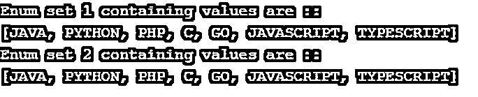
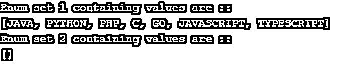
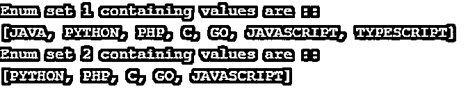
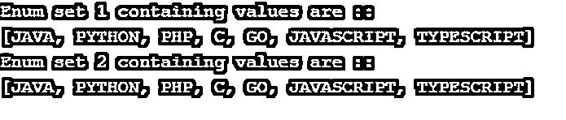

# Java 中的 Enumset

> 原文：<https://www.educba.com/enumset-in-java/>


## Java 中的 Enumset 简介

Enum set 是 set 接口的实现，它为枚举类型扩展了 java 中的抽象类。are Set 集合提供了在 java 中使用枚举的功能。枚举集不同步；因此，它们提供了更快的元素访问。枚举集不允许添加空元素；如果我们试图添加一个空值，它将抛出一个空指针异常。

**语法:**

<small>网页开发、编程语言、软件测试&其他</small>

```
public abstract class EnumSet<E extends Enum<E>> || This is the class decralation of enum set.
EnumSet<E extends Enum<E>> enum1, enum2, enum3, enum4; || Declare different enum.
```

由于枚举集是不同步的，所以它们更好，但是我们可以通过使用下面的 collections 类 synchronized 方法()来同步它们。

```
Collections.synchronizedSet(java.util.Set<T>)
Set<Enum_Type> s = Collections.synchronizedSet(EnumSet.noneOf(EnumClass.class));
```

### Java 中枚举集的方法

*   **static < E 扩展 Enum<E>T5】allOf(Class<E>element type):**该方法用于创建包含上述所有元素的 Enum。
*   EnumSet < E > clone(): 这个方法用来创建集合的副本。返回类型为 EnumSet < E >。
*   **静态< E 扩展枚举<E>T5】complement of(Enum set<E>s):**该方法用于创建方法中指定的枚举集合，该枚举将包含集合中未包含的所有元素。
*   **静态< E 扩展枚举<E>T5】copy of(集合< E > c):** 这将创建方法中指定的枚举集的副本。但是它接受集合参数。
*   **静态< E 扩展枚举<E>T5】copy of(Enum set<E>s):**这将创建一个枚举，指定为枚举集。这将返回一个 EnumSet < E >。
*   **静态< E 扩展枚举<E>T5】none of(类< E > elementType):** 这也将创建一个在方法中指定的枚举。返回一个枚举集< E >。
*   **静态< E 扩展枚举<E>E(E E)的>:**也创建一个最初包含元素的枚举。返回类型是 EnumSet < E >。
*   **静态< E 扩展 Enum<E>T5】of(E first，E… rest):** 创建包含元素的 Enum 并返回 EnumSet < E >
*   **static < E 扩展 Enum<E>T5】of(E E1，E e2):** 这个方法将创建一个包含上述元素的 Enum。返回类型为枚举集< E >
*   **静态< E 扩展 Enum<E>T5】of(E E1，E e2，E e3):** 这个方法会创建一个 Enum。方法返回类型是 EnumSet < E >。
*   **静态< E 扩展 Enum<E>T5】of(E E1，E e2，E e3，E e4):** 这个方法还会创建指定元素的 Enum。返回类型为枚举集< E >
*   **静态< E 扩展 enum<E>T5】of(E E1，E e2，E e3，E e4，E e5):** 这个方法也是创建 Enum，指定元素作为 Enum 传递。返回类型为枚举集< E >
*   **静态< E 扩展枚举<E>T5】范围(E from，E to):** 在这个方法中我们可以指定范围。然后它将创建一个新的枚举。返回类型是 EnumSet < E >。

**注:**

*   枚举集实现各种类和接口。枚举集类声明:
*   公共抽象类 EnumSet <e extends="" enum="">>扩展抽象集<e>实现可克隆、可序列化</e></e>

由枚举集实现的接口:

*   可克隆的
*   设置
*   可序列化
*   收藏
*   可迭代的

由枚举集扩展的类如下:

*   抽象集

### Java 中枚举集的示例

下面是 enumset 的例子:

#### 示例#1

在下面的例子中，我们正在向枚举集合添加元素。

**代码:**

```
import java.util.EnumSet;
public class EnumsetDemo {
public static void main(String[] args) {
// creating reference
EnumSet<EnumDemo> enum1;
// here we are adding elements to the enum1 which we create above.
enum1 = EnumSet.of(EnumDemo.JAVA, EnumDemo.JAVASCRIPT,
EnumDemo.C, EnumDemo.PHP, EnumDemo.GO, EnumDemo.PYTHON, EnumDemo.TYPESCRIPT);
System.out.println("Enum set 1 containing values are :: ");
System.out.println( enum1);
}
}
enum EnumDemo
{
JAVA, PYTHON, PHP, C, GO, JAVASCRIPT, TYPESCRIPT
};
```

**输出:**


#### 实施例 2

在本例中，我们仅使用值 sf enum1 创建 enum2。下面找一个例子。

**代码:**

```
import java.util.EnumSet;
public class EnumsetDemo {
public static void main(String[] args) {
// creating reference
EnumSet<EnumDemo> enum1;
// here we are adding elements to the enum1 which we create above.
enum1 = EnumSet.of(EnumDemo.JAVA, EnumDemo.JAVASCRIPT,
EnumDemo.C, EnumDemo.PHP, EnumDemo.GO, EnumDemo.PYTHON, EnumDemo.TYPESCRIPT);
System.out.println("Enum set 1 containing values are :: ");
System.out.println( enum1);
// adding value to another enum set using addAll method
EnumSet<EnumDemo> enum2 = EnumSet.allOf(EnumDemo.class);
System.out.println("Enum set 2 containing values are :: ");
System.out.println( enum2);
}
}
enum EnumDemo
{
JAVA, PYTHON, PHP, C, GO, JAVASCRIPT, TYPESCRIPT
};
```

**输出:**




#### 实施例 3

在这个例子中，我们找到了 enum1 到 enum2 的补码。

**代码:**

```
import java.util.EnumSet;
public class EnumsetDemo {
public static void main(String[] args) {
// creating reference
EnumSet<EnumDemo> enum1;
// here we are adding elements to the enum1 which we create above.
enum1 = EnumSet.of(EnumDemo.JAVA, EnumDemo.JAVASCRIPT,
EnumDemo.C, EnumDemo.PHP, EnumDemo.GO, EnumDemo.PYTHON, EnumDemo.TYPESCRIPT);
System.out.println("Enum set 1 containing values are :: ");
System.out.println( enum1);
// finind completents of enum1 to enum2
EnumSet<EnumDemo> enum2 = EnumSet.complementOf(enum1);
System.out.println("Enum set 2 containing values are :: ");
System.out.println( enum2);
}
}
enum EnumDemo
{
JAVA, PYTHON, PHP, C, GO, JAVASCRIPT, TYPESCRIPT
};
```

**输出:**




#### 实施例 4

指定要复制的元素的范围。

**代码:**

```
import java.util.EnumSet;
public class EnumsetDemo {
public static void main(String[] args) {
// creating reference
EnumSet<EnumDemo> enum1;
// here we are adding elements to the enum1 which we create above.
enum1 = EnumSet.of(EnumDemo.JAVA, EnumDemo.JAVASCRIPT,
EnumDemo.C, EnumDemo.PHP, EnumDemo.GO, EnumDemo.PYTHON, EnumDemo.TYPESCRIPT);
System.out.println("Enum set 1 containing values are :: ");
System.out.println( enum1);
// here we are specifing the range to another enum using enum1
EnumSet<EnumDemo> enum2 = EnumSet.range(EnumDemo.PYTHON, EnumDemo.JAVASCRIPT);
System.out.println("Enum set 2 containing values are :: ");
System.out.println( enum2);
}
}
enum EnumDemo
{
JAVA, PYTHON, PHP, C, GO, JAVASCRIPT, TYPESCRIPT
};
```

**输出:**




#### 实施例 5

从现有枚举制作副本。

**代码:**

```
import java.util.EnumSet;
public class EnumsetDemo {
public static void main(String[] args) {
// creating reference
EnumSet<EnumDemo> enum1;
// here we are adding elements to the enum1 which we create above.
enum1 = EnumSet.of(EnumDemo.JAVA, EnumDemo.JAVASCRIPT,
EnumDemo.C, EnumDemo.PHP, EnumDemo.GO, EnumDemo.PYTHON, EnumDemo.TYPESCRIPT);
System.out.println("Enum set 1 containing values are :: ");
System.out.println( enum1);
// here we are copying elements of enum1 to enum2.
EnumSet<EnumDemo> enum2 = EnumSet.copyOf(enum1);
System.out.println("Enum set 2 containing values are :: ");
System.out.println( enum2);
}
}
enum EnumDemo
{
JAVA, PYTHON, PHP, C, GO, JAVASCRIPT, TYPESCRIPT
};
```

**输出:**




### 结论

Java EnumSet 是 Set 接口在 Java 中的实现。它们是一种特殊类型的 java 集合框架，为 java 中的 enum 类型提供支持。我们也可以使它们同步，因为它们是不同步的。

### 推荐文章

这是 Java 中的 Enumset 指南。这里我们讨论 java 中 enumset 的介绍和方法，以及不同的例子和它的代码实现。您也可以阅读以下文章，了解更多信息——

1.  [Java 中的嵌套循环](https://www.educba.com/nested-loop-in-java/)
2.  [Java 中的优先级队列](https://www.educba.com/priorityqueue-in-java/)
3.  [Java 中的异常处理](https://www.educba.com/exception-handling-in-java/)
4.  [Java 中的字符串](https://www.educba.com/string-in-java/)


