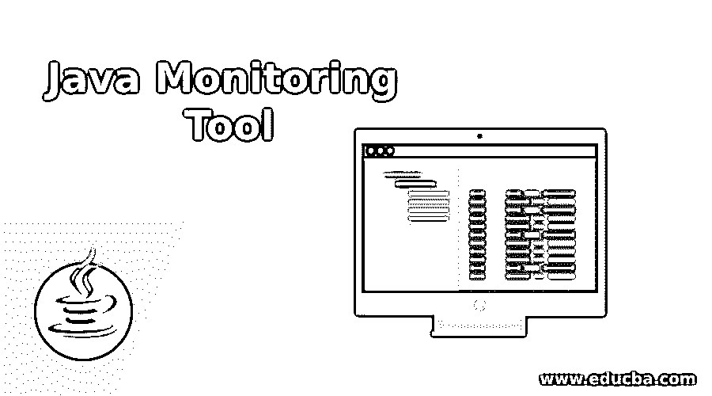

# Java 监控工具

> 原文：<https://www.educba.com/java-monitoring-tool/>

## 什么是 Java 监控工具？

java 监控工具被定义为用于跟踪用 java 编程语言开发的应用程序的性能的监控工具。该工具还能够跟踪服务器的性能。由于 java 是最流行的编程语言，并且应用程序主要是用 java 开发的，所以总是需要一些监控工具来帮助测量 Java 应用程序的性能。当应用程序运行时，它会消耗 CPU 和内存，还会使用应用程序运行期间消耗的资源。当应用程序处于开发阶段时，监控工具用于跟踪应用程序中的缺陷和错误。当应用程序进入 QA 阶段时，会对应用程序的性能进行测量。有各种 java 监控工具可以用来测量 Java 应用程序的性能。java 监控工具的一些例子有 Eclipse MAT、Netbeans Profiler、VisualVM、Scouter 等等。

### 7 大 Java 监控工具

7 大 java 监控工具解释如下:

<small>网页开发、编程语言、软件测试&其他</small>

#### 1.网络安全管理软件产品监狱

这种类型的 java 监控工具用于测量应用程序的性能，也有助于监控应用程序。该工具还用于定制仪表板，以及预配置警报。对代码性能的深入分析可以通过网络安全管理软件产品应用工具进行评估。该工具支持的其他功能是，它有助于调优应用程序的性能，并帮助开发人员了解完整的 java 基础设施。开发人员可以了解进程可用性、活动线程、java 堆使用、响应时间和其他性能参数。该工具有一个交互式界面，可以帮助用户对应用程序性能进行深入分析，还可以分析 java web 应用程序。

#### 2.网络安全管理软件产品·洛格里

这种类型的 java 监控工具用于日志管理，也用于提高应用程序的速度。工具是基于云的工具，也有助于改进应用程序的日志模块。使用这个工具，开发人员可以分析各种 web 应用程序的日志，还可以在工具 GUI 上看到网络日志。在一个单一的控制面板中，只有所有类型的网络日志可以方便地可视化。当 java 应用程序生成日志时，它们可以通过 Loggly 工具以集中的方式进行管理。

#### 3.Eclipse 内存分析器

eclipse 内存分析器是用于监控基于 java 的应用程序的最重要的工具，因为它有助于分析内存。该工具持续监控应用程序的 java 堆使用情况。当开发一个 java 应用程序时，它包含对象，并且创建的对象存储在堆中。在应用程序运行时，可以观察到堆使用量的波动。当堆的大小耗尽时，就没有空间来创建更多的对象。这个工具有助于分析内存消耗，也有助于开发人员检查 java 应用程序占用的内存。当 java 应用程序中创建了太多对象时，可以很容易地分析堆转储。使用这个工具可以计算对象大小，并可以监视垃圾收集器的工作。

#### 4.轻盈的步伐

Lightstep 是一个 web 跟踪器工具，因为它有助于跟踪 web 应用程序的性能，也有利于 it 团队分析应用程序的性能。对于开发人员来说，手动跟踪网络数据包、识别协议、跟踪 IP 地址始终是一项繁忙的工作。Lightstep 是开发人员的完美选择，因为该工具提供了对 web 应用程序性能的自动跟踪。该工具的另一个功能是它可以很容易地与用 java 开发的任何类型的应用程序集成。

#### 5.EJ 技术公司

为应用程序编写代码不仅仅是开发人员的工作。他们还需要了解应用程序的性能指标、内存消耗以及与应用程序执行相关的其他细节。为此，Jprofiler 工具是完美的解决方案。JProfiler 工具主要用于测量应用程序的 JVM 级别。使用该工具可以识别性能瓶颈，还可以识别 java 应用程序中存在的内存泄漏。这些工具提供了用户界面，开发人员可以在其中看到在 java 应用程序中创建的对象，并可以获得关于该对象的完整信息。使用 JProfiler 工具可以很容易地解决内存问题。

#### 6.Pingdom 服务器监视器

Pingdom 服务器监控工具是一个 JMX 监控工具，因为它有助于管理日志和分析 java 应用程序。该工具能够告知 JVM 的健康状况，还可以告知 JVM 资源。JMX 控制台用于提供有关 MBeans 的信息。这个工具为 java 应用程序提供了灵活性。用户可以监视应用程序的堆内存使用情况，也可以监视应用程序的非堆区域。通过使用该工具，开发人员可以了解与他们开发的应用程序相关的 java 问题。

#### 7.月蚀垫

Eclipse(内存分析器工具)是一种内存测量工具，用于分析应用程序获取的 java 堆。使用 MAT 工具可以很容易地发现内存泄漏，也有助于优化内存资源。使用这个工具可以很容易地找到导致旧 GC 的对象，并且有助于收集适合 java 垃圾收集器进行垃圾收集的未使用的对象。内存泄漏可以通过 Eclipse MAT 工具自动发现。

### 结论

所有的 java 监控工具都用于测量用 java 编程语言开发的应用程序的性能和内存使用情况。有许多类型的 java 监控工具是为不同的目的而开发的。并且开发者在应用的开发阶段使用这些工具，以便可以开发优化的 java 应用。

### 推荐文章

这是一个 Java 监控工具指南。在这里，我们还讨论了简介和 7 大 java 监控工具以及解释。您也可以看看以下文章，了解更多信息–

1.  [在 Java 中完成](https://www.educba.com/finalize-in-java/)
2.  [Java 断言](https://www.educba.com/java-assertion/)
3.  [Java 8 流](https://www.educba.com/java-8-stream/)
4.  [Java NullPointerException](https://www.educba.com/java-nullpointerexception/)

