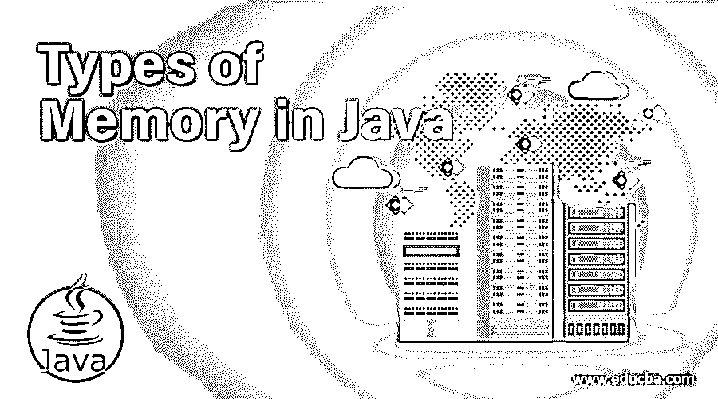

# Java 中的内存类型

> 原文：<https://www.educba.com/types-of-memory-in-java/>




## Java 中的内存类型介绍

java 虚拟机存储区是一个运行时区域，用于执行 Java 应用程序运行时涉及的各种程序。JVM 的存储区大致分为五个不同的部分，即方法区、堆区、堆栈、程序计数器(PC)寄存器区和本机方法区。在本文中，我们将讨论 java 中不同类型的内存。

### Java 中五大内存类型

我们知道，java 是一种面向对象的语言；因此，所有用 java 创建的对象都存储在 JVM (Java 虚拟机)中。JVM 内存基本上分为以下几个部分:

<small>网页开发、编程语言、软件测试&其他</small>

#### **1。方法区域**

 **所有正在执行的线程共享这部分 JVM 内存区域。类元素，如常量池、类字段、构造函数代码、方法代码等。方法区域可以被认为是堆区域的一部分，但是只存储每个类的数据。我们可以说方法区域负责保存类级别的信息。

#### **2。堆内存**

 **java 中的堆内存由 java 运行时用来在 java 程序执行期间为对象和类分配内存。每当在 java 中创建一个对象时，它就被存储到堆内存中。垃圾收集进程在堆内存上运行以释放不必要的空间，垃圾收集从没有任何引用的堆区域中移除那些对象。java 中的堆内存分为以下几个部分:

*   ******年轻一代:**** 这是放置所有新创建对象的部分。当 java 堆的这一部分被填满时，会进行少量的垃圾收集来释放空间。**
***   ******老一代:**** 所有次要垃圾回收后留在内存中的对象都移入老一代。因此，这是堆内存中存在长期对象的部分。*****   ******永久生成:****JVM 的这一部分包含了为运行 java 应用提供元数据的原生和静态方法。******

 ****以下是关于 java 堆内存的一些要点:

*   如果堆空间变满，java 就会抛出 OutOfMemory 错误。
*   与堆栈内存相比，对堆内存的访问速度较慢。
*   与堆栈内存相比，堆内存的大小要大得多。
*   堆内存不是线程安全的，因为所有对象都共享它。
*   堆内存中不存在自动释放，因为它需要垃圾收集器来释放空间。

#### **3。栈存储器**

 **顾名思义，堆栈内存是基于后进先出原则的。堆栈内存用于静态内存分配，java 程序中的每个执行线程都有自己的堆栈内存。每当调用一个 java 方法时，都会在 Java 堆栈内存中创建一个新的块来保存局部或中间变量以及对方法中其他对象的引用。一旦该方法的执行完成，堆栈中的内存块就会变空，供下一个方法使用。与堆内存相比，堆栈内存的大小较小。下面是堆栈内存的一些重要特性。

*   随着新方法被添加到堆栈内存和从堆栈内存中移除，堆栈内存会相应地增长和收缩。
*   方法执行完毕后，堆栈内存会自动分配和释放。
*   与堆内存相比，对堆栈内存的访问更快。
*   每当堆栈内存变满时，java 就会抛出一个叫做堆栈溢出的异常。
*   堆栈内存是线程安全的，因为每个线程都有自己的堆栈内存。

#### **4。PC 寄存器**

 **pc 寄存器的主要功能是存储当前执行指令的地址。它还存储负责执行当前指令的线程的地址。分配给 pc 寄存器的内存非常小。在 JVM 中执行的 Java 应用程序对 pc 寄存器内存或其内容没有任何影响。

#### **5。本土**

 **这个区域是用 java 以外的语言实现的。随着新线程的创建，在这个区域中为每个创建的线程分配内存。本地区域的大小可以是固定的，也可以是动态的。

### Java 中的内存示例

现在我们将看到一个 java 示例，展示如何分配内存:

**代码:**

```
package com.edubca.javademo;
class StudentData {
int rollNumber;
String name;
public StudentData(int rollNumber, String name) {
super();
this.rollNumber = rollNumber;
this.name = name;
}
public int getRollNumber() {
return rollNumber;
}
public void setRollNumber(int rollNumber) {
this.rollNumber = rollNumber;
}
public String getName() {
return name;
}
public void setName(String name) {
this.name = name;
}
}
public class Main {
public static void main(String[] args) {
int id = 11;
String name = "Yash";
StudentData s = null;
s = new StudentData(id, name);
System.out.println("Student Id is " + s.getRollNumber());
System.out.println("Student Name is " + s.getName());
}
}
```

**输出:**


**内存分配:**

现在我们将看到在上面的程序中内存是如何分配的:

*   在 main 类中，进入 Main 方法后，由于 id，name 是局部变量，堆栈内存中的一个空间是以如下方式创建的:
    *   具有原始值的整数 id 将被存储在堆栈存储器中。
    *   StudentData 对象的引用存储在堆栈内存中，指向存储在堆内存中的原始 StudentData 对象。
*   对 StudentData 类构造函数的调用将进一步被添加到堆栈内存的顶部。将存储以下内容:
    *   对调用对象的引用。
    *   值为 11 的整数变量 id。
    *   字符串类型变量名的引用，它将指向堆内存中字符串池中存储的实际对象。
*   在 StudentData 类中声明的名为 studentId 和 studentName 的两个实例变量将存储在堆内存中。

### 推荐文章

这是 Java 中内存类型的指南。这里我们讨论介绍，我们已经清楚地详细解释了 JVM 内存区域的不同部分。您也可以看看以下文章，了解更多信息–

1.  [Java 中的堆栈类工作](https://www.educba.com/stack-class-in-java/)
2.  [Java OffsetDateTime](https://www.educba.com/java-offsetdatetime/)
3.  [Java 时期](https://www.educba.com/java-period/)
4.  [Java 中的函数接口](https://www.educba.com/functional-interface-in-java/)


**************