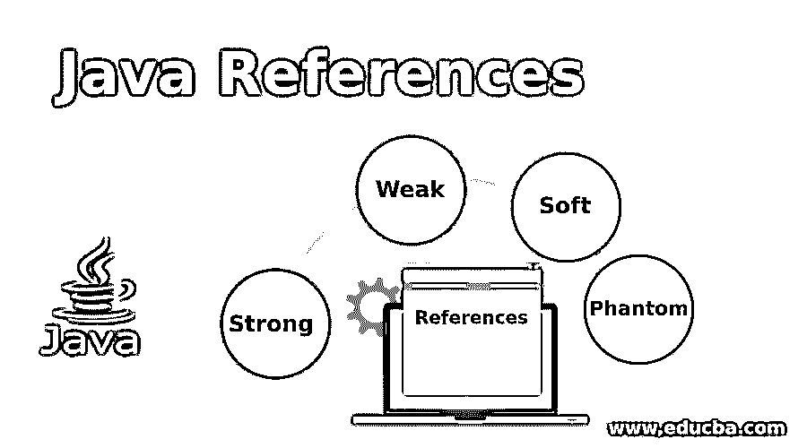
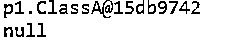
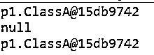
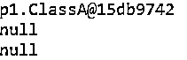

# Java 参考

> 原文：<https://www.educba.com/java-references/>




## Java 参考文献简介

Java 语言的优点之一是它自动管理内存，程序员不需要承担内存管理的负担，也不需要担心当对象不再需要时释放对象的内存。java 垃圾收集器线程为程序员完成这项工作；它在 JVM 的控制下清除不需要的对象并释放内存。程序员还可以通过使用 java.lang.ref 类来控制何时在需要时对对象进行垃圾收集。根据垃圾收集的方式或垃圾收集器对引用的行为，java 中有四种类型的引用。

### 带有示例的 Java 引用类型

根据垃圾收集器对引用的行为，有四种类型的 java 引用。

<small>网页开发、编程语言、软件测试&其他</small>

*   **强引用:**这是 java 中的默认引用。当对象被定期定义时，可以创建强引用。
*   **弱引用:**该引用将被明确指定。可以使用 java.lang.ref.WeakReference 类创建弱引用。
*   **软参照:**使用 lang.ref.SoftReference 类可以创建软参照。
*   **虚拟引用:**虚拟引用可以使用 lang.ref.PhantomReference 类创建。

#### 1.强引用

强引用通常是我们在编写 java 代码或创建对象时使用的。具有强引用并在内存中活动的对象不适合进行垃圾收集，具有指向 null 的强引用的对象可以进行垃圾收集。例如，下面的代码片段，其中变量 ob 是 ClassA 类型的对象。

```
ClassA ob = new ClassA();
```

“ob”对象具有指向类 ClassA 的强引用；由于 ob 是活动对象，因此不能对该对象进行垃圾回收。

如果参考“ob”指向 null，如下所示

```
ob = null;
```

现在该对象没有引用 ClassA 类；对象现在有资格进行垃圾回收。

##### 例子

**代码:**

```
package p1;
class ClassA
{
// something
}
public class Demo {
public static void main( String[] arg )
{
ClassA ob = new ClassA(); // default reference or Strong Reference
System.out.println(ob);
ob = null; // Now object <u>ob</u> pointing to null and is available for garbage collection
System.out.println(ob);
}
}
```

**输出:**




#### 2.弱引用

弱引用适合垃圾回收。一旦 JVM 检测到一个弱引用的对象，这个对象就会被标记，当垃圾收集器线程由 JVM 运行时，垃圾就会被收集。这些类型的引用在 WeakHashMap 中用于对象的条目。弱引用可以由 lang.ref.WeakReference 类创建。应用程序中可以使用的弱引用是建立 DBConnection，一旦数据库关闭，连接就会被垃圾收集器释放。例如，下面的代码片段，其中变量 ob 是 ClassA 类型的对象。

```
ClassA ob = new ClassA();
```

一个“ob”对象是一个强引用，要使它成为垃圾可收集的，我们需要将它的崇敬转化为弱引用，如下所示

```
WeakReference<ClassA> weakob = new WeakReference<ClassA>(ob);
```

现在，对象弱引用类 ClassA，对象现在可用于垃圾收集，并且当 JVM 运行垃圾收集线程时，它被垃圾收集。

##### 例子

**代码:**

```
package p1;
import java.lang.ref.WeakReference;
class ClassA
{
// something
}
public class Demo {
public static void main( String[] arg )
{
ClassA ob = new ClassA();  // default reference or Strong Reference
System.out.println(ob);
// now create Weak Reference object to which <u>ob</u> object is pointing
WeakReference <ClassA> weakob = new WeakReference <ClassA>(ob);
// Now <u>ob</u> object is eligible for garbage collection, but it will be remove from memory when JVM needs memory
ob = null;
System.out.println(ob);
// weakly referenced <u>ob</u> object can get back
ob = weakob.get();
System.out.println(ob);
}
}
```

**输出:**




#### 3.软引用

在 JVM 耗尽内存或 JVM 急需内存之前，软引用的对象没有资格进行垃圾收集。弱引用可以由 lang.ref.SoftReference 类创建。

```
SoftReference <ClassA> softob = new SoftReference <ClassA>(ob);
```

##### 例子

**代码:**

```
package p1;
import java.lang.ref.SoftReference;
class ClassA
{
// something
}
public class Demo {
public static void main( String[] arg )
{
ClassA ob = new ClassA();// default reference or Strong Reference
System.out.println(ob);
// now create soft Reference object which <u>ob</u> object is pointing
SoftReference <ClassA> softob = new SoftReference <ClassA>(ob);
// Now ob object is eligible for garbage collection, but it will be garbage collected when JVM badly needs memory
ob = null;
System.out.println(ob);
// the soft referenced, <u>ob</u> object can get back
ob = softob.get();
System.out.println(ob);
}
}
```

**输出:**


#### 4.幻像引用

幻影引用的对象可用于垃圾收集，但是在垃圾收集之前，对象被放入被 JVM 命名为‘引用队列’的引用队列中；对象上的 finalize()函数调用后。弱引用可以由 lang.ref. PhantomReference 类创建。

##### 例子

**代码:**

```
package p1;
import java.lang.ref.ReferenceQueue;
import java.lang.ref.PhantomReference;
class ClassA
{
// something
}
public class Demo {
public static void main( String[] arg )
{
ClassA ob = new ClassA();  // default reference or Strong Reference
System.out.println(ob);
// now Create Reference queue object
ReferenceQueue <ClassA> refq = new ReferenceQueue <ClassA>();
// Create Phantom Reference object to which <u>ob</u> object is pointing
PhantomReference <ClassA> phantomob = new PhantomReference <ClassA>(ob,refq);
// Now <u>ob</u> object is eligible for garbage collection, but it will be kept in '<u>refq</u>' before removing
ob = null;
System.out.println(ob);
// to get back object which has been Phantom referenced returns null
ob = phantomob.get();
System.out.println(ob);
}
}
```

**输出:**




### 推荐文章

这是一本 Java 参考指南。在这里，我们还讨论了 java 引用的介绍和类型，以及不同的例子和它们的代码实现。您也可以看看以下文章，了解更多信息–

1.  [Java 运行时类](https://www.educba.com/java-runtime-class/)
2.  [Java 控制台](https://www.educba.com/java-console/)
3.  [Java DatagramSocket](https://www.educba.com/java-datagramsocket/)
4.  [Java 模式类](https://www.educba.com/java-pattern-class/)


