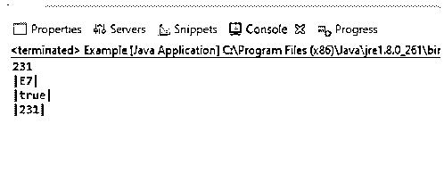
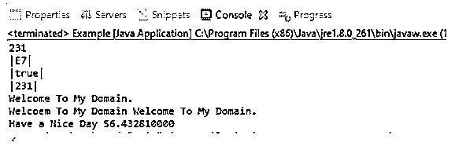
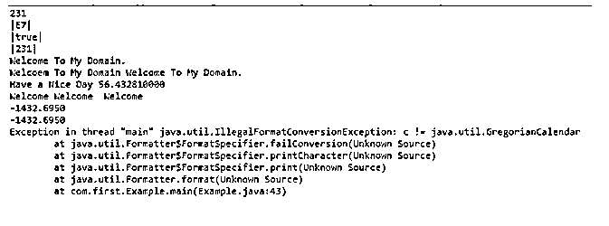

# Java 格式化程序

> 原文：<https://www.educba.com/java-formatter/>


## Java 格式化程序简介

Java formatter 是 java util 包类中的一个，可用于声明流输出格式的 final，而且它不能扩展，因为它是一个 final 类，可以用一些接口实现，如“可关闭和可刷新”接口。它有一些默认的预定义方法，如 close() 它将通过使用可关闭的接口进行扩展。该格式化程序类包将释放资源，这些资源将是代码中涉及的输入和输出包，主要是重要的概念，如打开文件 i/o 流等。最后，我们还使用 flush()方法来清除流和缓冲区。

**语法:**

<small>网页开发、编程语言、软件测试&其他</small>

java 有默认的包和它自己的方法，用于预定义和定制的方法，因此它将适用于项目中的用户需求。Likeweise java.util.formatter 有一些用于声明项目中默认方法的语法。

```
import java.util.*; // it will import all the util components if suppose we need formatter classes only         //means we will import that alone
public class{
public static void main(String[] args)
{
Formatter f=new Formatter();//create the instance for the formatter class
f.format(“%1$,.6f”);//example for the format() method arguments we can use any number of arguments based upon the requirements
---some java code logics-----
}
}
```

### Java 中格式化程序函数是如何工作的？

java 有用于创建对象的构造函数，只要我们没有在代码中指定任何构造函数，它就会自动调用默认的构造函数。在这种情况下，我们使用了相同的格式器构造函数来创建格式器类对象，并在逻辑中访问其功能。构造函数内存将在堆存储中使用，堆存储被分配用于存储和检索对象数据，因此它是一个可追加的缓冲区，但被显式地调用它的调用。Appendable 被称为它的一个接口，就像它自己对于对象创建和验证的意义一样，对于 char 和非 char 序列，它都是经过验证的 unicodes，它的值被附加到其他函数中。同样，我们有其他 java util 和 io 包类用于文件创建、访问文件、文件的读/写缓冲存储和数据，以及其他流功能，如输入、输出流和打印流对象。formatter()是创建 Formatter 对象的主要构造函数之一，也是 java util 包中的无参数构造函数之一。它可以通过默认的缓冲区创建自动操作，并与 StringBuilder 类一起使用，因此它通常与所有类型的其他构造函数一起使用。

格式化程序(Appendable a)构造函数有一些默认的参数，如 Appendable 接口，将用于指定格式化输出中的缓冲区数据存储。如果用户指定值，这取决于项目需求，但初始值为 null，因此将在 StringBuilder 类中自动创建对象，用于保存格式化的输出。如果我们可以使用格式化程序(Appendable a，Locale l ),参数将根据构造函数而变化。相同的构造函数名称有两个以上的参数可追加，并且 Locale locale 是区域级对象之一，由于此对象实例，输出数据格式将根据用户指定的区域而按区域排列。如果假设用户没有提及区域设置区域，它将采用默认区域设置，主要是根据地理政治或地理区域，基于文化敏感性数据(如格式化日期和时间)来定制输出，区域设置对象值将是与构造函数分隔的值的小数点。使用 Formatter(File f)构造函数的文件实例也作为参数被传递到构造函数中。它将与一些特殊字符一起使用，如运算符(%)，后跟字符 S%S，%S，%c 等，这些是用于在项目中利用 Java API 的格式化程序。

### Java 格式化程序的示例

下面是一些例子:

#### 示例#1

**代码:**

```
package com.first;
public class Example {
public static void main(String[] args) {
String s = String.format("%S", 231);
String s1 = String.format("|%X|", 231);
String s2 = String.format("|%b|", 231);
String s3 = String.format("|%d|", 231);
String s4 = String.format("|%-5d|", 231);
String s5 = String.format("|%5d|", 231);
String s6 = String.format("|%c|", 231);
String s7 = String.format("|%b|", 231);
System.out.println(s);
System.out.println(s1);
System.out.println(s2);
System.out.println(s3);
}
}
```

**输出:**




#### 实施例 2

**代码:**

```
package com.first;
import java.util.*;
public class Example {
public static void main(String[] args) {
String s = String.format("%S", 231);
String s1 = String.format("|%X|", 231);
String s2 = String.format("|%b|", 231);
String s3 = String.format("|%d|", 231);
String s4 = String.format("|%-5d|", 231);
String s5 = String.format("|%5d|", 231);
String s6 = String.format("|%c|", 231);
String s7 = String.format("|%b|", 231);
String st1 = "Welcome To My Domain.";
System.out.println(s);
System.out.println(s1);
System.out.println(s2);
System.out.println(s3);
String st2 = String.format("Welcome To My Domain %s", st1);
String st3 = String.format("Have a Nice Day %.9f", 56.43281);
String st4 = String.format("Good Day user %19.7f", 56.43281);
System.out.println(st1);
System.out.println(st2);
System.out.println(st3);
Formatter f=new Formatter();
f.format("%2$5s %4$5s %2$8s", "User",
"Welcome", "To My Domain");
System.out.println(f);
}
}
```

**输出:**




#### 实施例 3

**代码:**

```
package com.first;
import java.util.*;
import java.util.GregorianCalendar;
public class Example {
public static void main(String[] args) {
String s = String.format("%S", 231);
String s1 = String.format("|%X|", 231);
String s2 = String.format("|%b|", 231);
String s3 = String.format("|%d|", 231);
String s4 = String.format("|%-5d|", 231);
String s5 = String.format("|%5d|", 231);
String s6 = String.format("|%c|", 231);
String s7 = String.format("|%b|", 231);
String st1 = "Welcome To My Domain.";
System.out.println(s);
System.out.println(s1);
System.out.println(s2);
System.out.println(s3);
String st2 = String.format("Welcome To My Domain %s", st1);
String st3 = String.format("Have a Nice Day %.9f", 56.43281);
String st4 = String.format("Good Day user %19.7f", 56.43281);
System.out.println(st1);
System.out.println(st2);
System.out.println(st3);
Formatter f=new Formatter();
f.format("%2$5s %2$5s %2$8s", "User",
"Welcome", "To My Domain");
System.out.println(f);
StringBuilder sb=new StringBuilder();
Formatter f1=new Formatter(sb);
f1.format(Locale.JAPAN,"%.4f", -1432.695);
System.out.println(f1);
Formatter f2=new Formatter();
f2.format(Locale.US, "%.4f", -1432.695);
System.out.println(f2);
Formatter f3=new Formatter();
f3.format(Locale.GERMANY,"%1$te %1$cB, %2$tY",
Calendar.getInstance());
System.out.println(f3);
Formatter f4=new Formatter();
f4.format(Locale.CANADA,"%3$te %2$tB, %1$cY",
Calendar.getInstance());
System.out.println(f4);
}
}
```

**输出:**




### 结论

java formatter 实用程序类将用于不同的大洲地区，如果它依赖于基于 web 的应用程序，用户将访问这些应用程序。当我们使用格式化程序时，它通常不是线程安全的，所以单个用户将被访问，而且不适用于多线程概念。

### 推荐文章

这是一个 Java 格式化程序的指南。在这里，我们还讨论了 java 中的格式器函数的介绍和工作原理。以及不同的示例及其代码实现。您也可以看看以下文章，了解更多信息–

1.  [JavaScript object.is()](https://www.educba.com/javascript-object-is/)
2.  [Java array.push](https://www.educba.com/java-array-push/)
3.  [JavaScript 动画](https://www.educba.com/javascript-animation/)
4.  [Java 认证器](https://www.educba.com/java-authenticator/)


