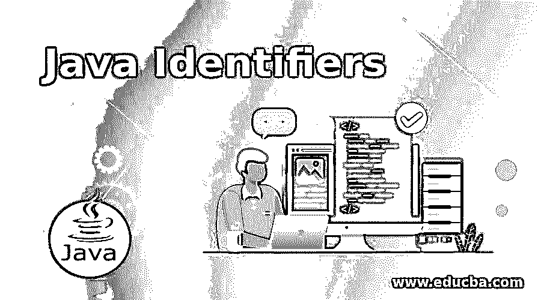
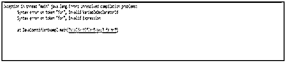

# Java 标识符

> 原文：<https://www.educba.com/java-identifiers/>




## Java 标识符的定义

在 Java 中，标识符被认为是一个或多个字符的序列，有助于命名变量、方法、类等。为了创建标识符，有一些特定的规则。除此之外，某些字符序列如关键字、保留字、文字不能用作标识符，因为它们在 Java 中有预定义的含义。让我们在下一节看看创建标识符的基本规则。

### Java 标识符的规则

如前所述，Java 标识符必须遵循相同的创建规则。如果不遵守这些规则，可能会出现编译时错误。规则解释如下。

<small>网页开发、编程语言、软件测试&其他</small>

*   **规则#1:** 标识符不能与保留字相同。这些保留字可以是关键字或文字。以下是 Java 中可用的关键字。

| 摘要 | 维护 | 布尔代数学体系的 | 破裂 | 字节 |
| 情况 | 捕捉 | 茶 | 班级 | 常数 |
| 继续 | 默认 | 做 | 两倍 | 其他 |
| 列举型别 | 延伸 | 最后的 | 最后 | 漂浮物 |
| 为 | 转到 | 如果 | 工具 | 进口 |
| instanceof | （同 Internationalorganizations）国际组织 | 连接 | 长的 | 当地的 |
| 新的 | 包裹 | 私人的 | 保护 | 公众的 |
| 返回 | 短的 | 静态 | strictfp | 极好的 |
| 转换 | 同步的 | 这 | 扔 | 投 |
| 短暂的 | 尝试 | 空的 | 不稳定的 | 在…期间 |

这里，尽管 const 和 goto 不是 Java 语言的一部分，但它们被认为是关键字。

*   **规则#2:** 标识符不能是诸如 null、true 和 false 之类的单词，因为它们是文字。
*   规则#3: 标识符区分大小写。此外，某些其他规则是关于在某些情况下使用用例的，即使编译器并不强制这样做。也就是说，Java 更喜欢使用 CamelCase，而不是使用 _(下划线)，其中两个连续单词的第一个字母将大写。
*   对于接口名和类名，名称以大写字母开始，随后是小写字母。如前所述，如果使用了多个单词，则必须遵循 CamelCase。

**示例:**样本类，雇员

同时，在变量名和方法名的情况下，遵循小写。与上述情况类似，如果使用多个单词，将遵循 camel case。

**示例:**数字，我的数字

在常量的情况下，建议全部使用大写或者使用 _(下划线)来分隔单词。

**示例:**布尔型

*   **规则 4:** 即使标识符可以包含数字[0-9]，字母[A-Z] [a-z]等。，它应该以一个字母或符号开头，如$(美元)或 _(下划线)。在任何情况下，它都不应该以数字开头。
*   规则 5: 标识符中不允许有空格。
*   **规则 6:** 不允许使用@、#等符号。
*   **规则七:**自？(问号)是保留字，不能用作标识符。
*   **规则 8:** 尽管标识符长度没有任何限制，但建议标识符的最佳长度应为 4-15。

无效标识符的例子及其原因。

| **无效标识符** | **无效的原因** |
| 尝试 | 尝试是一个关键词。[第一条规则] |
| 空 | Null 是 Java 中的文字之一。[第二条规则] |
| 安娜 | 标识符不应以数字开头。[第 4 条] |
| 快乐@ | 既然@是特殊字符，就不能用。[第 6 条] |
| num？ | 自从？是保留字，不能用。[第 7 条] |
| num 1； | 标识符不应包含空白。[第 5 条] |

### 带有示例的 Java 标识符

通常，许多人认为标识符只是变量。但事实是，标识符可以是类名、包名、方法名等。例如，让我们看看下面的代码。

```
public static void main(String args[]) {
// variable declaration
int number = 13;
```

这里，代码中的每一个单词都被认为是一个标识符。但是正如我们的规则 1 所说，关键字不能用作标识符。这是因为关键字和文字已经被预定义了。

假设一个程序定义了一个关键字作为标识符，如下所示，我们正在尝试编译它。会发生什么？

```
public class JavaIdentifierExampl {
//main method
public static void main(String args[]) {
// variable declaration
int for = 13;
System.out.println("value of the number variable is : "+ for);
}
}
```

**输出:**




在上面的输出示例中，发生了一个异常。这是因为在程序中使用了关键字 for。同时，让我们在上面的程序中使用一个预定义的方法名 main 来代替 for。

```
//Java program with an identifier which do not have any whitespace
public class JavaIdentifierExampl {
//main method
public static void main(String args[]) {
// variable declaration
int main = 13;
System.out.println("value of the number variable is : "+ main);
}
}
```

**输出:**


如你所见，执行代码时没有任何错误。因为标识符可以是预定义的方法名、类名等。，但是预定义的关键字和文字不能以相同的方式使用。

现在，让我们看看一些有效的标识符和基于它的 java 程序。

#### 示例#1

标识符不是关键字或文字的 Java 程序。

**代码:**

```
//Java program with an identifier which is not keyword or literal
public class JavaIdentifierExampl {
//main method
public static void main(String args[]) {
// variable declaration
int number = 25;
System.out.println("value of the number variable is : "+number);
}
}
```

**输出:**


#### 实施例 2

一个标识符没有任何空格的 Java 程序。

**代码:**

```
//Java program with an identifier which do not have any whitespace
public class JavaIdentifierExampl {
//main method
public static void main(String args[]) {
// variable declaration
int number_23 = 125;
System.out.println("value of the number variable is : "+number_23);
}
}
```

**输出:**


#### 实施例 3

标识符以$开头的 Java 程序。

**代码:**

```
//Java program with an identifier that starts with $
public class JavaIdentifierExampl {
//main method
public static void main(String args[]) {
// variable declaration
int $number_23 = 20;
System.out.println("value of the number variable is : "+ $number_23);
}
}
```

**输出:**


### 推荐文章

这是一个 Java 标识符指南。这里我们还讨论了 java 标识符的定义和规则，以及不同的例子和它们的代码实现。您也可以看看以下文章，了解更多信息–

1.  [Java 中的 JSON](https://www.educba.com/json-in-java/)
2.  [Java 模式类](https://www.educba.com/java-pattern-class/)
3.  [Java 目录](https://www.educba.com/java-directories/)
4.  [Java 中的线程组](https://www.educba.com/threadgroup-in-java/)


