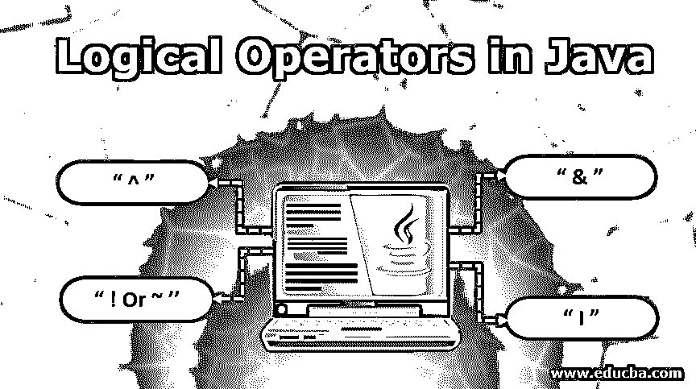
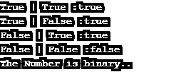
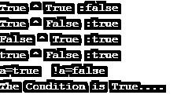
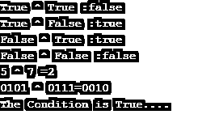

# Java 中的逻辑运算符

> 原文：<https://www.educba.com/logical-operators-in-java/>




## Java 中的逻辑运算符简介

逻辑运算符用于对一个或两个变量执行运算，以评估和检索逻辑结果。通常，逻辑运算的返回值是布尔格式的，并且应用于程序中以在程序的执行流中建立更好的控制。在 Java 中，使用的逻辑运算符是' & '执行 AND 运算，' | '执行 or 运算，'！'用于非运算，'^'用于异或运算。

### Java 中逻辑运算符的特点

*   [逻辑运算符用于](https://www.educba.com/logical-operators-in-c-sharp/)控制执行流程。
*   布尔逻辑运算符总是返回布尔值。
*   这些运算符应用于一个或多个布尔操作数。
*   Java 提供了 4 个逻辑运算符“&”、“|”、“！”或者“~”和“^".”

让我们考虑下表中对特定输入的每个操作的结果。

<small>网页开发、编程语言、软件测试&其他</small>

| **答** | **B** | **甲&乙** | **A&#124;B** | **A^B** | **！A 或~A** |
| **真(1)** | 真实(1) | 真实(1) | 真实(1) | False (0) | False (0) |
| **真(1)** | False(0) | False(0) | 真实(1) | 真实(1) | False(0) |
| **假(0)** | 真实(1) | False(0) | 真实(1) | 真实(1) | 真实(1) |
| **假(0)** | False(0) | False(0) | False(0) | False(0) | 真实(1) |

### Java 中不同的逻辑运算符及其描述

下表显示了运算符及其说明。

| **操作员** | **意为** | **描述** |
| **&T1】** | 逻辑与 | 如果两个输入都为真，则结果为真；如果任何人输入是假的，结果也将是假的。 |
| **&#124;** | 逻辑或 | 如果任何输入为真，则结果为真。如果两个输入都为假，结果将为假。 |
| ！或者 **~** | 逻辑非 | 逻辑 NOT 是一元运算符；它只对单个操作数进行操作。它总是输出输入值的负值。 |
| **^** | 逻辑异或 | 如果任何一个输入为真，则结果为真。如果两个输入相同，结果将为假。 |

#### 1.逻辑与运算符“&”

逻辑“&”运算符执行数字“与”运算。这个操作符作用于两个布尔操作数，结果将是布尔型的。由符号“&”或“&&”表示的操作符，即短路和操作。

**Note:** in simple & operation, it checks both operands’ values, i.e. Operand1 & Operand 2\. In short circuit AND operation && it checks the value of the first Operand1 later it will go with the value of operand 2 if and only if operand 1 value is true.

**语法:**

```
Operand1 & Operand2
```

Operand1 和 Operand2 是任意布尔值。

**输出:**

1.  **真**:当且仅当两个操作数值都为真时，结果为真。
2.  **假:**任一操作数值为假时，结果为假。如果两个值都为假。

**与的真值表:**

| **答** | **B** | **甲&乙** |
| **假(0)** | FALSE (0) | FALSE (0) |
| **假(0)** | 真实(1) | FALSE (0) |
| **真(1)** | FALSE (0) | FALSE (0) |
| **真(1)** | 真实(1) | 真实(1) |

##### AND 运算符的示例

```
package com.java.demo;
public class DemoAND
{
public static void main(String[] args)
{
boolean a=true;
boolean b=false;
int num1=0;
int num2=1;
boolean out1=(a & a);
boolean out2=(a & b);
boolean out3=(b & a);
boolean out4=(b & b);
System.out.println("True & True :"+out1);
System.out.println("True & False :"+out2);
System.out.println("False & True :"+out3);
System.out.println("False & False :"+out4);
if(num1 ==0  & num2 == 1)
{
System.out.println("The Condition is True....");
}
}
}
```

**输出:**


#### 2.逻辑或运算符“|”

java 中的逻辑 or 运算符用于在 java 中执行实际的数字 OR 运算。该运算符与两个布尔操作数一起使用，结果将为布尔型，即 true 或 False。在 java 中，逻辑 or 运算符用符号“|”(简单 OR)或“||”(短路 OR)表示。

**Note:** Java uses two Logical OR operations, simple OR – “|” and Short circuit OR – “||”.in simple logical OR operation, both operand values are checked, and depending on the values it gives the result.in Short Circuit OR operation “||” it checks the value of the first operand, i.e. Operand1, and then checks the value of the second operand, i.e. operand2 either operand1 value is true or false.

**语法:**

```
Operand1 || Operand2
```

Operand1 和 Operand2 是任意布尔值。

**输出:**

*   **真:**如果两个操作数值都为真。假设任何一个操作数值为真。
*   **假:**如果两个操作数值都为假。

**OR 的真值表:**

| A | B | A &#124;B |
| **假(0)** | FALSE (0) | FALSE (0) |
| **假(0)** | 真实(1) | 真实(1) |
| **真(1)** | FALSE (0) | 真实(1) |
| **真(1)** | 真实(1) | 真实(1) |

##### OR 运算符的示例

```
package com.java.demo;
public class DemoOR
{
public static void main(String[] args)
{
boolean a=true;
boolean b=false;
int num=0;
boolean out1=(a | a);
boolean out2=(a | b);
boolean out3=(b | a);
boolean out4=(b | b);
System.out.println("True | True :"+out1);
System.out.println("True | False :"+out2);
System.out.println("False | True :"+out3);
System.out.println("False | False :"+out4);
if(num == 0 | num == 1)
{
System.out.println("The Number is binary..");
}
}
}
```

**输出:**




#### 3.逻辑非运算符"！"或者“~”

逻辑非运算符在 java 中执行实际的数字非运算，即输入值的求反。此逻辑运算符是一元逻辑运算符；它只与一个操作数一起使用。在 java 中，逻辑 NOT 运算符用符号“！”表示或者“~”。简单的使用！运算符是对输入值求反。例如，input，True 使其为 False，或者如果 input 为 False 则使其为 True。

**语法:**

```
!Operand or ! Condition
```

操作数保存任何布尔值。条件是任何布尔值，即任何逻辑运算的结果。

**结果:**

*   **真:**如果输入值为假，结果为真。
*   **假** **:** 如果输入值为真，结果为假。

**非真值表:**

| **答** | **！答** |
| **假(0)** | 真实(1) |
| **真(1)** | FALSE (0) |

##### NOT 运算符的示例

```
public class DemoNOT
{
public static void main(String[] args)
{
boolean a=true;
boolean b=false;
int num1=0;
int num2=1;
boolean out1=(a ^ a);
boolean out2=(a ^ b);
boolean out3=(b ^ a);
boolean out4=(!b ^ b);
System.out.println("True ^ True :"+out1);
System.out.println("True ^ False :"+out2);
System.out.println("False ^ True :"+out3);
System.out.println(!b+" ^ False :"+out4);
System.out.println("a=true  !a="+!a);
if(!(num1 ==0)  ^ (num2 == 1))
{
System.*out*.println("The Condition is True....");
}
}
}
```

**输出:**




#### 4.逻辑异或运算符“^.”

逻辑异或运算符是异或运算符的简称。这个[逻辑运算符](https://www.educba.com/logical-operators-in-python/)是当我们必须检查或比较任何一个操作数的值为真时，那么输出为真。在 Java 中，逻辑异或用符号“^”来表示。该运算符是二元逻辑运算符，即可以与两个操作数/条件一起使用。输出这个运算符也是一个布尔值。

**语法:**

```
Operand1 ^  Operand2 or Condition1 ^ Condition2
```

操作 1 和操作 2 保存任何布尔值。条件 1 和条件 2 保存任何布尔值，即输出任何逻辑运算。

**输出:**

*   **真:**如果任何一个输入为真，结果为真。
*   **假:**如果两个输入相同，结果为假。

**异或的真值表:**

| **答** | **B** | **甲^乙** |
| **假(0)** | FALSE (0) | FALSE (0) |
| **假(0)** | 真实(1) | 真实(1) |
| **真(1)** | FALSE (0) | 真实(1) |
| **真(1)** | 真实(1) | FALSE (0) |

##### XOR 运算符示例

```
public class DemoXOR
{
public static void main(String[] args)
{
boolean a=true;
boolean b=false;
int num1=0;
int num2=1;
int num3=5;
int num4=7;
boolean out1=(a ^ a);
boolean out2=(a ^ b);
boolean out3=(b ^ a);
boolean out4=(b ^ b);
System.out.println("True ^ True :"+out1);
System.out.println("True ^ False :"+out2);
System.out.println("False ^ True :"+out3);
System.out.println("False ^ False :"+out4);
System.out.println("5 ^ 7 ="+(num3 ^ num4));
System.out.println("0101 ^ 0111=0010");
if((num1 ==2)  ^ (num2 == 1))
{
System.out.println("The Condition is True....");
}
}
}
```

**输出:**




### 结论

它使 java 代码更加强大和灵活。在条件语句或者循环语句中使用[逻辑运算符](https://www.educba.com/logical-operators-in-javascript/)看起来非常干净。逻辑运算符最重要的好处是它降低了代码的复杂性。例如，它减少了 if…else 条件语句的数量。这间接有利于代码编译、运行时间等。…整体代码性能得到提高。

### 推荐文章

这是一本关于 Java 中逻辑运算符的指南。这里我们结合实例讨论 java 中的简介和不同的逻辑运算符，即 and、OR、NOT、XOR。您也可以阅读以下文章，了解更多信息——

1.  [JavaFX 库](https://www.educba.com/javafx-libraries/)
2.  [JavaFX FlowPane](https://www.educba.com/javafx-flowpane/)
3.  [Java 8 特性](https://www.educba.com/java-8-features/)
4.  [Java Swing 中的定时器](https://www.educba.com/timer-in-java-swing/)


