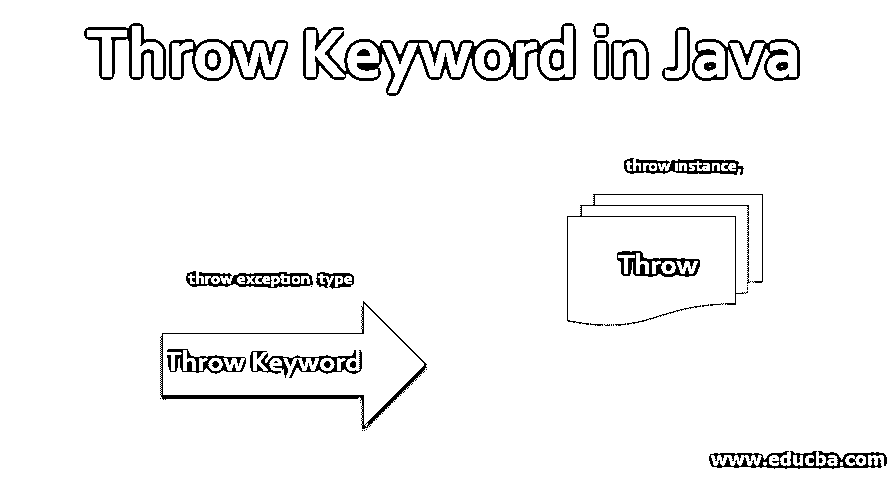
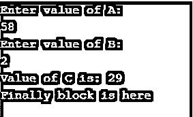
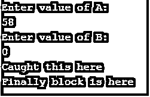
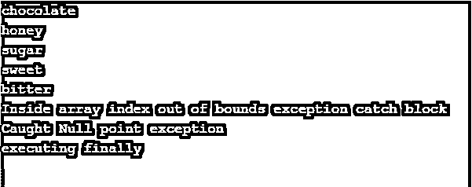
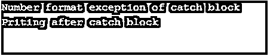
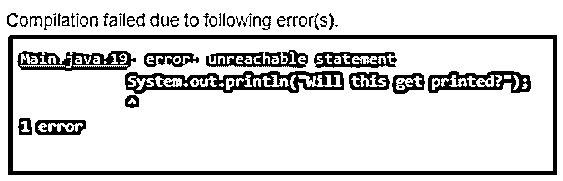

# 在 Java 中抛出关键字

> 原文：<https://www.educba.com/throw-keyword-in-java/>




## Java 中 Throw 关键字的介绍

这个 Throw 关键字主要用于异常处理的概念中。顾名思义，throw 关键字就是从程序中抛出一个异常给编译器。异常是指在代码运行过程中，如果出现任何不一致，编译器就会从程序中弹出的一种错误。通过使用这个 throw 关键字，我们可以通过解释程序运行时的任何错误原因来定义我们的异常。

下面让我们来看看它的更多细节:

<small>网页开发、编程语言、软件测试&其他</small>

**语法**

java 中 throw 的语法如下:

```
throw exception_type ;
```

或者

```
throw instance;
```

### 在 Java 中使用 Throw 关键字

在这里，我们可以通过一个例子来检查该关键字实际上是如何使用的，并了解该流程是如何工作的。

```
import java.util.Scanner;
public class Main
{
public static void main(String[] args) {
int c;
Scanner sc = new Scanner(System.in);
System.out.println("Enter value of A: ");
int a = sc.nextInt();
//Scanner b = new Scanner(System.in);
System.out.println("Enter value of B: ");
int b = sc.nextInt();
try {
c= a/b;
if(b==0)
{
throw new ArithmeticException();
}
System.out.println("Value of C is: " +c);
}
catch(ArithmeticException e) {
System.out.println("Caught this here");
}
finally {
}
System.out.println("Finally block is here");
}
} Let’s deal with this with a classic and simple example of division by zero.
```

**分析下面的代码:**

*   首先，我们将扫描仪模块导入到[中，获取用户输入的](https://www.educba.com/java-user-input/)值。
*   我们读取两个数字，即‘A’和‘B’，它们作为输入提供给用户。
*   我们声明了一个变量“C”来存储数“A”除以“B”后的商的值。
*   由于用户可以随机给出数字，我们可以考虑这样一种情况，用户可以给出的除数为零。
*   接受这种情况，我们在 try 块中编写我们的部门代码。
*   写一个条件，如果 B 的值为零，那么我们抛出一个异常。
*   Try 后面总是跟着一个 catch 块。
*   因此，这里我们提到了我们使用关键字 throw 的新命令定义的异常。
*   同样的异常出现在 catch 和，我们只是在下面打印了一条语句，以便清楚地理解获得 try、throw、catch 和 finally 的流程。
*   最后，我们声明我们的 finally 块。众所周知，这个块中的语句肯定会执行。

让我们检查下面的输出。

**输出 1:** 如果 b 值不为零。




我们可以清楚地看到，因为“B”值不为零，所以没有执行 try、throw 和 catch 块。最后，不管异常是否创建，块都会被执行。

**输出 2:** 如果 b 值为零。




突出显示的部分确保异常被抛出并被 catch 块成功捕获。

所以，我们来看下面一个例子。

**举例:**

让我们看看如何在一个程序中抛出多个异常。

```
public class Main
{
public static void main(String[] args) {
String sun[] = {"chocolate", "honey", "sugar", "sweet", "bitter"};
String h = null;
try {
for (int i=0; i<=7; i++)
{
if(i > sun.length)
{
throw new ArrayIndexOutOfBoundsException();
}
System.out.println(sun[i]);
}
}
catch(ArrayIndexOutOfBoundsException ae)
{
System.out.println("Inside array index out of bounds exception catch block");
}
try{
sun[0]=h;
if (sun[0] == null)
{
throw new NullPointerException();
}
System.out.println("Value of sun[0] is: " +sun[0]);
}
catch(NullPointerException f)
{
System.out.println("Caught Null point exception");
}
finally {
System.out.println("executing finally");
}
}
} Above, we have used two different types of exceptions and used throw keyword to interpret the program. Array index out of bound and Null pointer exception is what we used here in a single program.
```

**输出:**




### 投掷的重要性

这个 throw 关键字将帮助我们充当 try 和 catch 块之间的桥梁。这将有助于将程序的控制权从 try 块转移到 catch 块。

让我向您展示一个程序在使用和不使用 throw 关键字的情况下如何工作的例子。

```
public class Main
{
public static void main(String[] args) {
try {
int a = Integer.parseInt ("Happy") ;
System.out.println("Will this get printed?");
} catch(NumberFormatException e) {
System.out.println("Number format exception of catch block");
}
System.out.println("Priting after catch block");
}
} We have written code without the throw keyword. But we used the code to try and catch block, which is in the fact going to handle the exception. So, do you know the output of the above?
```




预期对吗？因此，它执行了代码，发现了一个异常，并捕获了该异常。

现在，当我们插入 throw 语句时，代码是如何工作的呢？下面来看看。

```
public class Main
{
public static void main(String[] args) {
try {
int a = Integer.parseInt ("Happy") ;
throw new NumberFormatException();
System.out.println("Will this get printed?");
} catch(NumberFormatException e) {
System.out.println("Number format exception of catch block");
}
System.out.println("Priting after catch block");
}
}
```

只有高亮显示的部分是上面两个代码之间的变化。

**输出:**




是的，我们有一个编译错误，因为 throw 关键字后面的 print 语句不可达。我们希望您通过这个例子理解了“将控制权从 try to catch 块转移”的确切含义。

作为练习，试着删除 throw 关键字后的 print 语句，检查程序的反应。

### 结论

这就是异常处理时 throw 命令的作用。请注意 THROW 和 THROWS 关键字之间有很大的区别。两者都与异常的概念一起使用。我们已经知道了“THROW”关键字的概念，以及如何使用和在哪里使用。只是练习，尝试用不同的方式使用它。不断学习。

### 推荐文章

这是一个在 Java 中抛出关键字的指南。这里我们讨论 Java 的简介、工作原理以及 Throw 关键字在 Java 中的重要性。您也可以浏览我们推荐的其他文章，了解更多信息——

1.  [Java 中受保护的关键字](https://www.educba.com/protected-keyword-in-java/)
2.  [JavaScript 中的 For 循环](https://www.educba.com/for-loop-in-javascript/)
3.  [Java 中的 While 循环](https://www.educba.com/while-loop-in-java/)
4.  [Java 中的 Continue 语句](https://www.educba.com/continue-statement-in-java/)


