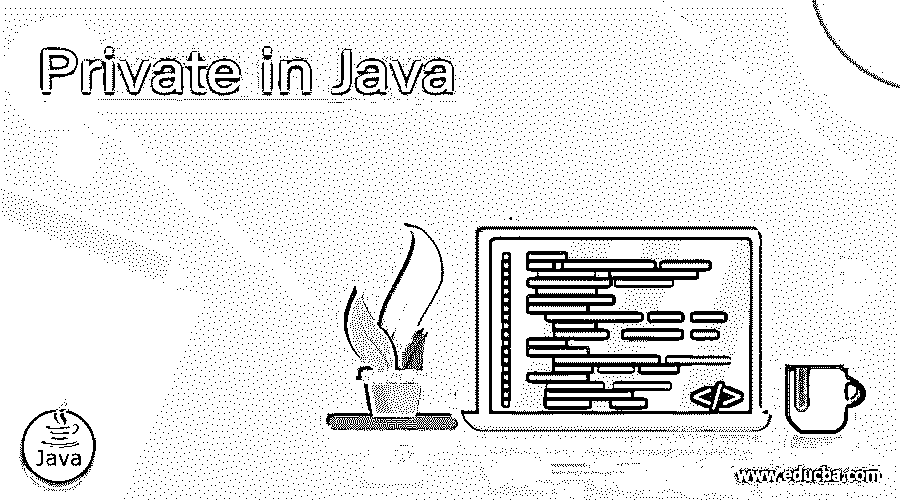
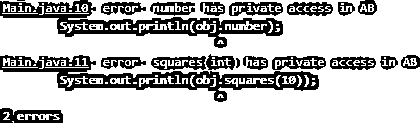

# Java 私有

> 原文：<https://www.educba.com/private-in-java/>




## Java 私有语言简介

java 中的关键字“private”用于限制 Java 代码块中的类、方法或变量的可访问性。如果一个类、方法或变量在程序中被命名为私有，这意味着一个特定的类、方法或变量不能被该类或方法外部访问，这与公共方法不同。Private 关键字通常在 Java 的完全封装类中使用。

### Private 关键字在 Java 中是如何工作的？

Java 中的 Private 关键字在特定的类中起作用。不能在类外访问它。它在类/类和接口/接口之外不起作用。如果类的成员是私有的，Private 关键字就能很好地工作，在完全封装的类中也是如此。Private 关键字、变量或方法也可以使用一些访问修饰符来调用类外部的私有方法，从而覆盖到子类/类。这样，Private 关键字也可以在类之外使用 Private 访问修饰符工作。

<small>网页开发、编程语言、软件测试&其他</small>

### 例子

下面是一些私有修饰符的例子，如下所示:

#### 示例#1

这里我们举例说明了私有访问修饰符的例子，它显示了由于从 AB 类访问私有数据成员而导致的编译错误，如下例所示。私有方法或私有成员只能在特定的类中访问。

**代码:**

```
class AB{
private double number = 100;
private int squares(int a){
return a*a;
}
}
public class Main{
public static void main(String args[]){
AB obj = new AB();
System.out.println(obj.number);
System.out.println(obj.squares(10));
}
}
```

**输出:**




#### 实施例 2

这是一个说明 PRIVATE 关键字在以下程序中的用法的示例:

**代码:**

```
class Emp{
private int id1;
private String name14;
private int age14;
public int getId1() {
return id1;
}
public void setId(int id1) {
this.id1 = id1;
}
public String getName14() {
return name14;
}
public void setName14(String name14) {
this.name14 = name14;
}
public int getAge14() {
return age14;
}
public void setAge14(int age14) {
this.age14 = age14;
}
}
public class Main{
public static void main(String args[]){
Emp e=new Emp();
e.setId(1473);
e.setName14("Pavan Kumar Sake");
e.setAge14(24);
System.out.println(e.getId1()+" "+e.getName14()+" "+e.getAge14());
}
}
```

**输出:**


#### 实施例 3

在这个例子中，您可以看到如何使用默认的访问修饰符将私有方法覆盖到子类。我们甚至不允许从子类中调用父类方法。

**代码:**

```
class ABC{
private void msg()
{
System.out.println("Hey Buddy this is the parent class method"); //Output of the Private Method
}
}
public class Main extends ABC{ // Private method is overridden using the access modifier
void msg()
{
System.out.println("Buddy this is the child class method");
}
public static void main(String args[]){
Main obj=new Main();
obj.msg();
}
}
```

**输出:**


#### 实施例 4

在这个例子中，我说明了私有方法不能在类之外调用。现在，私有方法通过改变类的运行时行为从外部类调用。

**代码:**

```
import java.lang.reflect.Method;
class ABC {
private void display()
{
System.out.println("Hey Now private method is invoked/Called");
}
}
public class Main{
public static void main(String[] args)throws Exception{
Class d = Class.forName("ABC");
Object p= d.newInstance();
Method n =d.getDeclaredMethod("display", null);
n.setAccessible(true);
n.invoke(p, null);
}
}
```

**输出:**


#### 实施例 5

这是 Java 编程语言中私有方法和字段的一个例子。这里，私有方法在编译时使用静态绑定，甚至不能被覆盖。不要与私有变量输出混淆，因为私有变量实际上可以在内部类中访问。如果私有变量在类外被调用，编译器肯定会产生一个错误。

**代码:**

```
public class Main {
private String i_m_private1 = " \n Hey Buddy I am a private member and i am not even accessible outside of this Class";
private void privateMethod1() {
System.out.println("Outer Class Private Method");
}
public static void main(String args[]) {
Main outerClass = new Main();
NestedClass nestc = outerClass.new NestedClass();
nestc.showPrivate(); //This syntax shows private method/methods are accessible inside the class/inner class.
outerClass = nestc;
nestc.privateMethod1(); //It don't call/invoke private method from the inner class because
// you can not override the private method inside the inner class.
}
class NestedClass extends Main {
public void showPrivate() {
System.out.println("Now we are going to access Outer Class Private Method: " + i_m_private1);
privateMethod1();
}
private void privateMethod1() {
System.out.println("Nested Class's Private Method");
}
}
}
```

**输出:**


### 优势

下面我们将解释在 Java 中使用私有方法/字段的优势。

*   它也适用于 Java 编程语言中的方法、字段和内部类。
*   我们不能将 private 赋给外部接口或类。
*   在 Java 编程语言中，顶级类总是不能是私有的。
*   当然，我们知道私有变量或私有方法在 java 类之外是不可访问的，但是它们可以通过使用 setAccessible(true)的反射和改变私有可见性以另一种方式被访问。
*   在 Java 编程语言中，这个方法不能被覆盖，甚至不能在内部类中覆盖。
*   私有成员[允许 Java 虚拟机](https://www.educba.com/java-virtual-machine/)和编译器对其进行优化，以获得更好的性能。

### Java 中私有构造函数的规则和规范

这里有一些你应该知道的私人规则和条例。

*   如果类包含[私有构造函数](https://www.educba.com/private-constructor-in-java/)，你就不能从外部类创建这个特定类的任何对象。
*   您不应该在类外部访问私有关键字。如果你尝试，它会产生一个编译错误。为此，您必须修改代码。
*   在这种 java 语言中，顶级类不能是私有的。

### 结论

在主题的最后，我们很高兴知道在 Java 中使用 Private 关键字是多么的有用和简单。在本文中，我希望你理解私有关键字、私有变量、访问修饰符、私有构造函数，以及如何在程序中使用这些私有关键字。

### 推荐文章

这是一个 java 私有构造函数的指南。这里我们讨论 java 的基本概念、工作原理、优点、规则和私有规则以及它们的例子和实现。您也可以阅读以下文章，了解更多信息——

1.  [Java 中的这个关键字](https://www.educba.com/this-keyword-in-java/)
2.  [Java 中的原生关键字](https://www.educba.com/native-keyword-in-java/)
3.  [JavaFX 进度条](https://www.educba.com/javafx-progressbar/)
4.  [Java 中的嵌套类](https://www.educba.com/nested-class-in-java/)


