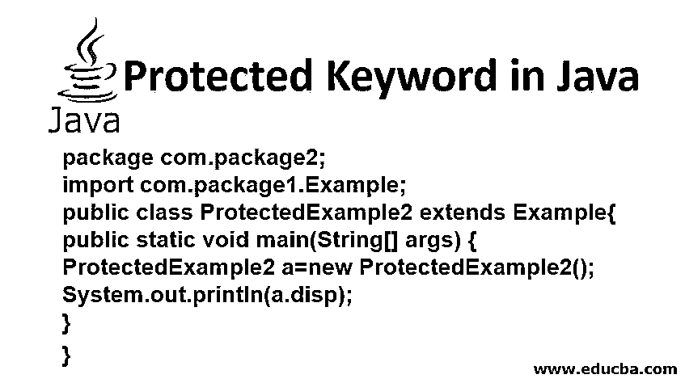
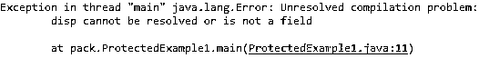
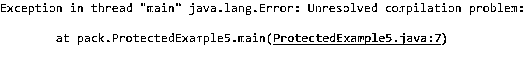
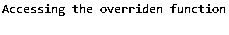

# Java 中受保护的关键字

> 原文：<https://www.educba.com/protected-keyword-in-java/>




## Java 中受保护关键字概述

受保护的关键字是用于限制变量、方法和构造函数的访问范围的关键字。它是 Java 中[访问修饰符](https://www.educba.com/access-modifiers-in-java/)的类型之一。它们用于区分方法、变量、构造函数和类的范围。Java 中有 4 种类型的访问修饰符，它们是:

1.  **默认关键字:**只能在包内访问，不能在包外调用。顾名思义，当没有提到访问说明符时，它被自动指定为缺省值。
2.  ****公共关键字:**** 它们可以从程序中的任何地方访问。这意味着它可以在相同或不同的类以及相同或不同的包中使用。
3.  ****私有关键字:**** 它们通过不允许从类本身之外的任何地方访问关键字，将关键字限制到一个更高的级别。
4.  ****受保护关键字:**** 在本文中，我们将了解更多关于受保护关键字的知识。

一旦变量或方法被标记为受保护，它只能由以下方法访问:

<small>网页开发、编程语言、软件测试&其他</small>

*   在声明它的同一个类中。
*   来自与声明的类在同一个包中的其他类。
*   从声明的类继承的类，而不考虑它们的包。

受保护的关键字类似于公共关键字和私有关键字的组合，因为它们被引入来访问类外的变量(这在私有关键字的情况下是不可能的),并且保持只有某些方法可以继承相同的属性。

### 句法

受保护的关键字在声明时带有前缀关键字“Protected”。我们首先在一个名为“MyClass”的类中声明 protected 关键字，如下所示:

```
class MyClass {
protected String name = "Katy";
protected int token= 55;
}
public class SubClass extends MyClass {
public static void main(String[] args) {
SubClass obj = new SubClass();
System.out.println(obj.name + "'s token number is: " + obj.token);
}
}
```

在这里，类“SubClass”扩展了“MyClass ”,因此可以通过创建子类的对象和调用变量来使用 protected 关键字。

**输出:**

**

** 

受保护的关键字只能在成员级别使用，即在函数外部声明的非静态的[内部类](https://www.educba.com/inner-class-in-java/)。Protected 关键字不同于 private 关键字，因为它们可以在类外部和另一个包的子类中访问。

使用受保护关键字的一些限制是:

*   它们不能用于声明受保护的类。
*   接口不能声明为受保护的。
*   包外的可访问性只能通过继承来实现。
*   受保护的构造函数不能通过创建其实例在包外部访问。

### Java 中受保护关键字的示例

让我们通过一些例子来更好地理解受保护关键字的概念。

#### 1.调用 protected 关键字而不扩展父类

这里我们尝试从“package1”的父类中调用关键字。“ProtectedExample2”是在“package2”中创建的，这里调用了关键字“disp”。但是代码将不能访问关键字，因为子类没有从主类继承它的值，并将抛出一个异常，如图所示。

**代码:**

```
package com.package1;
public class Example {
protected String disp="Printing message from protected variable from package1";
}
//Create new package as com.package2
//Create new class as ProtectedExample2
package com.package2;
import com.package1.Example;
public class ProtectedExample2 {
public static void main(String[] args) {
ProtectedExample2 a=new ProtectedExample2();
System.out.println(a.disp);
}
}
```

**输出:**




#### 2.访问受保护的类

在本例中，我们尝试访问受保护的类“ProtectedExample5”。这将导致编译错误。

**代码:**

```
protected class ProtectedExample5 {
void display()
{
System.out.println("Try to access outer protected class");
}
public static void main(String[] args) {
ProtectedExample5 p=new ProtectedExample5();
p.display();
}
}
```

**输出:**




#### 3.显示来自相同包但不同类的受保护关键字

在下面的例子中，我们首先创建一个名为“com.package1”的包，并创建一个名为“example”的新类。这里我们声明我们的关键字“disp”是受保护的。我们将尝试使用类“Example1”来显示这个受保护的关键字。为此，首先需要创建父类“Example1”的对象，然后打印分配给关键字“disp”的值。

**代码:**

```
package com.package1;
public class Example {
protected String disp="Printing message from protected variable from package1";
}
class Example1 {
public static void main(String[] args) {
Example obj=new Example();
System.out.println(obj.disp);
}
}
```

**输出:**


#### 4.显示不同包中受保护的关键字

使用与上面相同的代码，我们将看到如何通过创建一个不同的包“package2”来调用 protected 关键字。受保护的关键字只能通过从 package1 继承来访问；因此“ProtectedExample2”是从“Example”扩展而来的。与第一个示例类似，我们必须创建一个“ProtectedExample2”类的对象，以便从包“com.package1”中访问 protected 关键字。

**代码:**

```
package com.package2;
import com.package1.Example;
public class ProtectedExample2 extends Example{
public static void main(String[] args) {
ProtectedExample2 a=new ProtectedExample2();
System.out.println(a.disp);
}
}
```

**输出:**


#### 5.通过重写子类来访问受保护的类

这里，该类在继承的类“Example5”中被声明为受保护的。此外，一个名为“Example”的受保护类在函数外部声明，但在同一个包中。当创建了“Example5”对象并调用了受保护的类“disp()”时，我们可以观察到调用了被覆盖的方法，而不是外部类。这是因为我们将无法导入“com.package1”及其类“Example ”,因为它不可见并会导致编译错误。

**代码:**

```
//Create a file by Example.java
package com.package1;
class Example
{
protected void disp()
{
System.out.println("Printing from protected class in the outside function");
}
}
//Create a class by the name Example5.java
public class Example5 extends Example {
protected void disp()
{
System.out.println("Accessing the overriden function");
}
public static void main(String[] args) {
Example5 exp=new Example5();
exp.disp();
}
}
```

**输出:**




### 受保护关键字的重要性

java 中 protected 关键字的重要性在于:

*   这些[关键字允许](https://www.educba.com/c-keywords/)类或它们的变量从它们的父类继承，这对于任何其他受限制的关键字如 private 是不可能的。
*   受保护的关键字结合了私有关键字和公共关键字的优点。它消除了 public 关键字的缺点，即通过限制作用域，可以从程序中的任何地方访问变量或类。

### 结论

如上面的例子所示，我们根据代码级所需的访问级别来选择受保护的关键字。在需要从程序中的其他继承方法访问同一个变量或类的情况下，它们非常有用。父类和使用 protected 关键字的子类之间总是存在父子关系。

### 推荐文章

这是 Java 中受保护关键字的指南。这里我们讨论概述，java 中受保护关键字的不同例子，以及重要性。您也可以阅读以下文章，了解更多信息——

1.  [Java 中的封装](https://www.educba.com/encapsulation-in-java/)
2.  [Java 中的构造函数](https://www.educba.com/constructor-in-java/)
3.  [Java 关键字](https://www.educba.com/java-keywords/)
4.  [Java 部署工具](https://www.educba.com/java-deployment-tools/)


