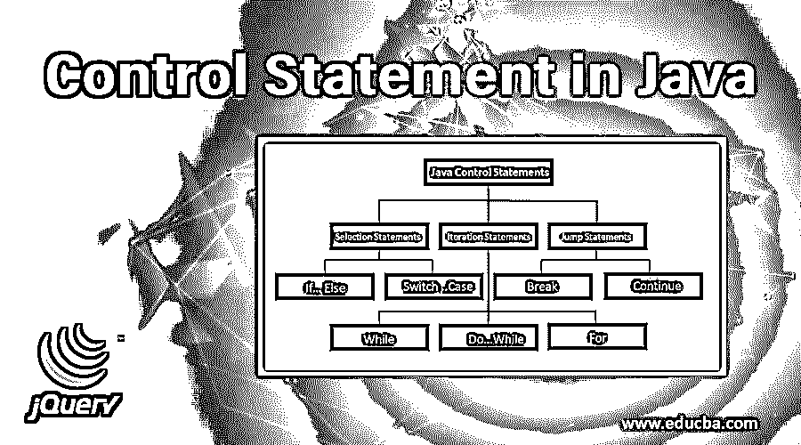
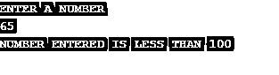
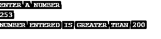
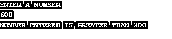
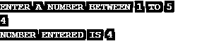
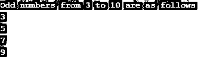
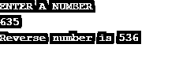
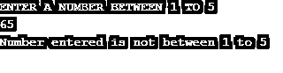

# Java 中的控制语句

> 原文：<https://www.educba.com/control-statement-in-java/>




## Java 中的控制语句概述

Java 中的控制语句是帮助确定从 Java 中的一个语句到另一个语句的控制流的语句。Java 中的控制语句有很多种类型。在本文中，我们将观察控制语句的不同方面以及它们的一些例子。不同种类的控制语句有:

**决策报表:**

<small>网页开发、编程语言、软件测试&其他</small>

*   if-else，嵌套的 if-else 语句
*   Switch case 语句

**重复/循环语句:**

*   For 循环
*   对于每个循环
*   While 循环
*   Do while 循环

**跳转语句:**

*   破裂
*   继续
*   转到
*   返回

以上是 Java 中作为流控制语句使用的语句，它们分为决策语句、重复或循环语句和跳转语句。

### Java 中的决策语句

在决策语句中，我们将看到 if-else 和嵌套 if-else 语句以及 Switch case 语句。我们还将看到显示这种语句的有效性和执行的编码示例和样本输出。

#### 1.If Else 语句

if-else 语句以有条件的方式工作。以下是语法:

**语法:**

```
if(condition)
Statement 1
else
Statement 2
```

**举例:**

在第一个 if-else 示例中，我们将查看用户输入的数字是否大于 100。如果该数字大于 100，则相应地显示输出。

**代码:**

```
import java.io.*;
public class Example1
{
public static void main(String args[])throws IOException
{
BufferedReader br= new BufferedReader(new InputStreamReader(System.in));
System.out.println("ENTER A NUMBER");
int n= Integer.parseInt(br.readLine());
if (n>100)
System.out.println("NUMBER ENTERED IS GREATER THAN 100");
else
System.out.println("NUMBER ENTERED IS LESS THAN 100");
}
}
```

**输出:**





在下面的程序中，我们输入两个数字。每当我们输入 250 作为数字时，程序显示它大于 100，每当我们输入 65 作为数字时，程序显示该数字小于 100。

#### 2.嵌套的 If Else 语句

在嵌套的 if-else 语句中，有多个 if 条件，最后还有一个 print 语句。以下是语法:

**语法:**

```
if (condition1)
if(condition2)
if (condition3)
Statement 1
```

**举例:**

在[嵌套的 if 语句](https://www.educba.com/nested-if-statements-in-java/)中，我们使用两三个 if-else 语句检查条件，然后最终得出结论。我们进一步检查该数字是否大于 200；如果它大于 200，我们就将其打印出来。

**代码:**

```
import java.io.*;
public class Example2
{
public static void main(String args[])throws IOException
{
BufferedReader br= new BufferedReader(new InputStreamReader(System.in));
System.out.println("ENTER A NUMBER");
int n= Integer.parseInt(br.readLine());
if (n>100)
{
if(n>200)
System.out.println("NUMBER ENTERED IS GREATER THAN 200");
}
}
}
```

**输出:**







我们输入两个大于 200 的数字，并找到两个都大于 200 的正确输出。

#### 3.Switch Case 语句

在切换情况下，有多个情况可供选择。以下是语法:

**语法:**

```
switch(Variable)
case 1:
case 2:
case 3:
case n:
```

**举例:**

在这个例子中，我们将输入一个数字，程序将返回用户返回的数字。这是一个在 BlueJ 编程接口中运行的 switch case 语句的简单示例。

**代码:**

```
import java.io.*;
public class Example3
{
public static void main(String args[])throws IOException
{
BufferedReader br= new BufferedReader(new InputStreamReader(System.in));
System.out.println("ENTER A NUMBER BETWEEN 1 TO 5");
int n= Integer.parseInt(br.readLine());
switch(n)
{
case 1: System.out.println("NUMBER ENTERED IS 1");
break;
case 2: System.out.println("NUMBER ENTERED IS 2");
break;
case 3: System.out.println("NUMBER ENTERED IS 3");
break;
case 4: System.out.println("NUMBER ENTERED IS 4");
break;
case 5: System.out.println("NUMBER ENTERED IS 5");
break;
}
}
}
```

**输出:**




在上面的代码中，我们输入数字 4，程序返回输入的数字是 4。

### Java 中的重复/循环语句

下面是 Java 中的重复/循环子句:

#### A.For 循环

在 for 循环中，循环按照用户初始化的次数进行。下面是语法。

**语法:**

```
for(initialization, condition, update)
Statement 1
```

**举例:**

在 for 循环示例中，我们将打印从 3 到 10 的奇数。我们对相应的程序使用 for 循环。

**代码:**

```
import java.io.*;
public class Example4
{
public static void main(String args[])throws IOException
{
System.out.println("Odd numbers from 3 to 10 are as follows");
for(int  i=3; i<10; i+=2)
{
System.out.println(i);
}
}
}
```

**输出:**




在上面的程序中，我们看到从 3 到 10 的奇数，打印出来的数字是 3，5，7，9。

#### B.While 循环

在 while 循环中，当条件为真时执行语句。以下是语法:

**语法:**

```
while(Condition)
Statement 1
```

**举例:**

使用 while 循环，我们现在要找到一个数的倒数。这个程序是健壮的，可以找到任何整数的倒数。

**代码:**

```
import java.io.*;
public class Example5
{
public static void main(String args[])throws IOException
{
BufferedReader br= new BufferedReader(new InputStreamReader(System.in));
System.out.println("ENTER A NUMBER");
int n= Integer.parseInt(br.readLine());
int digit, rev=0;
while(n>0)
{
digit= n%10;
rev= (rev*10) +digit;
n=n/10;
}
System.out.println("Reverse number is " +rev);
}
}
```

**输出:**




在上面的程序中，我们找到了一个特定数的倒数。输入的数字是 635，数字的倒数是 536，如输出屏幕上所示。

### Java 中的跳转语句

java 中的跳转语句解释如下。

#### break 语句

在 for 循环中可以有 break 语句 while 循环或者在 [switch case](https://www.educba.com/switch-case-in-shell-scripting/) 中。下面是语法。

**语法:**

```
for(Statements)
break;
while(Statements)
break;
```

**举例:**

在这个例子中，我们将看到一个菜单驱动的程序，我们看到了 break 语句的应用。

**代码:**

```
import java.io.*;
public class Example6
{
public static void main(String args[])throws IOException
{
BufferedReader br= new BufferedReader(new InputStreamReader(System.in));
System.out.println("ENTER A NUMBER BETWEEN 1 TO 5");
int n= Integer.parseInt(br.readLine());
switch(n)
{
case 1: System.out.println("NUMBER ENTERED IS 1");
break;
case 2: System.out.println("NUMBER ENTERED IS 2");
break;
case 3: System.out.println("NUMBER ENTERED IS 3");
break;
case 4: System.out.println("NUMBER ENTERED IS 4");
break;
case 5: System.out.println("NUMBER ENTERED IS 5");
break;
default: System.out.println("Number entered is not between 1 to 5");
break;
}
}
}
```

**输出:**




上面的代码与 switch case 语句中使用的代码非常相似。break 语句通常用在 switch case 语句中。break 语句也用在 if-else 条件中，其中 if-else 语句需要终止。上面的程序要求输入 1 到 5 之间的数字。如果数字不在 1 到 5 之间，则默认打印输入的数字不在 1 到 5 之间。在上面的例子中，我们输入数字 65，它相应地显示输入的数字不在 1 到 5 之间。

### 结论–Java 中的控制语句

在本文中，我们会遇到 Java 中的控制语句。我们来看看循环语句、条件语句以及其他存在的语句。我们还看了语句的编程方面，以及如何在代码中使用语句。控制语句在 Java 中被广泛使用，在其他编程语言中也存在。为了顺利执行，它们在所有程序中都被大量使用。

### 推荐文章

这是 Java 中控制语句的指南。这里我们讨论基本概念，java 中的各种控制语句，即决策、重复/循环和跳转语句等。你也可以看看下面的文章来了解更多-

1.  [Java 中的 Continue 语句](https://www.educba.com/continue-statement-in-java/)
2.  [Java 中的 Case 语句](https://www.educba.com/case-statement-in-java/)
3.  [Java 中的运行时多态性](https://www.educba.com/runtime-polymorphism-in-java/)
4.  [C 语言中嵌套的 if 语句](https://www.educba.com/nested-if-statement-in-c/)


