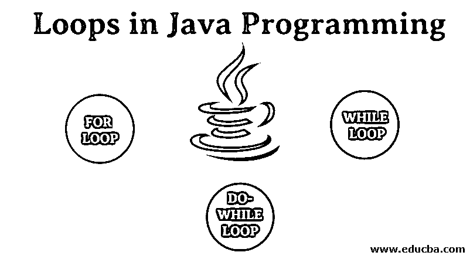
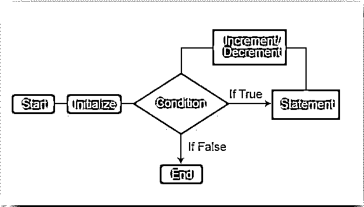
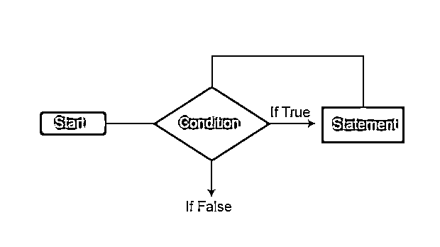
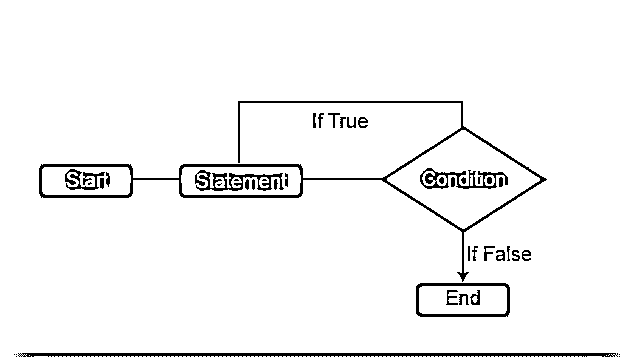

# Java 编程中的循环

> 原文：<https://www.educba.com/loops-in-java-programming/>




## Java 编程中什么是循环？

简单来说,“编码”意味着告诉计算机做什么的一种方式；然而，这并不像看起来那么容易，但是现在，我们不会关注后面的部分(意味着容易或困难)。在这个主题中，我们将学习 Java 编程中的循环。

计算机只能理解“开”和“关”类型的数据，通常称为“二进制”值。二进制代码由(0 和 1)组成，可以被全世界的计算机理解。但问题是，我们不能仅仅为了让计算机理解我们要求它们计算的东西，而写上万亿个 0 和 1。这就是编程语言或编码发挥作用的地方。

<small>网页开发、编程语言、软件测试&其他</small>

至此，我们已经成功地将我们的理解过滤到了编码层面，现在，既然我们知道了“编码”是做什么的，为什么我们要编码，我们就必须进一步深入到“循环”层面，这就是我们讨论的主题？

我们中间有好几个 PL；有很多是做 web 开发的，也有做桌面应用开发的，有被称为高级的，有被称为低级 PL 的。所有这些编程语言都有一个共同点，即“循环”。

深入讨论一下，几乎所有的编程语言中都存在循环；让我们看看它们对开发人员有什么好处——

*   这些是“可重复使用的”
*   它们减少了“编码”的大小
*   它们使“控制”变得容易。
*   他们倾向于降低“复杂性”

JAVA 编程中的循环是用来解决代码复杂性的，是可用的，是开发者用来根据需求重用代码的。

### Java 中的循环类型

java 中的循环类型如下:

在 JAVA 中，[循环是迭代的](https://www.educba.com/loops-in-java-programming/)语句。这些语句帮助开发人员(或用户)迭代程序代码，或者一组代码运行多次(根据需要)。

在 JAVA 中，主要有 3 类循环，即

*   FOR 循环
*   WHILE 循环
*   DO-WHILE 循环

在我们深入研究这些循环之前，我们希望读者理解一件事(这对所有三个循环都有价值)。无论是 FOR、WHILE 还是 DO WHILE，都有起点、主体和终点。如果没有，让我们一个一个来看

#### 1.For 循环

如果您是一名开发人员，并且希望在获得最终结果之前执行或运行程序的一部分特定次数，那么您将使用 FOR 循环。记住，只有当你清楚地知道你想要执行语句的次数时，你才会使用[这个 For 循环’](https://www.educba.com/for-loop-in-java/)。FOR 循环将不断重复，直到其值等于“真”。

让我们看看它的流程图，以便更好、更清楚地理解——




**语法**

```
for(initialization condition; testing condition; increment/decrement)
{
statement(s)
}
```

**解释**

所有 3 个参数(即初始化、条件和递增/递减)都在 FOR 循环中的一个语句中。初始化意味着提供变量的初始值。条件意味着我们想要在 program.Increment/Decrement 中检查的值意味着你想要在循环中有什么；该值将相应地增加或减少。循环体以花括号开始，以花括号(})结束，包含将使用循环执行的语句。

**例子**

我们的目的是打印 1 到 100 之间的所有偶数。

```
class Test
{
public Static Void Main (String ar [])
{
int no; for (no = 2; no <=100; no = no+2)
{
System.out. print ln(no);
}
}
}
```

此计划的输出将是 2，4，6，8，10，12………………..96,98,100

#### 2.While 循环

只有当需要重复执行一定数量的语句直到满足条件时，我们才需要？这里，与 FOR 循环不同，在执行语句之前首先检查条件。

让我们看看它的流程图，以便更好、更清楚地理解——




**语法**

```
while (boolean condition)
{
loop statements
}
```

**解释**

虽然 loop 从括号内的应用条件语句开始，但这些语句也包含在花括号内。正如我们所说的, [WHILE 循环](https://www.educba.com/while-loop-in-java/)一直运行，直到该值为真值。

**例子**

我们想打印 1 到 100 之间的所有奇数。

```
class Test
{
public static void main (String ar[])
{
int no = 1;
while (no<100)
{
System.out.print (no);
No = no +2;
} } }
```

该计划的输出将是 1，3，5，7，9，11..97,99

#### 3.做什么

WHILE 和 DO WHILE 循环没有太大区别；区别在于它们的语句验证。[在 DO WHILE](https://www.educba.com/do-while-loop-in-java/) 中，执行语句块后检查条件；因此我们可以说，在 DO WHILE 中，语句至少执行一次。

让我们看看它的流程图，以便更好、更清楚地理解——




**语法**

```
do
{
statements..
}
while (condition);
```

**解释**

第一次在 DO WHILE 循环中没有条件检查；稍后，检查条件的真或假。如果为真，则循环的下一次迭代开始；否则，循环将自行终止。

**例子**

```
class Test
{
public Static Void Main (String ar[])
{
int no = 2;
do
{
System.out.print (no);
No = no + 2;
}
while (no<=100);
}}}
```

此程序的输出将为–2，4，6，8，10………98，100

### 不同类型环路之间的比较

不同类型的回路之间的比较如下:

1)声明

**为循环**

```
for (initialization; condition; iteration){
//body of 'for' loop
}
```

**While 循环**

```
Statements; //body of loop
}
```

**边做边**

```
do
{
Statements
}
while (condition);
```

2)如果用户知道迭代时间，我们使用 FOR 循环，而当迭代次数未知时，WHILE 和 DO WHILE 循环是首选。

3)关于 FOR 循环中的条件语句，它将无限期运行，而 for WHILE 和 DO WHILE 缺少条件语句将会给出“编译错误”。

### 结论

循环概念对于任何属于开发的用户来说都是至关重要的；如果他们是大一新生，准备参加考试或面试，他们必须对 Loops 概念进行充分的练习。我们已经讨论了循环的所有重要方面，这就是循环中的工作方式。这三个循环是最关键的，其余的都是在上面即兴创作的。如果你很好地掌握了这些，那么剩下的就很容易理解了。

### 推荐文章

这是 Java 编程中的循环指南。这里我们讨论 Java 中的循环类型，包括流程图，解释，以及相应的例子和输出。您也可以阅读以下文章，了解更多信息——

1.  [C 中的循环](https://www.educba.com/loops-in-c/)
2.  [c++中的循环](https://www.educba.com/loops-in-c-plus-plus/)
3.  [Java getMethod()](https://www.educba.com/java-getmethod/)
4.  [VBScript 中的循环](https://www.educba.com/vb-dot-net-loops/)


