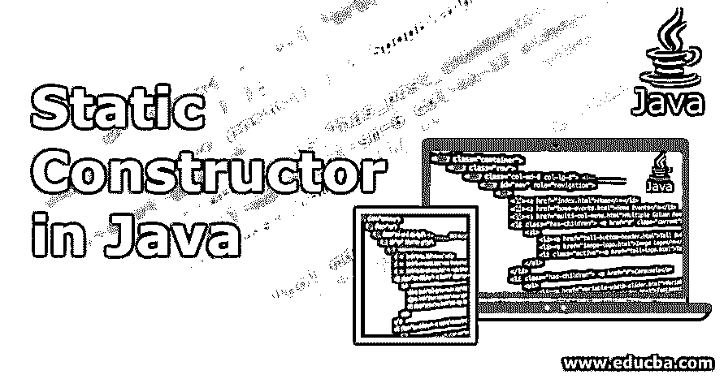
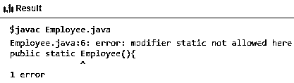
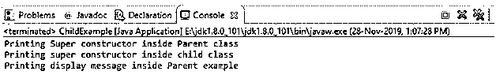

# Java 中的静态构造函数

> 原文：<https://www.educba.com/static-constructor-in-java/>




## Java 静态构造函数简介

静态构造函数是用来初始化静态数据的一段代码，这意味着一个特定的任务在整个程序中只需要执行一次。它通常在引用任何静态成员或生成第一个实例之前自动调用。静态构造函数是使用“static”关键字显式声明的构造函数。在 Java 中，构造函数不允许是 static、abstract、final、native、synchronized 或 [strictfp。](https://www.educba.com/strictfp-in-java/)

它们有如下几个独特的特征:

<small>网页开发、编程语言、软件测试&其他</small>

*   静态构造函数不带参数或访问修饰符。
*   一个特定的类只能拥有一个静态构造函数。
*   静态构造函数中不允许继承或重载。
*   它不能被直接调用，因为它总是被自动调用。
*   如果没有提供静态字段的初始化值，那么它将初始化为默认值表中的默认值。

**语法**:

```
public class <Class_Name> {
private <datatype> <variable>;
public static <Constructor_Name> () {}
}
```

在这里，我们试图通过将构造函数定义为 static 来声明它。当这样的代码被编译时，我们会得到一个错误消息，指出一个非法的修饰符被用于类型<class_name>中的构造函数，并且只允许 public、protected 和 private。</class_name>

### Java 中静态构造函数的使用

Java 中不允许构造函数是静态的，原因如下:

在 Java 中，静态方法和变量应用于类。但是当使用新操作符创建实例时，会调用构造函数。因为它不属于 property 类，所以不允许是静态的。如果一个构造函数被认为是静态的，它不能被它的子类的对象访问。

但是如果一个构造函数被允许是静态的，那么它可以在类中被访问，但是不能被它的子类访问。它也不能被继承，这意味着它们属于它们所声明的类。允许静态构造函数违反了继承的整个概念；因此这是非法的。

### Java 中静态构造函数的例子

通过下面的例子，我们可以更好地理解 Java 中静态构造函数的概念:

#### 示例#1

**代码:**

```
public class Employee {
//Initialising variables for employee name and ID
public String emp_name;
public int emp_id;
//Declaration of the static constructor
public static Employee(){
System.out.println("Printing Constructor of the Employee class");
}
//Declaring method to print message
public void displayMsg(){
System.out.println("Employee Name is: "+this.emp_name );
System.out.println("Employee ID is: "+this.emp_id );
}
public static void main(String args[]) {
//Creating a new object to call the display message constructor
new Employee().displayMsg();
}
}
```

**输出:**




这里我们得到一个编译时错误，告诉我们修饰符 static 不允许用于 Employee()类中的 Employee()构造函数，因为我们通过在下面创建一个新对象来调用它。这可以通过不将其声明为静态来解决。看看下面的例子。

#### 实施例 2

我们必须在同一个包中创建两个类；ParentExample.java 和 ChildExample.java，它从它的父类扩展而来。

**代码:**

括号 Example.java:

```
public class ParentExample {
ParentExample(){
super();
System.out.println("Printing Super constructor inside Parent class");
}
void displayMessage(){
System.out.println("Printing inside display Message class");
}
}
```

ChildExample.java:

```
public class ChildExample extends ParentExample {
ChildExample(){
super();
System.out.println("Printing super constructor inside child class");
}
@Override
void displayMessage(){
System.out.println("Printing display message inside Parent example");
}
public static void main(String[] args){
ChildExample childexample = new ChildExample();
childexample.displayMessage();
}
}
```

现在运行 ChildExample.java。

**输出:**




**观察:**

*   父类和子类都有不带参数的默认构造函数，并且打印了一条消息以使执行流程清晰。
*   [静态构造函数](https://www.educba.com/static-constructor-in-c-sharp/)是类中运行的第一个代码块，因为当相应的类开始执行时，它们立即被执行。
*   子类覆盖 display message()方法并打印消息。
*   我们已经创建了 ChildExample 类的一个新对象，它执行第一个超类构造函数，然后执行第二个子类。
*   最后，调用新创建的对象的显示方法来显示消息。
*   在实现继承的情况下，构造函数要么显式调用，要么隐式调用。因此，它应该是非静态的，以便可以访问。
*   当它成为静态类时，它与一个特定的类而不是它的实例相关联，并且在对象实例化期间不可用。

#### 实施例 3

此示例将结合上述静态和非静态构造函数，并检查它们的实现。

**代码:**

```
class ParentClass{
private static String message= "Test message";
// Declaring a nested static class
public static class StaticNestedClass{
// In the nested class only static members belonging to parent class can be accessed
// in a static nested class
public void displayprint() {
// We get a compiler error if we try and make this message
// a non-static variable
System.out.println("Displaying from nested class: " + message);
}
}
// Declaring Inner class or also called non-static nested class
public class ChildClass{
// The static and non-static constructor both can be accessed in
// this Child class
public void displayprint(){
System.out.println("Printing from static non-nested class: "+ message);
}
}
}
class Main
{
public static void main(String args[]){
// Instance of static nested class creation
ParentClass.StaticNestedClass printer = new ParentClass.StaticNestedClass();
//Calling the non-static constructor of static nested class
printer.displayprint();
// Creating Parent class instance first in order
//to create the child class instance
ParentClass outer = new ParentClass();
ParentClass.ChildClass inner = outer.new ChildClass();
// Here we call the non-static method of Child class
inner.displayprint();
// Creation of instance for child class in one line
//by combining above 2 lines
ParentClass.ChildClass innerObject = new ParentClass().new ChildClass();
// Now we call the child method
innerObject.displayprint();
}
}
```

**输出:**


### Java 中静态构造函数的局限性

下面是 java 中静态构造函数的一些限制:

*   构造函数名不能是显式的，并且必须与它们的类名相同。由于它们局限于这些约定，所以不能给它们起更易读的名字。
*   每次需要调用构造函数时，都必须创建一个新的对象。这也会影响代码的性能，从而使它变慢。
*   构造函数的返回类型被限制为返回与对象相同的类型。
*   我们不能在子类构造中使用静态构造函数，因为只允许超类构造函数的实现。
*   静态构造函数不允许使用“this”关键字来访问实例。
*   在涉及静态构造函数的情况下，需要的测试工作更多。

### 结论

构造函数的主要工作是初始化对象，从上面的例子可以看出，构造函数不允许是静态的，主要原因是子类的对象和其他非静态成员不能被它访问。静态构造函数的替代方法是使用静态代码块来初始化类的静态变量。

### 推荐文章

这是一个 Java 静态构造函数的指南。这里我们讨论 java 中静态构造函数的基本概念、工作原理、局限性和例子，以及它们的实现。您也可以阅读以下文章，了解更多信息——

1.  [Java 中的 HashMap](https://www.educba.com/hashmap-in-java/)
2.  [Java 中的内部类](https://www.educba.com/inner-class-in-java/)
3.  [Java 中的嵌套类](https://www.educba.com/nested-class-in-java/)
4.  [Java 中的 NumberFormatException](https://www.educba.com/numberformatexception-in-java/)


