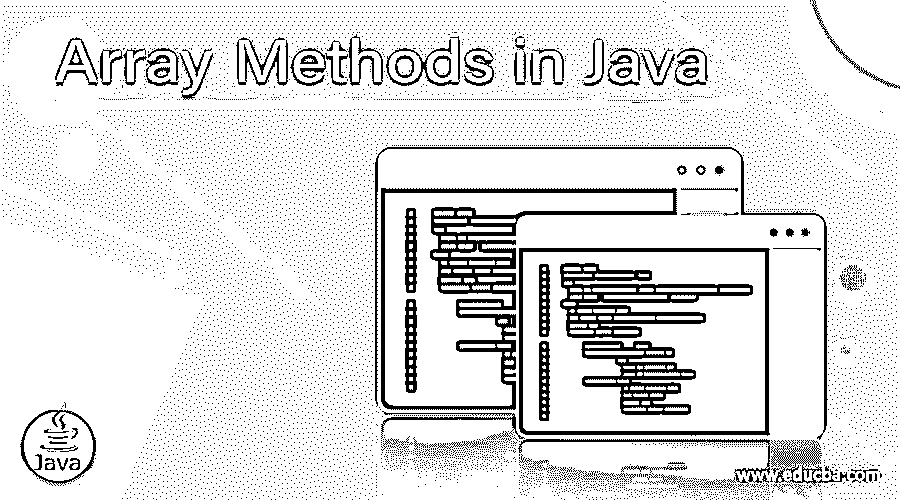
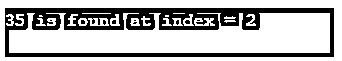
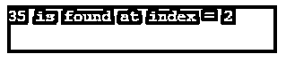
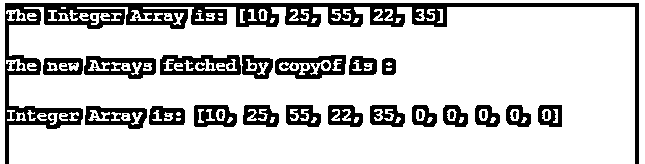
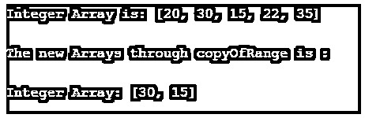
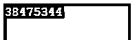

# Java 中的数组方法

> 原文：<https://www.educba.com/array-methods-in-java/>




## Java 中的数组方法简介

Arrays 类属于 java。util 包属于 Java 集合框架。Array 类给出了静态的方法，以便动态地创建和访问 Java 数组。数组只有静态方法和对象类的方法。

### Java 数组中的方法及示例

属于 java 的类数组。util 包有许多静态方法，这些方法在填充、排序、搜索和数组中的许多其他事情上都很有用。它们如下:

<small>网页开发、编程语言、软件测试&其他</small>

#### 1.静态<t>列表 <t>asList (T… a)</t></t>

asList 方法用于返回提到数组的固定大小的列表。

**代码:**

```
// Program to showcase asList() method
import java.util.Arrays;
public class Array {
public static void main(String[] args)
{
// Fetching Array
int Arr[] = { 10, 30, 35, 52, 75 };
// Converting elements into list
System.out.println("The Integer Array as a List = "+ Arrays.asList(Arr));
}
}
```

**输出:**

**

** 

#### <u>2。静态 int 二进制搜索(itemToSearch)</u>

 <u>该方法将通过二分搜索法算法搜索数组中提到的元素。

**代码:**

```
// Program to showcase binarySearch() method
import java.util.Arrays;
public class Main {
public static void main(String[] args)
{
// Fetching Array
int Arr[] = { 10, 30, 35, 52, 75 };
Arrays.sort(Arr);
int ele = 35;
System.out.println (ele  + " is found at index = "
+ Arrays.binarySearch(Arr, ele));
}
}
```

**输出:**




#### 3.static<t>int binary search(T[]an int from index，int toIndex，T key，Comparator <t>c)</t></t>

该方法将利用二分搜索法算法在所述数组的范围内搜索指定的对象。

**代码:**

```
// Program to showcase binarySearch() method
import java.util.Arrays;
public class Main {
public static void main(String[] args)
{
// Fetching Array
int Arr[] = { 10, 30, 35, 52, 75 };
Arrays.sort(Arr);
int ele = 35;
System.out.println ( ele
+ " is found at index = "
+ Arrays.binarySearch(Arr, 1, 3, ele));
}
}
```

**输出:**




#### 4.share signed(arr 1，arr 2)

CompareUnsigned 方法将比较以字典式样式作为参数传递的两个数组，并将它们视为无符号数组。Integer 类的这个方法将比较两个整数值，将它们视为无符号的，然后在 x 等于 y 的情况下返回零。

**代码:**

```
// Program to showcase compareUnsigned() method
import java.lang.Integer;
class Arrays {
public static void main(String args[])
{
int m = 10;
int n = 20;
// as 10 less than 20, the output would be a value less than zero
System.out.println(Integer.compareUnsigned(m, n));
int x = 8;
int y = 8;
// as 8 equals 8, Output would be zero
System.out.println(Integer.compareUnsigned(x, y));
int e = 25;
int f = 8;
// as 25 is greater than 8, Output would be a value greater than zero
System.out.println(Integer.compareUnsigned(e, f));
int o = 15;
int p = -7;
// as 15 is greater than -7 but -7 would be treated as an unsigned number
// which will be greater than 15
// Output would be a value less than zero
System.out.println(Integer.compareUnsigned(o, p));
}
}
```

**输出:**


#### 5.copyOf(原始数组，新长度)

Copy 方法复制所提到的数组，截断它或用默认值填充它，但只有在必要时，副本才具有所提到的长度。

**代码:**

```
// Java program to showcase
// Arrays.copyOf() method
import java.util.Arrays;
public class Example {
public static void main(String[] args)
{
// Fetching Array
int Arr[] = { 10, 25, 55, 22, 35};
// Printing the elements in a single line
System.out.println("The Integer Array is: "
+ Arrays.toString(Arr));
System.out.println("\nThe new Arrays fetched by copyOf is :\n");
System.out.println("Integer Array is: "
+ Arrays.toString(Arrays.copyOf(Arr, 10)));
}
}
```

**输出:**




#### 6.copyOfRange(前一个数组，startIndex，finishIndex)

CopyOfRange 方法将把提到的数组的范围复制到一个新的数组中。

**代码:**

```
// Java program to showcase
// Arrays.copyOf() method
import java.util.Arrays;
public class Array{
public static void main(String[] args)
{
// Fetching Array
int Arr[] = {20, 30, 15, 22, 35 };
// Printing the elements in a single line
System.out.println("Integer Array is: "
+ Arrays.toString(Arr));
System.out.println("\nThe new Arrays through copyOfRange is :\n");
System.out.println("Integer Array: "
+ Arrays.toString(Arrays.copyOfRange(Arr, 1, 3)));
}
}
```

**输出**:




#### 7.静态布尔值 deepEquals(对象[] m1，对象[] m2)

如果提到的两个数组完全等于另一个数组，DeepEquals 方法将返回 true。

**代码:**

```
// Java program to showcase
// method Arrays.deepEquals()
import java.util.Arrays;
public class Array{
public static void main(String[] args)
{
// Fetching first Array
int Arr[][] = { {10, 20, 35, 82, 95} };
// Fetching second Array
int Arr2[][] = { { 10, 15, 22 } };
// Comparing both arrays
System.out.println("Arrays when compared: "
+ Arrays.deepEquals(Arr, Arr2));
}
}
```

**输出:**


#### 8.static int deepHashCode(Object[]a):deepHashCode

方法将根据提到的数组的“深层内容”返回哈希代码。

**代码:**

```
// Java program to showcase
// Arrays.deepHashCode() method
import java.util.Arrays;
public class Array {
public static void main(String[] args)
{
// Fetching first Array
int Arr[][] = { { 10, 20, 15, 22, 35} };
// Getting deep hashCode of arrays
System.out.println(Arrays.deepHashCode(Arr));
}
}
```

**输出:**




### 结论

因此，我们可以得出结论，java.util.Arrays 类可以包含许多静态方法，以便对数组进行排序和搜索、比较数组以及填充数组元素。所有这些方法都是为所有基元类型重载的。此外，数组用于存储数据；但是，数组是同一数据类型的变量的集合是很有用的。

### 推荐文章

这是 Java 中数组方法的指南。在这里，我们讨论了简要概述，方法在 Java 数组与例子和输出的细节。您也可以浏览我们推荐的其他文章，了解更多信息——

1.  [JavaScript 中的数组方法](https://www.educba.com/arrays-methods-in-javascript/)
2.  [Java 中的 2D 数组](https://www.educba.com/2d-arrays-in-java/)
3.  [JavaScript 静态方法](https://www.educba.com/javascript-static-method/)
4.  [Java 中的 BinarySearch()](https://www.educba.com/binarysearch-in-java/)


</u>