# 用 Java 打印数组

> 原文：<https://www.educba.com/print-array-in-java/>

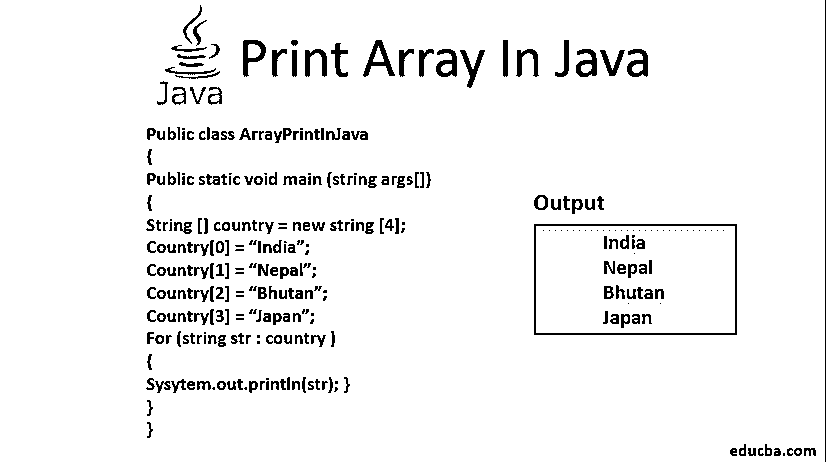


## Java 中的打印数组简介

数组基本上是一个[数据结构](https://www.educba.com/data-structure-java-interview-questions/)，我们可以在其中存储相似类型的元素。例如，整数数组存储多个整数，字符串数组存储多个字符串，等等。因此，如果您有一个包含大量数据的数组，您可能需要在方便的时候使用 Java 中的 Print Array 来打印这些数据。在 Java 中，有几种方法可以用来打印一个[数组。您可以使用这些方法中的任何一种来打印数组。对于我将在这里讨论的 Java 中 Print Array 的每个方法，我都给出了代码示例，以便更好地理解和实践。为了更好的可读性，我还在代码中添加了注释。而且，我已经给出了每个代码的输出截图。一行一行地检查代码并理解它们。然后在 java 编译器中自己编写并运行这些代码，并将这些输出与给定的输出进行匹配。](https://www.educba.com/java-list-vs-array-list/)

### Java 中打印数组的技巧

下面是用 Java 打印数组的技巧:

<small>网页开发、编程语言、软件测试&其他</small>

#### 方法 1:使用 for 循环

众所周知，循环用于重复执行一组语句，直到满足特定条件。我们将使用 for 循环的这个功能在这里打印数组。

**例:1**

这里我们将创建一个包含四个元素的数组，并使用 for 循环从数组中获取值并打印出来。

**代码:**

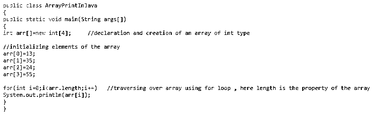


**输出:**


上面的例子是一维数组。

**例:2**

对于二维数组，需要打印出行和列。因此，您需要以嵌套的方式运行两个 for 循环。一个用于行及其内部，另一个用于列。

**代码:**

```
for ( k = 0; k< rows; k++)
for ( m = 0; m< columns; m++)
For print: System.out.print(arr[k][m] + " " )
```

自己试试，看看神奇之处。

#### 方法 2:使用 for-each 循环

for-each 循环的[也用于](https://www.educba.com/for-each-loop-in-java/)遍历数组。作为输出，它将在已定义的变量中逐个返回元素。

**例子**

我们将创建一个包含四个字符串的数组，并使用 for-each 循环迭代和打印这些字符串。

**代码:**

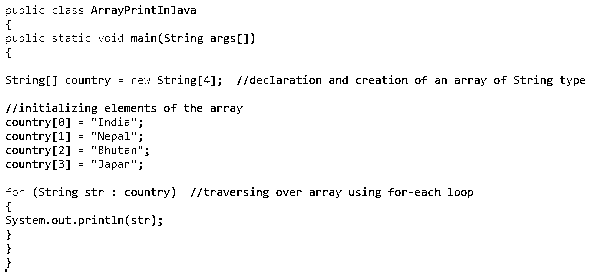


**输出:**


到目前为止，我们已经使用 for 和 for-each 单路打印数组。但是从下一个方法开始，我们将使用与 java 下的数组相关的类。java 中专门提供的用于处理数组的 util 包。我们将使用这些类的各种静态方法来处理数组。这将使我们的编码变得简单和没有麻烦。

让我们一个一个地看看那些。

#### 方法 3:使用 Java Arrays.toString()

java.util.Arrays 包有一个静态方法 Arrays.toString()。因此，要使用这个静态方法，我们需要导入这个包。Arrays.toString()接受任何原始类型的数组(例如，int、String)作为其参数，并以字符串类型返回输出。

**例:1**

这种字符串类型表示是一维数组。因此，您可以用行或列来表示数据。

**代码**


**输出:**

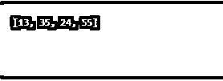


注意输出中的方括号。方括号表示维度的级别。因此，这里的一对方括号(左右一对)表示该数组是一维的。

*   Arrays.toString()的限制

**例:2**

对于维数为 2 或更大的数组，我们不能使用 Arrays.toString()方法。下面是一个示例代码:

**代码:**

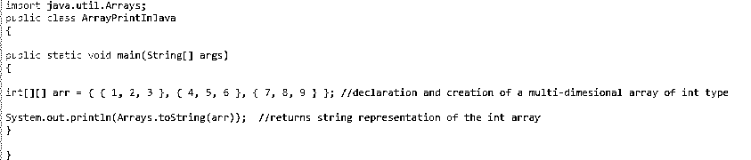


**输出:**

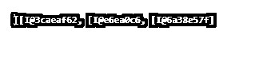


这是因为该方法不进行深度转换。它只会在第一维上迭代，并调用每一项的 toString()方法。因此，我们得到了不想要的结果。那么，解决办法是什么？让我们看看我们的下一个方法。

#### 方法 4:使用 Arrays.deep string()方法

对于二维或二维以上的数组，我们将使用静态方法 Arrays.deepToString()，它属于 java.util.Arrays 包。此方法将深度转换为数组中的字符串。这里，数组的维数也将表示为方括号。

**例子**

三维阵列

**代码:**

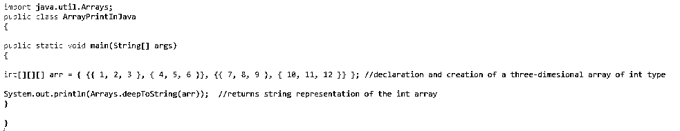


**输出:**


请注意方括号表示。方括号也有 3 层深，这证实了数组的维数为 3。

#### 方法 5:使用 Arrays.asList()方法

java.util.Arrays 包有一个静态方法 Arrays.asList()。因此，要使用这个静态方法，我们需要导入包。

**例子**

Arrays.asList()接受数组作为其参数，并以数组列表的形式返回输出。

**代码:**

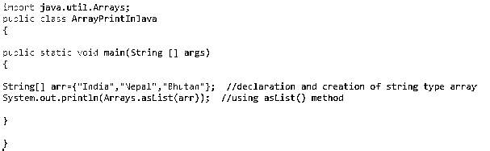


**输出:**


#### 方法 6:使用迭代器接口

迭代器包有一个接口迭代器。因此，要使用这个接口进行数组打印，我们需要导入这个包。我们将[通过调用 Iterator()方法创建一个迭代器](https://www.educba.com/iterator-in-java/)对象。我们将首先把数组转换成列表，然后调用 iterator()方法来创建集合。然后我们将使用一个 [while 循环](https://www.educba.com/while-loop-in-java/)遍历集合并打印值。

**例子**

因为我们需要将数组转换成列表，所以我们还需要使用 Arrays.asList()方法，因此还需要导入 java.util.Arrays。

**代码:**

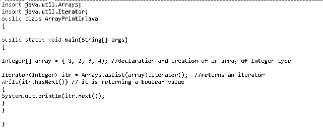


**输出:**

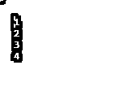


#### 方法 7:使用 ArrayList()方法

Java 中的普通数组是静态数据结构，因为数组的初始大小是固定的。数组列表是一种动态数据结构，可以在列表中添加和删除条目。因此，如果您不确定数组中有多少个元素，这种动态数据结构将会帮助您。需要导入 java.util.ArrayList 包才能使用 ArrayList()方法创建 ArrayList 对象。一旦有了新的 ArrayList 对象，就可以用 add() /remove()方法向它添加/移除元素:

**例子**

类似于方法 6。这里，我们也将首先将数组转换成列表，然后调用 iterator()方法来创建集合。然后，我们将使用 while 循环遍历集合并打印值。

**代码:**

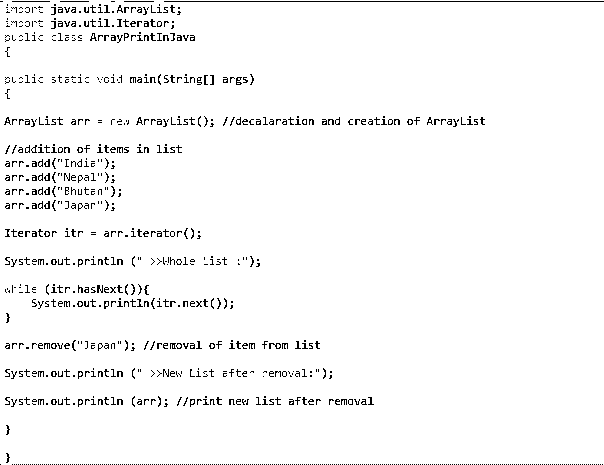


**输出:**

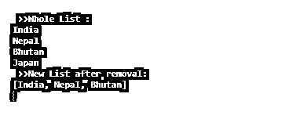


#### 方法 8:使用 Java 流 API

**例子**

我们还可以使用 Arrays.stream()方法将数组转换为流。然后我们使用 foreach()遍历流并打印它们。

**代码:**

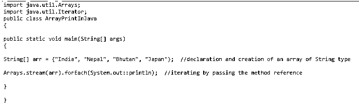


**输出:**


主题“Java 中的打印数组”的学习到此结束。通过编写上述示例中提到的代码来练习示例。如果你不亲自动手，对代码的学习是不完整的。编码快乐！！

### 推荐文章

这是一个用 Java 打印数组的指南。这里我们已经讨论了用不同的方法在 Java 中打印数组的基本概念、技术以及代码和输出。您也可以浏览我们的其他相关文章，了解更多信息——

1.  [JavaScript 中的数组](https://www.educba.com/arrays-in-javascript/)
2.  [Java 中的封装](https://www.educba.com/encapsulation-in-java/)
3.  [Java 中的 2D 数组](https://www.educba.com/2d-arrays-in-java/)
4.  [用 Java 打印 2D 数组](https://www.educba.com/print-2d-array-in-java/)


