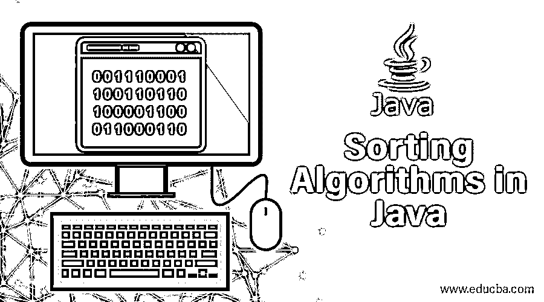
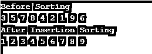
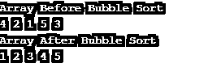
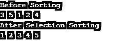
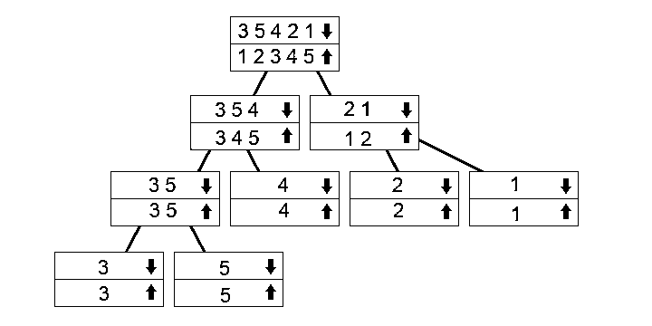
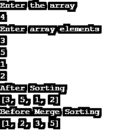
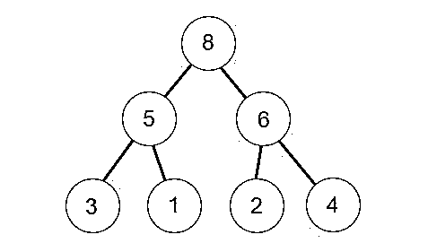
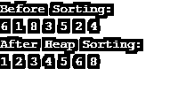

# Java 中的排序算法

> 原文：<https://www.educba.com/sorting-algorithms-in-java/>




## Java 中的排序算法简介

通常在一个类似数组的框架内，按照一定的顺序对信息进行排序，就是对它们进行排列。您可以使用不同的序列要求；流行的方法是从最小到最大或者从最大到最小对数字进行排序，或者按字典顺序对字符串进行排序。我们将讨论不同的算法，从低效但直观的替代方法到用 Java 和其他语言有效实现的高效算法，如果你对排序是如何工作的感兴趣的话。

### java 中不同的排序算法

有[种不同的排序算法](https://www.educba.com/sorting-in-java/)，并不是所有的排序算法都同样有效。为了比较它们，看看哪一个性能最好，我们将分析它们的时间复杂度。

<small>网页开发、编程语言、软件测试&其他</small>

1.  插入排序
2.  冒泡排序
3.  选择排序
4.  合并排序
5.  堆排序

#### 1.插入排序

插入排序背后的概念是将范围分成排序和未排序的子数组。分类部分位于持续时间 1 的开始，与数组中的第一个(左侧)组件匹配。我们遍历数组，并在每次迭代中将数组的分类部分扩展一个组件。当我们扩展时，我们在排序的子数组中放置新的元素。为此，我们将所有元素向右移动，直到我们发现不必更改第一个组件。当粗体部分按升序排序时，例如，在下面的数组中，它会出现:

1.  3 5 7 8 4 2 1 9 6:考虑 4，插入这是我们需要的。从 8 > 4 开始我们就一直在转移
2.  2.3 5 7 x 8 2 1 9 6
3.  3 5 x 7 8 2 1 9 6
4.  3 x 5 7 8 2 1 9 6
5.  3 4 5 7 8 2 1 9 6

**代码:**

```
public class InsertionSortEx {
public static void insertionSort(int[] arr) {
for (int x = 1; x < arr.length; x++) {
int current = arr[x];
int y = x - 1;
while(y >= 0 && current < arr[y]) {
arr[y+1] = arr[y];
y--;
}
arr[y+1] = current;
}
}
public static void main(String a[]){
int[] arr1 = {3,5,7,8,4,2,1,9,6};
System.out.println("Before Sorting");
for(int x:arr1){
System.out.print(x+" ");
}
System.out.println();
insertionSort(arr1);//sorting array using insertion sort
System.out.println("After Insertion Sorting");
for(int x:arr1){
System.out.print(x+" ");
}
}
}
```

**输出:**




按照这种方法，一个组件扩展了排序后的部分；我们现在有五个而不是四个元素。每次迭代都这样做，整个数组会到最后排序。

**Note:** This is because we need to transfer the whole classified list one by one in each iteration, which is O(n). We must do this for each component in each table, which implies that it is O(n^2) bounded.2.

#### 2.冒泡排序

如果气泡没有按照要求的顺序排列，它会通过替换相邻的组件来运行。重复这一过程，直到所有组件都从数组开始按顺序排列。我们知道，如果我们设法在没有交换的情况下完成整个迭代，那么与相邻元素相比较的所有项目都处于理想的顺序，并且，通过扩展，整个数组也处于理想的顺序。使用[冒泡排序算法](https://www.educba.com/bubble-sort-in-java/)的原因是像“冒泡”一样的数字进入“地下”如果在一个特定的数量之后，您再次遍历该实例(4 是一个很好的实例)，您会注意到该数字慢慢地向右移动。

冒泡排序的步骤如下:

1.  **4 2** 1 5 3:这里 1 <sup>st</sup> 两个数顺序不对；因此，我们必须对这两个数字进行排序。
2.  2 **4 1** 5 3:之后，下一对数字的顺序也不对。于是[排序再次发生](https://www.educba.com/sorting-in-python/)。
3.  2 1 **4 5** 3:这两个的顺序是正确的，4 < 5，因此没有必要交换。
4.  2 1 4 **5 3** :同样，我们必须交换正确的顺序。
5.  2 1 4 3 5:这是一次迭代后得到的数组。
6.  我们必须再次重复这个过程，直到数字排列正确。

**代码:**

```
public class BubbleSortExample {
public static void bubbleSort(int[] arr) {
int n = arr.length;
int tmp = 0;
for(int x=0; x < n; x++){
for(int y=1; y < (n-x); y++){
if(arr[y-1] > arr[y]){
//swap elements
tmp = arr[y-1];
arr[y-1] = arr[y];
arr[y] = tmp;
}
}
}
}
public static void main(String[] args) {
int arr[] ={4,2,1,5,3};
System.out.println("Array Before Bubble Sort");
for(int x=0; x < arr.length; x++){
System.out.print(arr[x] + " ");
}
System.out.println();
bubbleSort(arr);
System.out.println("Array After Bubble Sort");
for(int x=0; x < arr.length; x++){
System.out.print(arr[x] + " ");
}
}
}
```

**输出:**




**Note:** It might have ended up in an infinite loop if I used a[i]>= a[i+1 ] because that connection would still be valid with equivalent components and thus always swap them from one element to another.

#### 3.选择排序

选择排序将数组拆分为未排序的分类数组。然而，这一次，通过交换在排序数组的末尾插入未排序子数组[的最小元素来形成排序子数组:](https://www.educba.com/swapping-in-java/)

1.  35
2.  **1** 5 3 *2* 4
3.  **1 2**T2 35 4
4.  **1 2 3** 5 *4*
5.  **1 2 3 4**T2】5
6.  **1 2 3 4 5**

**代码:**

```
public class SelectionSortEx {
public static void selectionSort(int[] arr){
for (int x = 0; x < arr.length - 1; x++)
{
int indx = x;
for (int y = x + 1; y < arr.length; y++){
if (arr[y] < arr[indx]){
indx = y;
}
}
int smallNumber = arr[indx];
arr[indx] = arr[x];
arr[x] = smallNumber;
}
}
public static void main(String a[]){
int[] arr1 = {3,5,1,2,4};
System.out.println("Before Sorting");
for(int x:arr1){
System.out.print(x+" ");
}
System.out.println();
selectionSort(arr1);
System.out.println("After Selection Sorting");
for(int x:arr1){
System.out.print(x+" ");
}
}
}
```

**输出:**




**Note:** The minimum is O(n) for the array size because all the components must be checked. For each element of the array, we must find the minimum and make the whole process O (n^2) limited.

#### 4.合并排序

归并排序利用[递归来解决](https://www.educba.com/recursion-in-java/)分治法的问题，比前面描述的算法更有效。




这个树显示了递归调用是如何工作的。向下箭头标记的数组是我们在融合向上箭头数组时调用函数的数组。然后你沿着箭头到树的边缘，然后返回并合并。我们有 3 5 3 1 范围，所以我们把它分成 3 5 4 和 2 1。我们把它们分成不同的部分，以便分类。当我们到达底部时，我们开始融合和分类它们。

**代码:**

```
import java.io.BufferedReader;
import java.io.InputStreamReader;
import java.util.Arrays;
public class MergeSort {
static void merge(int[] array,int lowval,int midval,int highval){
int x, y ,k;
int[] c= new int[highval-lowval+1];
k = 0;
x=lowval;
y=midval+1;
while(x<=midval && y<=highval){
if(array[x]<=array[y]){
c[k++] = array[x++];
}
else{
c[k++] = array[y++];
}
}
while(x<=midval){
c[k++] = array[x++];
}
while(y<=highval){
c[k++] = array[y++];
}
k=0;
for(x = lowval; x<=highval; x++){
array[x] = c[k++];
}
}
static void mergeSort(int[] array,int lowval, int highval){
if(highval-lowval+1>1){
int midval = (lowval+highval)/2;
mergeSort(array,lowval,midval);
mergeSort(array,midval+1,highval);
merge(array,lowval,midval,highval);
}
}
public static void main(String[] args) {
BufferedReader r = new BufferedReader(new InputStreamReader(System.in));
int size;
System.out.println("Enter the array");
try {
size = Integer.parseInt(r.readLine());
} catch (Exception e) {
System.out.println("Please Enter valid Input");
return;
}
int[] array = new int[size];
System.out.println("Enter array elements");
int x;
for (x = 0; x < array.length; x++) {
try {
array[x] = Integer.parseInt(r.readLine());
} catch (Exception e) {
System.out.println("An error Occurred");
}
}
System.out.println("After Sorting");
System.out.println(Arrays.toString(array));
mergeSort(array,0,array.length-1);
System.out.println("Before Merge Sorting");
System.out.println(Arrays.toString(array));
}
}
```

在这个程序中，我们要求用户输入输入。输出将根据用户的输入进行排序。

**输出:**




#### 5.堆排序

您首先必须知道 Heapsort 运行的框架——堆——以便理解它为什么运行。我们将专门讨论二进制堆，但是您也可以将其推广到其他堆结构。堆是满足堆属性的树，即它的所有子节点都与每个节点有关系。堆也必须接近完成。接近完全的 d 深度二进制有一个具有相同根的 d-1 子树，每个节点有一个完整的左子树，左降序。

换句话说，当你沿着树向下移动时，你会得到一个越来越小的数字(最小堆)或者越来越大的数字(最大堆)。下面是一个最大堆实例:




1.  6 1 8 3 5 **2 4** :这里，两个孩子的数字都小于父方；因此，我们不需要改变任何东西。
2.  6 1 8 **3 5** 2 4:在这里，5 > 1，我们需要交换它们。我们需要为 5 个人做准备。
3.  6 5 8 **3 1** 2 4:两个孩子的数字都比较小；一切照旧。
4.  6 **5 8** 3 1 2 4:这里，8 > 6，因此我们应该交换它们。
5.  8 5 6 3 1 2 4:经过这次迭代，我们会得到这个结果。

再次重复这个过程后，我们会得到以下结果:

*   8 5 6 3 1 2 4

1.  4 5 6 3 1 2 **8** :交换
2.  6 5 4 3 1 2 **8** : Heapify
3.  2 5 4 3 1 **6 8** :交换
4.  5 2 4 2 1 **6 8** :填充
5.  1 2 4 2 **5 6 8** :交换

**代码:**

```
public class HeapSort
{
public void sort(int arr[])
{
int n = arr.length;
for (int x = n / 2 - 1; x >= 0; x--)
heapify(arr, n, x);
for (int x=n-1; x>=0; x--)
int tmp = arr[0];
arr[0] = arr[x];
arr[x] = tmp;
heapify(arr, x, 0);
}
}
void heapify(int arr[], int n, int x)
{
int largest = x;
int L = 2*x + 1;
int r = 2*x + 2;
if (L < n && arr[L] > arr[largest])
largest = L;
if (r < n && arr[r] > arr[largest])
largest = r;
if (largest != x)
{
int swap = arr[x];
arr[x] = arr[largest];
arr[largest] = swap;
heapify(arr, n, largest);
}
}
static void printArray(int arr[])
{
int n = arr.length;
for (int x=0; x<n; ++x)
System.out.print(arr[x]+" ");
System.out.println();
}
public static void main(String args[])
{
int arr[] = {6,1,8,3,5,2,4};
int n = arr.length;
System.out.println("Before Sorting:");
printArray(arr);
HeapSort ob = new HeapSort();
ob.sort(arr);
System.out.println("After Heap Sorting:");
printArray(arr);
}
}
```

**输出:**




您可以从左到右从图形的点到层查看它。我们在这里实现了，当数组中有第 k 个组件时，它的子组件的位置是 2\*k+1 和 2\*k+2(假设索引从 0 开始)。你可以监控这个。对于第 k 个组件，父组件的位置始终是(k-1)/2。你可以很容易地“最大堆积”任何范围，因为你知道。检查它的一个子项是否低于每个组件的子项。如果是这样，配对一个父节点，并对该父节点递归重复该步骤。

**Note:** Since iterating for-loops across the entire array makes heapSort) (obviously O(N), it would create Heapsort O’s overall complexity(nlog n). Heapsort has an on-the-spot type, which means that it requires O(1) more room than Merge Sort, but it has some disadvantages, such as parallels that are hard.

### 结论 Java 中的排序算法

排序是数据集的一个非常普遍的过程，无论是为了进一步的分析，利用依赖于排序信息的更有效的算法加速搜索，还是过滤信息，等等。几种语言都支持排序，而且这些接口经常会掩盖程序员的工作。

### 推荐文章

这是一个 Java 排序算法的指南。这里我们讨论 Java 中不同类型的排序以及它们的算法。您还可以浏览我们推荐的其他文章——

1.  [Java 中的归并排序算法](https://www.educba.com/merge-sorting-algorithms-in-java/)
2.  [Python 中的堆排序](https://www.educba.com/heap-sort-in-python/)
3.  [Java 中的快速排序算法](https://www.educba.com/quick-sorting-algorithms-in-java/)
4.  [c#中的排序](https://www.educba.com/sorting-in-c-sharp/)


