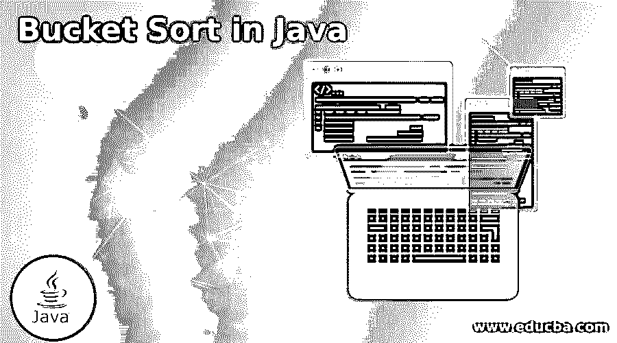
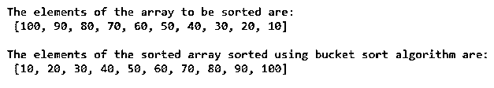
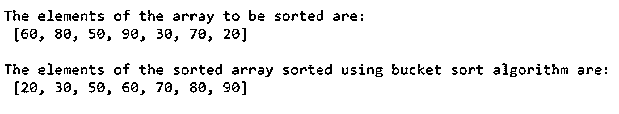

# Java 中的桶排序

> 原文：<https://www.educba.com/bucket-sort-in-java/>




## Java 中桶排序的介绍

将给定数组的元素分布到许多桶中以通过使用不同的排序算法或通过递归地使用桶排序算法来对每个桶进行排序的排序技术在 Java 中被称为桶排序，其空间复杂度为 O(1)，最坏情况复杂度为 O(n^2， 最佳情况复杂度是ω(n+k ),平均情况复杂度是θ(n+k ),并且与其他排序算法相比，对阵列的给定元素进行排序的桶排序技术以更快的速度工作，并且要使用桶排序算法排序的阵列元素必须是均匀分布的。

**Java 中执行桶排序的函数如下:**

<small>网页开发、编程语言、软件测试&其他</small>

```
public static int[] bucketsort(int[] array, int maximum_value)
{
int[] newbucket = new int[maximum_value + 1];
int[] sorted_array = new int[array.length];
for (int a= 0; a <array.length; a++)
newbucket[array[a]]++;
int position = 0;
for (int b = 0; b < newbucket.length; b++)
for (int c = 0; c < newbucket[b]; c++)
sorted_array[position++] = b;
return sorted_array;
}
```

其中，array 是要使用桶排序算法排序的输入数组，maximum_value 是给定数组中的最大值，sorted_array 是由排序元素组成的结果数组。

### 桶排序算法在 Java 中的实现

Java 中桶排序算法的工作原理如下:

*   桶排序算法的第一步是创建一个空数组作为桶。
*   第二步是遍历其元素将被排序的整个输入数组，并将每个元素添加到 bucket 中。
*   第三步是将桶中的柠檬分类。
*   第四步是遍历桶中的所有元素，并将它们按排序顺序添加到原始输入数组中。

### Java 中桶排序的例子

下面是一些例子:

#### 示例#1

Java 程序，通过实现桶排序算法对给定数组的元素进行排序，然后将排序后的数组元素作为输出显示在屏幕上:

**代码:**

```
import java.util.*;
public class Main
{
public static int[] bucketsort(int[] array, int maximum_value)
{
//creating an empty array called newbucket which is considered as bucket array
int[] newbucket = new int[maximum_value + 1];
//creating another empty array called sorted_array to store the result array
int[] sorted_array = new int[array.length];
//traversing through the input array to add each element to the bucket array
for (int a= 0; a <array.length; a++)
newbucket[array[a]]++;
//sorting each element in the bucket array and adding each sorted element in order to the original input array
int position = 0;
for (int b = 0; b < newbucket.length; b++)
for (int c = 0; c < newbucket[b]; c++)
sorted_array[position++] = b;
return sorted_array;
}
//function to find the maximum value in the input array in order to sort the given array using bucket sort technique
static int maximumValue(int[] array)
{
int maximum_value = 0;
for (int d = 0; d < array.length; d++)
if (array[d] > maximum_value)
maximum_value = array[d];
return maximum_value;
}
//main function is called within which we display the resulting array
public static void main(String args[])
{
int[] array ={100, 90, 80, 70, 60, 50, 40, 30, 20, 10};
int maximum_value = maximumValue(array);
System.out.print("\nThe elements of the array to be sorted are:\n ");
System.out.println(Arrays.toString(array));
System.out.print("\nThe elements of the sorted array sorted using bucket sort algorithm are:\n ");
System.out.println(Arrays.toString(bucketsort(array,maximum_value)));
}
}
```

**输出:**




在上面的程序中，我们创建了一个名为 newbucket 的空数组，它被认为是 bucket 数组。然后我们创建另一个名为 sorted_array 的空数组来存储结果数组。然后，我们遍历输入数组，将每个元素添加到桶数组中。然后，我们对桶数组中的每个元素进行排序，并将每个排序后的元素添加到原始输入数组中。然后，我们定义一个函数来查找输入数组中的最大值，以便使用桶排序技术对给定的数组进行排序。然后调用 main 函数，在其中显示结果数组。输出显示在上面的快照中。

#### 实施例 2

Java 程序，通过实现桶排序算法对给定数组的元素进行排序，然后将排序后的数组元素作为输出显示在屏幕上:

**代码:**

```
import java.util.*;
public class Main
{
public static int[] bucketsort(int[] array, int maximum_value)
{
//creating an empty array called newbucket which is considered as bucket array
int[] newbucket = new int[maximum_value + 1];
//creating another empty array called sorted_array to store the result array
int[] sorted_array = new int[array.length];
//traversing through the input array to add each element to the bucket array
for (int a= 0; a <array.length; a++)
newbucket[array[a]]++;
//sorting each element in the bucket array and adding each sorted element in order to the original input array
int position = 0;
for (int b = 0; b < newbucket.length; b++)
for (int c = 0; c < newbucket[b]; c++)
sorted_array[position++] = b;
return sorted_array;
}
//function to find the maximum value in the input array in order to sort the given array using bucket sort technique
static int maximumValue(int[] array)
{
int maximum_value = 0;
for (int d = 0; d < array.length; d++)
if (array[d] > maximum_value)
maximum_value = array[d];
return maximum_value;
}
//main function is called within which we display the resulting array
public static void main(String args[])
{
int[] array ={ 60, 80, 50, 90, 30, 70, 20 };
int maximum_value = maximumValue(array);
System.out.print("\nThe elements of the array to be sorted are:\n ");
System.out.println(Arrays.toString(array));
System.out.print("\nThe elements of the sorted array sorted using bucket sort algorithm are:\n ");
System.out.println(Arrays.toString(bucketsort(array,maximum_value)));
}
}
```

**输出:**




在上面的程序中，我们创建了一个称为新桶的空数组，它被认为是桶数组。然后我们创建另一个名为 sorted_array 的空数组来存储结果数组。然后，我们遍历输入数组，将每个元素添加到桶数组中。然后，我们对桶数组中的每个元素进行排序，并将每个排序后的元素添加到原始输入数组中。然后，我们定义一个函数来查找输入数组中的最大值，以便使用桶排序技术对给定的数组进行排序。然后调用 main 函数，在其中显示结果数组。输出显示在上面的快照中。

### 推荐文章

这是一个 Java 中桶排序的指南。在这里，我们还讨论了 java 中桶排序算法的介绍和工作原理，并给出了一些例子。您也可以看看以下文章，了解更多信息–

1.  [在 Java 中排序字符串数组](https://www.educba.com/sort-string-array-in-java/)
2.  [JavaScript hash()](https://www.educba.com/javascript-hash/)
3.  [Java 中的排序字符串](https://www.educba.com/sort-string-in-java/)
4.  [在 JavaScript 中排序字符串](https://www.educba.com/sort-string-in-javascript/)


