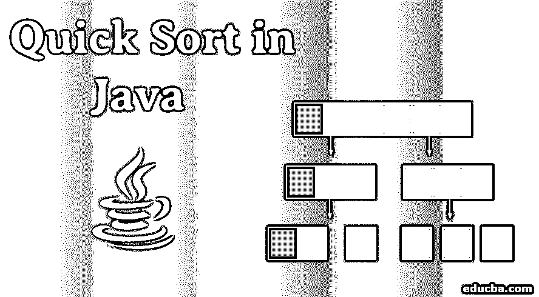
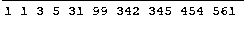

# Java 中的快速排序

> 原文：<https://www.educba.com/quick-sort-in-java/>




## Java 快速排序简介

下面这篇文章，java 中的快速排序，提供了 Java 中快速排序算法的概要。快速排序算法是一种高效的排序算法，类似于[合并排序算法](https://www.educba.com/merge-sort-in-java/)。这是用于实时排序目的的普遍使用的算法之一。该算法最坏情况时间复杂度为 O(n^2)，平均情况时间复杂度为 O(n log n)，最好情况时间复杂度为 O(n log n)。

空间复杂度为 O(n log n)，其中 n 是输入的大小。排序的过程包括输入的划分、递归迭代和标记每个递归的关键元素。该算法中的排序类型包括以迭代方式比较相邻元素。

<small>网页开发、编程语言、软件测试&其他</small>

### 快速排序在 Java 中是如何工作的？

快速排序算法可以在 Java 中通过形成伪代码来实现，该伪代码具有以有效方式设计和遵循的一系列步骤。

*   快速排序算法的主要原理是基于分治法，也是一种有效的排序算法。
*   输入数组被划分成子数组，这种划分基于 pivot 元素，pivot 元素是一个中心元素。pivot 元素两侧的子数组是排序实际发生的主要区域。
*   中心枢纽元素是将数组分成两个分区的基础，其中数组元素的左半部分小于枢纽元素，数组元素的右半部分大于枢纽元素。
*   在考虑 pivot 元素之前，它可以是数组中的任何元素。为了便于理解，这通常被认为是中间的一个或第一个，或最后一个。枢纽元素可以是任意数组元素中的任意一个。
*   在我们的示例中，数组的最后一个元素被视为 pivot 元素，其中子数组的划分从数组的右端开始。
*   最后，在排序过程完成后，pivot 元素将处于其实际排序位置，其中排序的主要过程在于排序算法的[的划分逻辑。](https://www.educba.com/sorting-algorithms-in-python/)
*   算法的效率取决于子阵列的大小以及它们是如何平衡的。子阵列越不平衡，时间复杂度就越高，导致最坏情况的复杂度。
*   在许多情况下，以随机方式选择中枢元素导致最佳的时间复杂度，而不是选择特定的开始、结束或中间索引作为中枢元素。

### 用 Java 实现快速排序的例子

快速排序算法已经用 Java 编程语言实现如下，输出代码已经显示在代码下面。

*   代码最初使用 quickSortAlgo()方法获取输入，并将数组、初始索引和最终索引(即数组的长度)作为参数。
*   调用 quickSortAlgo()方法后，它检查初始索引是否小于最终索引，然后调用 arrayPartition()方法来获取 pivot 元素值。
*   partition 元素包含根据 pivot 元素周围的元素值排列较小和较大元素的逻辑。
*   在 partition 方法执行后获得 pivot 元素索引后，quickSortAlgo()方法被自己递归调用，直到所有子数组都被完全分区和排序。
*   在划分逻辑中，最后一个元素被指定为中枢元素，并且第一个元素与中枢元素进行比较，即最后一个元素，其中基于元素是更小还是更大来交换元素。
*   这个[递归](https://www.educba.com/recursion-in-java/)的过程一直发生，直到一个数组的所有元素都被分区和排序，最终结果是一个组合排序后的数组。
*   仅当元素小于或等于 pivot 元素时，才会在 for 循环迭代中交换元素。
*   在完成迭代过程之后，交换最后一个元素，即主元值被移动到左侧，从而产生新的分区，并且相同的过程以递归的形式重复，这导致在不同的可能分区上的一系列排序操作，作为给定数组元素的子数组的形成。
*   以下代码可以在任何 IDE 上运行，并且可以通过更改 main()中的数组值来验证输出。main 方法仅用于获取控制台中的输出。作为 Java 编码标准的一部分，main 方法可以在下面被移除，并且可以创建一个对象，下面的方法可以通过使它们成为非静态的来调用。

### 快速排序算法的 Java 代码实现

下面是一个代码实现:

**代码:**

```
/*
* Quick Sort algorithm - Divide & Conquer approach
*/
public class QuickSortAlgorithm {
public static void main(String[] args) {
int[] array = { 99, 31, 1, 3, 5, 561, 1, 342, 345, 454 };
quickSortAlgo(array, 0, array.length - 1);
for (int ar : array) {
System.out.print(ar + " ");
}
}
public static int arrayPartition(int[] array, int start, int end) {
int pivot = array[end];
int i = (start - 1);
for (int ele = start; ele < end; ele++) {
if (array[ele] <= pivot) {
i++;
int swap = array[i];
array[i] = array[ele];
array[ele] = swap;
}
}
// Swapping the elements
int swap = array[i + 1];
array[i + 1] = array[end];
array[end] = swap;
return i + 1;
}
public static void quickSortAlgo(int[] arrayTobeSorted, int start, int end) {
if (start < end) {
int pivot = arrayPartition(arrayTobeSorted, start, end);
quickSortAlgo(arrayTobeSorted, start, pivot - 1);
quickSortAlgo(arrayTobeSorted, pivot + 1, end);
}
}
}
```

**输出:**




### 结论

快速排序算法是有效的，但是与其他排序技术相比不太稳定。在大量重复元素的情况下，快速排序算法的效率下降，这是一个缺点。该快速排序算法优化了空间复杂度。

### 推荐文章

这是一个 Java 快速排序的指南。这里我们讨论快速排序在 Java 中是如何工作的，以及一个示例和代码实现。您也可以浏览我们推荐的其他文章，了解更多信息——

1.  [Java 中的堆排序](https://www.educba.com/heap-sort-in-java/)
2.  [JavaScript 中的合并排序](https://www.educba.com/merge-sort-in-javascript/)
3.  [Python 中的堆排序](https://www.educba.com/heap-sort-in-python/)
4.  [JavaScript 中的排序算法](https://www.educba.com/sorting-algorithms-in-javascript/)


