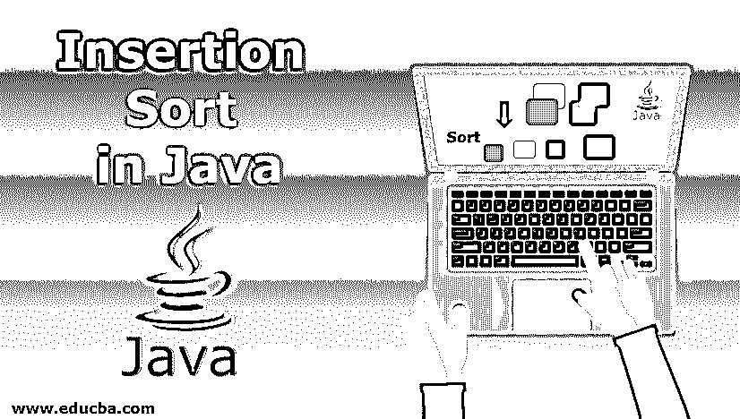

# Java 中的插入排序

> 原文：<https://www.educba.com/insertion-sort-in-java/>




## Java 中插入排序的介绍

如果你是一个程序员，你一定听说过很多排序。排序基本上是按升序或降序排列元素。有这么多的排序算法可以用来对元素进行排序，每种算法都有不同的排序方式，不同的复杂度。因此，应该使用哪种算法取决于具体的场景和元素的数量。插入也是常用的排序算法[之一](https://www.educba.com/sorting-algorithms-in-javascript/)具有 O(n^2 复杂度，执行起来就像我们对手中的扑克牌进行排序一样。在这个主题中，我们将学习 Java 中的插入排序。

### Java 中的插入排序是如何工作的？

让我们通过一个例子来理解插入排序的工作原理。

<small>网页开发、编程语言、软件测试&其他</small>

假设有一个名为 arr 的数组，它包含下面提到的元素:

10 5 8 20 30 2 9 7

**步骤# 1-**插入排序从数组的第 2 个元素开始，即 5，考虑数组的第 1 个元素本身。现在将元素 5 与 10 进行比较，因为 5 小于 10，所以将 10 向前移动 1 个位置，并在它之前插入 5。

现在得到的数组是:

5 10 8 20 30 2 9 7

**步骤# 2-**现在将元素 arr[2]，即 8 与元素 arr[1]，即 10 进行比较。因为 8 比它前面的元素 10 小，所以它从它的位置向前移动一步，然后与 5 进行比较。由于 8 大于 5，所以在它之后插入。

那么得到的数组是:

5 8 10 20 30 2 9 7

**步骤# 3-**现在，元素 20 与 10 进行比较，因为它大于 10，所以它保持在原来的位置。

5 8 10 20 30 2 9 7

**步骤# 4-**将元素 30 与 20 进行比较，因为它大于 20，所以不会进行任何更改，数组保持原样。现在这个数组应该是

5 8 10 20 30 2 9 7

**步骤# 5-**将元素 2 与 30 进行比较，当它小于 30 时，它将向前移动一个位置，然后逐一与 20、10、8、5 进行比较，所有元素都将向前移动 1 个位置，2 将插入到 5 之前。

生成的数组是:

2 5 8 10 20 30 9 7

**步骤# 6-**元素 9 与 30 进行比较，因为它小于 30；它与 20，10 逐一比较，元素向前移动 1 个位置，在 10 之前和 8 之后插入 9。

生成的数组是:

2 5 8 9 10 20 30 7

**步骤# 7—**元素 7 与 30 比较，由于小于 30，所以与 30、20、10、9、8 比较，所有元素都一一前移 1 位，7 插在 8 之前。

生成的数组将变成:

2 5 7 8 9 10 20 30

这样，使用插入排序对数组的所有元素进行排序[，开始与前一个元素进行比较。](https://www.educba.com/insertion-sort-in-data-structure/)

### 用 Java 实现插入排序的例子

Java 中的插入排序是一种简单的排序算法，适用于所有小型数据集。

**代码:**

```
public class InsertionSort {
public static void insertionSort(int arr[]) { for (int j = 1; j < arr.length; j++) { int key = arr[j]; int i = j-1;
while ( (i > -1) && ( arr[i] > key ) ) { arr[i+1] = arr[i]; i--; }
arr[i+1] = key;
}
}
static void printArray(int arr[]) { int len = arr.length;
//simple for loop to print the elements of sorted array for (int i= 0; i<len; i++)
System.out.print(arr[i] + " " );
System.out.println();
}
public static void main(String args[]){ int[] arr1 = {21,18,15,23,52,12,61};
//calling the sort function which performs insertion sort insertionSort(arr1);
//calling the printArray function which performs printing of array printArray(arr1);
}
}
```

**输出:**

12 15 18 21 23 52 61

**说明:**

*   在上面的插入排序程序中，Insertion Sort()函数用于对原始数组元素进行排序。排序从第二个元素开始，因为第一个元素本身被认为是已排序的。所以 j 的循环从数组的索引 1 开始。“I”是跟踪“j”之前的索引以便比较值的变量。'
*   “key”是保存当前元素值的变量，该元素将被排列在排序后的位置。如果当前值小于最左边的值，则执行 while()循环，以便可以处理元素的移位，最后，可以在正确的位置插入当前元素。printArray()函数用于最终打印排序后的数组。

#### 1.最好的情况

在插入排序中，最好的情况是数组的所有元素都已经排序了。因此，当任何元素与其最左边的元素比较时，它总是更大，因此不会处理元素的移动和插入。在这种情况下，最佳情况复杂度将是线性的，即 O(n)。

#### 2.最坏情况

在上面的插入排序代码中，最坏的情况是数组顺序相反，所以每次当元素与其最左边的元素比较时，它总是较小，然后与所有前面的元素比较，移位和插入完成。在这种情况下，插入排序的复杂性是 O(n^2).

#### 3.一般情况

即使在一般情况下，插入排序也具有 O(n^2 复杂度，其中一些元素不需要移位，而一些元素从它们的位置移位，并且在正确的位置执行插入。

#### 4.最佳用途

当数组的大小不是很大，或者只有少量的元素需要排序时，插入排序是最好的选择。在插入排序中，几乎所有的元素都要排序，并且只需要做一些修改。插入排序是小型数组中最快的算法之一，甚至比快速排序还要快。事实上，quicksort 在对数组的小部分进行排序时使用了插入排序。

### 结论

上面的解释清楚地显示了 Java 中插入排序的工作和实现。在其他编程语言中，执行插入排序的逻辑保持不变，只是语法发生了变化。在实现任何排序算法之前，对需要进行排序的场景进行一些分析是非常重要的，因为不是每个排序算法都适合所有场景。

### 推荐文章

这是一个 Java 插入排序的指南。这里我们讨论插入排序在 java 中是如何工作的，以及用 java 实现插入排序的例子。您也可以看看以下文章，了解更多信息–

1.  [Java 中的平方根](https://www.educba.com/square-root-in-java/)
2.  [Java 中的 BorderLayout](https://www.educba.com/borderlayout-in-java/)
3.  [Java 中的反数](https://www.educba.com/reverse-number-in-java/)
4.  [Java 中的 string buffer](https://www.educba.com/stringbuffer-in-java/)


