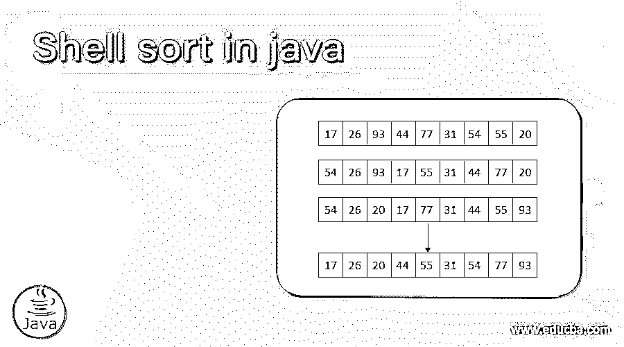
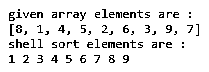
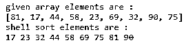
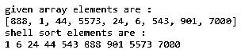

# java 中的 Shell 排序

> 原文：<https://www.educba.com/shell-sort-in-java/>




## java 中外壳排序的定义

shell sort 是一种使用 java 编程语言对给定的数字或数组进行排序的算法。它基于插入排序算法，根据需要对元素进行排序。它是一个使用除数的排序元素，并且比较彼此相距很远的元素。它是一种使用 java 语言按升序或降序设置元素的算法。它是一个元素中的除法数组，使用 java 将一个元素与另一个不同的元素进行比较。这是一个比较两个相距很远的元素的排序过程。Shell 排序是对排列数组元素的插入排序方法的推广。

### 句法

下面是使用 java 的 shell 排序语法。

<small>网页开发、编程语言、软件测试&其他</small>

```
int array_length = shell_array.length;
for (int elemnt_gap = array_length / 2; elemnt_gap > 0; elemnt_gap = elemnt_gap /2)
{
int j, i;
for ( i = elemnt_gap; i < array_length; i += 1)
{
int temprary_elemnt = shell_array[i];
for ( j = i; j >= elemnt_gap && shell_array[j - elemnt_gap] > temprary_elemnt; j -= elemnt_gap)
shell_array[j] = shell_array[j - elemnt_gap];
shell_array[j] = temprary_elemnt;
}
}
```

**描述:**

*   “array_length”是用于 shell 排序的给定数组的长度。
*   您可以使用“elemnt _ gap”变量在两个元素之间创建间隙。
*   使用“for loop”遍历数组元素中的变量。
*   “temprary_elemnt”用于对数组元素进行排序。
*   然后，您可以按照升序开始 shell 排序。

### Java 中 Shell 排序是如何工作的？

*   用 java 创建一个主类。

```
public class Shell{ … }
```

*   用数组变量创建 shell 排序方法。

```
int shellSort(int shell_array[]) { … }
```

*   为给定的所需数组创建数组长度。

```
int array_length = shell_array.length;
```

在两个元素之间留出一个间隙，以便对数组元素进行排序。

```
for (int elemnt_gap = array_length / 2; elemnt_gap > 0; elemnt_gap = elemnt_gap /2) {
write shell sort algorithm here…
}
```

将 shell 排序算法放在“for 循环”中

该算法以表格格式排列数组元素。较小的元素放在列的左侧，较大的元素放在列的右侧。

```
for (int elemnt_gap = array_length / 2; elemnt_gap > 0; elemnt_gap = elemnt_gap /2) {
int j, i;
for ( i = elemnt_gap; i < array_length; i += 1) {
int temprary_elemnt = shell_array[i];
int j;
for (j = i; j >= elemnt_gap && shell_array[j - elemnt_gap] > temprary_elemnt; j -= elemnt_gap)
shell_array[j] = shell_array[j - elemnt_gap];
shell_array[j] = temprary_elemnt;
}
}
return 0;
```

创建 main 方法并返回排序元素。

```
public static void main(String args[]) {
int shell_array[] = { 1, 4, 5, 2, 3 };
Shell shell = new Shell();
shell.shellSort(shell_array);
System.out.println("shell sort elements are: ");
int array_length = shell_array.length;
for (int i = 0; i < array_length; ++i)
System.out.print(shell_array[i] + " ");
System.out.println();
}
```

### 例子

以下是不同的例子:

#### 示例#1:单一数值

**代码:**

```
import java.util.Arrays;
public class Shell {
int shellSort(int shell_array[]) {
int array_length = shell_array.length;
int j, i;
for (int elemnt_gap = array_length / 2; elemnt_gap > 0; elemnt_gap = elemnt_gap /2) {
for (i = elemnt_gap; i < array_length; i += 1) {
int temprary_elemnt = shell_array[i];
for ( j = i; j >= elemnt_gap && shell_array[j - elemnt_gap] > temprary_elemnt; j -= elemnt_gap)
shell_array[j] = shell_array[j - elemnt_gap];
shell_array[j] = temprary_elemnt;
}
}
return 0;
}
public static void main(String args[]) {
int shell_array[] = { 8, 1, 4, 5, 2, 6, 3, 9, 7};
System.out.println("given array elements are : ");
System.out.println(Arrays.toString(shell_array));
Shell shell = new Shell();
shell.shellSort(shell_array);
System.out.println("shell sort elements are : ");
int array_length = shell_array.length;
for (int i = 0; i < array_length; ++i)
System.out.print(shell_array[i] + " ");
}
}
```

**输出:**




#### 示例 2:双数值

**代码:**

```
import java.util.Arrays;
public class Shell {
int shellSort(int shell_array[]) {
int array_length = shell_array.length;
int j, i;
for (int elemnt_gap = array_length / 2; elemnt_gap > 0; elemnt_gap = elemnt_gap /2) {
for (i = elemnt_gap; i < array_length; i += 1) {
int temprary_elemnt = shell_array[i];
for ( j = i; j >= elemnt_gap && shell_array[j - elemnt_gap] > temprary_elemnt; j -= elemnt_gap)
shell_array[j] = shell_array[j - elemnt_gap];
shell_array[j] = temprary_elemnt;
}
}
return 0;
}
public static void main(String args[]) {
int shell_array[] = { 81, 17, 44, 58, 23, 69, 32, 90, 75};
System.out.println("given array elements are : ");
System.out.println(Arrays.toString(shell_array));
Shell shell = new Shell();
shell.shellSort(shell_array);
System.out.println("shell sort elements are : ");
int array_length = shell_array.length;
for (int i = 0; i < array_length; ++i)
System.out.print(shell_array[i] + " ");
}
}
```

**输出:**




#### 示例#3:多个数值

**代码:**

```
import java.util.Arrays;
public class Shell {
int shellSort(int shell_array[]) {
int array_length = shell_array.length;
int j, i;
for (int elemnt_gap = array_length / 2; elemnt_gap > 0; elemnt_gap = elemnt_gap /2) {
for (i = elemnt_gap; i < array_length; i += 1) {
int temprary_elemnt = shell_array[i];
for ( j = i; j >= elemnt_gap && shell_array[j - elemnt_gap] > temprary_elemnt; j -= elemnt_gap)
shell_array[j] = shell_array[j - elemnt_gap];
shell_array[j] = temprary_elemnt;
}
}
return 0;
}
public static void main(String args[]) {
int shell_array[] = { 888, 1, 44, 5573, 24, 6, 543, 901, 7000};
System.out.println("given array elements are : ");
System.out.println(Arrays.toString(shell_array));
Shell shell = new Shell();
shell.shellSort(shell_array);
System.out.println("shell sort elements are : ");
int array_length = shell_array.length;
for (int i = 0; i < array_length; ++i)
System.out.print(shell_array[i] + " ");
}
}
```

**输出:**




**描述:**

*   你可以看到给定的多种类型的数值。
*   Shell 排序在元素之间创建了一个差异。
*   然后，按升序对数组进行排序。

### 结论

*   java 中的 shell sort 有助于按照用户的要求排列数组元素。
*   它使 web 应用程序变得有序、简单和易于理解。
*   shell sort 可以简单地安排数据，并使应用程序对用户友好。

### 推荐文章

这是一个 java 中 Shell 排序的指南。在这里，我们讨论定义、语法和参数，以及 java 示例中 Shell 排序的工作方式和代码实现。您也可以看看以下文章，了解更多信息–

1.  [Java 中的排序字符串](https://www.educba.com/sort-string-in-java/)
2.  [排序字符串 C++](https://www.educba.com/sort-string-c/)
3.  [C 中的冒泡排序](https://www.educba.com/bubble-sort-in-c/)
4.  [排序字符串 PHP](https://www.educba.com/sort-string-php/)


