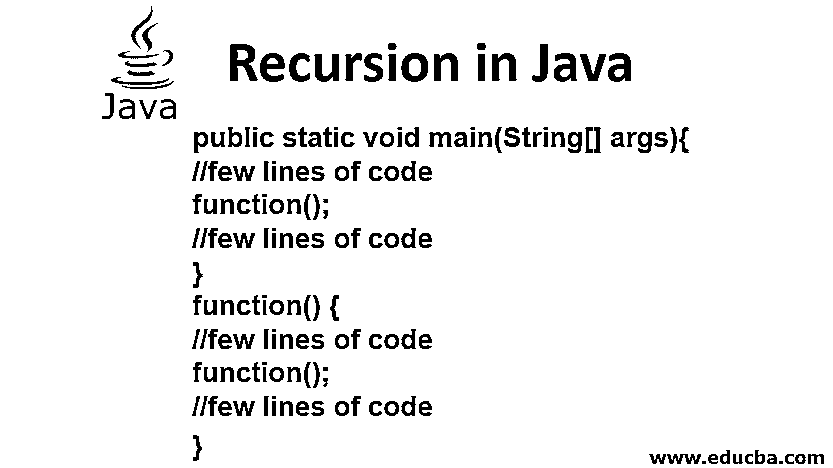
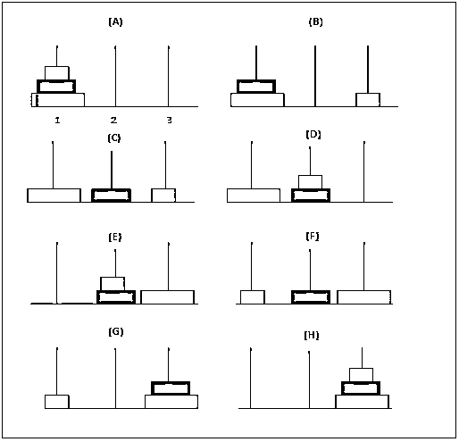
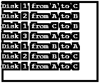
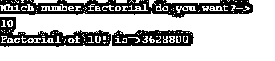
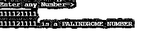
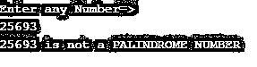

# Java 中的递归

> 原文：<https://www.educba.com/recursion-in-java/>




## Java 中递归的介绍

Java 中的递归定义为“一个方法连续地直接或间接地调用自己(同一个方法)。”递归函数用于需要一次又一次地执行同一组操作直到得到结果的情况。它执行多次迭代，问题陈述随着每次迭代变得越来越简单。**Java 中的递归是一种基于同一问题的较小块的解来求解问题的方法。大部分无限可能性迭代都可以用递归来解决。我们可以说递归是循环语句的一种替代方式。如果我们没有正确使用递归函数，那么它会执行无限次。**

 ******语法:****

<small>网页开发、编程语言、软件测试&其他</small>

```
returntype methodName()
{
//logic for application
methodName();//recursive call
}
```

### 怎样才能在 Java 中停止递归的无限条件？

要停止无限条件，我们必须具备以下条件:

*   ******基础条件:**** 指定条件是否停止递归函数。**
***   ******递归调用:**** 适当递归调用。****

 ****我们可以用两种方式调用递归函数:

#### **1。直接递归调用**

 **如果我们从内部方法体调用同一个方法。

****语法:****

```
returntype methodName()
{
//logic for application
methodName();//recursive call
}
```

**举例:**

数字的阶乘是直接递归的一个例子。递归的基本原理是通过将复杂的问题分解成较小的问题来解决。例如，在一个数的阶乘的情况下，如果我们知道“i-1”的阶乘，我们就计算“I”的阶乘。

**代码:**

```
public class Factorial {
static int fact(int i){
if (i == 1)
return 1;
else
return(i * fact(i-1));
}
public static void main(String[] args) {
System.out.println("The factorial of given number 6 is: "+fact(6));
}
}
```

**输出:**


#### **2。间接/相互递归调用**

 **如果我们从另一个方法调用一个方法，而另一个方法从第一个方法调用，反之亦然。

****语法:****

```
<firstIndirectRecursive()
{
// Logic
secondIndirectRecursive();
}
secondIndirectRecursive()
{
//Logic
firstIndirectRecursive();
}
```

**举例:**

为了展示间接递归，我们采用下面的程序来从给定的输入中找出一个给定的数是偶数还是奇数。

**代码:**

```
import java.util.Scanner;
public class IndirectRecursion {
public static boolean oddNum(int i) {
if (i<0) throw new IllegalArgumentException("Number is negative");
if(i == 0){
return false;
} else {
return evenNum(i-1);
}
}
public static boolean evenNum(int i) {
if (i<0) throw new IllegalArgumentException("Number is negative");
if(i == 0){
return true;
} else {
return oddNum(i-1);
}
}
public static void main(String[] args) {
Scanner inputNum = new Scanner(System.in);
System.out.print("Give a number: ");
int n = inputNum.nextInt();
if (evenNum(n)) System.out.println(n + " is even");
else System.out.println(n + " is odd");
inputNum.close();
}
}
```

**输出:**


### Java 中递归的例子

这里还有一些用递归方法解决问题的例子。

#### 示例 1–斐波那契数列

如果数字 3 =数字 1+数字 2，即每个数字都是前两个数字之和，则称一组“n”个数字为斐波纳契数列。因此，序列总是从前两个数字开始，如 0 和 1。第三个数字是 0 和 1 的和，结果是 1，第四个数字是 1 和 1 的和，结果是 2，这样继续下去。

查看以下 Java 代码以生成斐波那契数列:

**代码:**

```
public class FibonacciSeries{
static int num1=0,num2=1,num3=0;
static void fibonacci(int n){
if(n>0){
num3 = num1 + num2;
num1 = num2;
num2 = num3;
System.out.print(" "+num3);
fibonacci(n-1);
}
}
public static void main(String args[]){
int n=10;
System.out.print(num1+" "+num2);//printing constant first two digits 0 and 1
fibonacci(n-2);//Since first two numbers are already done
}
}
```

**输出:**


这里，前两个数字被初始化为 0 和 1，并被打印出来。变量“num1”、“num2”和“num3”用于生成所需的序列。变量“num3”是通过将“num1”和“num2”相加得到的，数字通过如代码所示的洗牌向左移动一个位置。这里递归调用函数“Fibonacci”，每迭代一次，“n”的值就减 1。因此，只要“n”达到值 0，递归就退出。

#### 例子# 2–河内塔

这是一个经典的数学问题，有 3 个极点和“n”个不同大小的圆盘。谜题是这样的:




开始时，第一个磁极的圆盘排列成最大的圆盘在磁极的底部，最小的圆盘在磁极的顶部。目标是将这些圆盘从第一磁极移动到第三磁极，保持圆盘在与第一磁极相同的位置。移动这些磁盘时，请记住以下几个条件:

*   一次只能移动一个磁盘。
*   在此过程中，不允许将较大的磁盘放在较小的磁盘上。
*   第二(中间)极可用于在将盘从第一极转移到第二极时进行调节。

下面是可以用来解决这个难题的 Java 代码:

**代码:**

```
public class TowerOfHanoi {
public static void main(String[] args) {
int count = 3;
tower(count, 'A', 'B', 'C');
}
public static void tower(int first, char disk1, char temp, char disk2) {
if (first == 1) {
System.out.println("Disk 1 from " + disk1 + " to " + disk2);
} else {
tower(first - 1, disk1, disk2, temp);
System.out.println("Disk " + first + " from " + disk1 + " to " + disk2);
tower(first - 1, temp, disk1, disk2);
}
}
}
```

**输出:**




这里，变量“计数”表示要使用的盘的数量。函数“tower”是用于将圆盘从杆 1 移动到杆 3 的递归函数。这个问题的简单解决方案可以通过首先考虑 2 个盘来提供。

*   首先，我们从将 disc1 从 rod 1 移动到 rod 2 开始。
*   接下来，我们将磁盘 2 移动到杆 3。
*   最后，我们将 disc1 移动到 rod 3，完成所需的解决方案。

通过将(n-1)个圆盘从杆 1 移动到杆 2 并遵循与上述类似的步骤，同样的原理适用于“n”个圆盘。

#### 例 3–数字的阶乘

****代号:****

```
package com.recursion;
import java.util.Scanner;
public class FactorialOfNumber {
public static void main(String[] args) {
Scanner scanner = new Scanner(System.in);
System.out.println("Which number factorial do you want?=>");
//taking input from the user
int input = scanner.nextInt();
System.out.println("Factorial of " + input + "! is=>"+getMyFactorialNumber(input));
scanner.close();
}
public static long getMyFactorialNumber(int inputNumber) {
if (inputNumber == 1)//base condition
return 1;
return inputNumber * getMyFactorialNumber(inputNumber - 1);//recursive call
}
}
```

**输出:**




#### **示例 4–阿姆斯特朗编号**

 ******代号:****

```
import java.util.Scanner;
//ARMSTRONG number means sum of numbers of cubes equal to the number
public class ArmstrongNumber {
public static void main(String[] args) {
Scanner scanner = new Scanner(System.in);
System.out.println("Enter any Number?=>");
// taking input from the user
int input = scanner.nextInt();
//calling isArmstrongNumber() method and put in a variable
double checkNumber=isArmstrongNumber(input);
//checking the number
if(input==checkNumber)
{
System.out.println(input+" is ARMSTRONG NUMBER");
}
else
{
System.out.println(input+" not is ARMSTRONG NUMBER");
}
scanner.close();
}
static int remainderNumber;
static double total = 0;
public static double isArmstrongNumber(int inputNumber) {
if (inputNumber > 0) {
remainderNumber = inputNumber % 10;//separating digits
total = total + Math.pow(remainderNumber, 3);//cubes sum
isArmstrongNumber(inputNumber / 10);//recursive call
}
return total;
}
}
```

****输出:****


#### **例 5–回文数字**

 ******代号:****

```
import java.util.Scanner;
public class PalindromeNumber {
public static void main(String[] args) {
Scanner scanner = new Scanner(System.in);
System.out.println("Enter any Number=>");
// taking input from the user
int input = scanner.nextInt();
int checkNumber = palindromeNumberOrNot(input,0);
if (checkNumber == input)
{
System.out.println(input+" is a PALINDROME NUMBER");
}
else
{
System.out.println(input+" is not a PALINDROME NUMBER");
}
scanner.close();
}
public static int palindromeNumberOrNot(int inputNumber,int baseNumber) {
if (inputNumber == 0)// base case
return baseNumber;
baseNumber = (baseNumber * 10) + (inputNumber % 10);// getting the reverse of the number and stores in temp
return palindromeNumberOrNot(inputNumber/10,baseNumber);//recursive call
}
}
```

**输出:**







### 结论

递归函数的编码相对简单，但与其他现有方法相比，它们的效率也不是很高。因此，它们主要用于开发时间较少的情况，以及可以在问题中观察到重要模式的情况。

### 推荐文章

这是一本关于 Java 中递归的指南。在这里，我们讨论介绍以及如何在 Java 中停止无限的递归条件，以及不同的例子和代码实现。你也可以看看下面的文章来了解更多-

1.  [Java 中的数学函数](https://www.educba.com/math-functions-in-java/)
2.  [Java 中的构造函数](https://www.educba.com/constructor-in-java/)
3.  [Python 中的递归函数](https://www.educba.com/recursive-function-in-python/)
4.  [JavaScript 中的阶乘程序](https://www.educba.com/factorial-program-in-javascript/)


**************