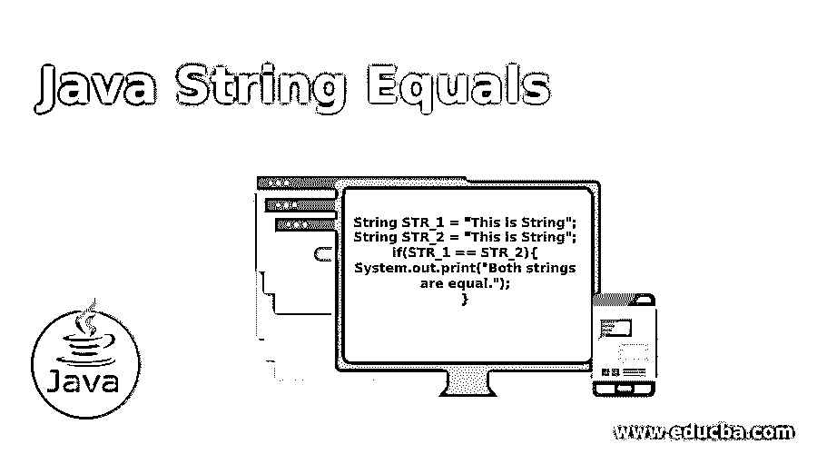

# Java 字符串等于

> 原文：<https://www.educba.com/java-string-equals/>




## Java 字符串等于简介

对于任何编程语言来说，字符串比较都是常见的事情。有各种方法可以比较字符串。在 Java 中，我们有各种方法来检查字符串是否相等。我们有一个函数列表。我们可以通过在 Java 编程语言中使用它来实现。一般来说，我们用 Java equals()和 equalsIgnoreCase()来检查字符串的相等性。equals()是一个区分大小写的函数。如果我们想继续区分大小写，我们可以使用 equalsIgnoreCase()函数来做同样的工作。我们还可以通过使用==操作符和 compareTo()来检查字符串比较。

### 它是如何工作的？

要使用字符串 equals，我们必须至少有两个字符串。比如说 STR_1 和 STR_2。我们可以简单地使用 Java equals 运算符。

<small>网页开发、编程语言、软件测试&其他</small>

**==操作员**

```
String STR_1 = "This is String";
String STR_2 = "This is String";
if(STR_1 == STR_2){
System.out.print("Both strings are equal.");
}
```

运行上面的代码后，我们可以看到两个字符串相等。

**equals()函数–**同样，该函数区分大小写，用于检查两个字符串是否相等。这与 compareTo()处理字符串的方式相同。这个函数的返回类型是 Boolean。这是一个区分大小写的函数。

```
String str1 = "Hello World";
String str2 = "Hello World";
boolean equalsStr = str1.equals(str2);
```

**equalsIgnoreCase()函数—**该函数的工作方式与 compareToIgnoreCase()函数非常相似。这忽略了 equals()函数工作之外的大小写检查。

```
String str1 = "Hello World";
String str2 = "Hello World";
boolean equalsStr = str1.equalsIgnoreCase(str2);
```

**Java compareTo()函数–**这是一个区分大小写的字符串比较函数。如果我们想用大小写检查来比较相同的文本或字符串，这个函数是最好的选择。在下面的代码中，我们有相同的字符串“Hello World ”,但在 str2 中，我们有带小写“h”的“Hello”单词。所以这两个字符串不相等。

```
String str1 = "Hello World";
String str2 = "hello World";
int compare = str1.compareTo(str2);
```

如果两个字符串相等，我们不会在比较标识符中取 0。但是在上面的例子中，我们不会得到 0。换句话说，str1 和 str2 的字符串不相等。

**Java comparetignorecase()函数–**如果我们希望将字符串与大小写匹配进行比较，那么这个函数将对我们有所帮助。让我们使用这个函数 compareToIgnoreCase()来看看上面提到的相同字符串。

```
String str1 = "Hello World";
String str2 = "hello World";
int compare = str1.compareToIgnoreCase(str2);
```

### 句法

```
int compareTo(String str)
```

这个函数的返回类型是一个整数。如果两个字符串相等，那么这个函数将返回 0。这也将检查字符串的大小写是否相同。即使在相等之后，字符串也将被认为是不相等的，但是大小写顺序不同。

```
int compareToIgnoreCase(String str)
```

这个函数的返回类型是一个整数。如果两个字符串相等，那么这个函数将返回 0。这也将检查字符串的大小写是否相同。这将忽略大小写差异。

```
boolean equals (String str1);
If strings will be equal, then it will return true otherwise false.
boolean equalsIgnoreCase(String str1);
```

如果字符串相等，那么它将返回 true。此函数将忽略大小写差异。

### Java 字符串等于的示例

现在，是时候看一些例子来理解我们到目前为止所讨论的内容了。

#### 示例 1–等号()的使用

**代码:**

```
public class StrEquals {
public static void main(String[] args) {
String str1 = "Hello World";
String str2 = "hello World";
boolean equalsStr = str1.equals(str2);
if(equalsStr == true){
System.out.print("Strings are equal.");
}else{
System.out.print("Strings are not equal.");
}
}
}
```

**输出**


#### 示例 2–equalsIgnoreCase()的使用

这是一个区分大小写的函数。

**代码:**

```
public class StrEquals {
public static void main(String[] args) {
String str1 = "Hello World";
String str2 = "hello World";
boolean equalsStr = str1.equalsIgnoreCase(str2);
if(equalsStr == true){
System.out.print("Strings are equal.");
}else{
System.out.print("Strings are not equal.");
}
}
}
```

**输出**


#### 示例 3–compare to()的使用

**代码:**

```
public class StrEquals {
public static void main(String[] args) {
String str1 = "Hello World";
String str2 = "hello World";
int equalsStr = str1.compareTo(str2);
if(equalsStr == 0){
System.out.print("Strings are equal.");
}else{
System.out.print("Strings are not equal.");
}
}
}
```

**输出**


#### 示例 4–comparetignorecase()的使用

这是一个区分大小写的函数。

**代码:**

```
public class StrEquals {
public static void main(String[] args) {
String str1 = "Hello World";
String str2 = "hello World";
int equalsStr = str1.compareToIgnoreCase(str2);
if(equalsStr == 0){
System.out.print("Strings are equal.");
}else{
System.out.print("Strings are not equal.");
}
}
}
```

**输出**


#### 例 5——使用==

是的，我们可以使用==进行字符串比较。这将作为区分大小写的相等检查。如果我们想忽略大小写检查，那么 toLowerCase()和 toUpperCase()可以为我们完成这项工作。通过使用这个函数中的任何一个，字符串都将是相同的大小写，然后我们可以将这个==应用于字符串 equals。

**代码:**

```
public class StrEquals {
public static void main(String[] args) {
String string1 = "Hello World, this is first.";
String string2 = "hello World, this is first.";
if(string1 == string2){
System.out.print("Strings are equal.");
}else{
System.out.print("Strings are not equal.");
}
}
}
```

**输出**


现在，我们已经讨论了所有的例子。

### 结论–Java 字符串等于

我们使用任何内置函数都是根据我们的业务需求。我们在 Java 中有 equals()、equalsIgnoreCase()、compareTo()、compareToIgnoreCase 等内置函数来处理字符串比较。开发人员或编码人员应该足够聪明，能够根据业务需求推进这些功能。如果我们的需求不是那么重要，我们也可以使用传统的字符串比较方法，即== (double equals)操作符本身。

### 推荐文章

这是一个 Java 字符串等于的指南。在这里，我们讨论 Java String Equals 是如何工作的，以及示例和样本代码。您也可以浏览我们推荐的其他文章，了解更多信息——

1.  [Java 里什么是 public？](https://www.educba.com/what-is-public-in-java/)
2.  [Java 引用](https://www.educba.com/java-references/)
3.  [JavaScript 承诺](https://www.educba.com/javascript-promise/)
4.  [Java 中的对象类](https://www.educba.com/object-class-in-java/)


