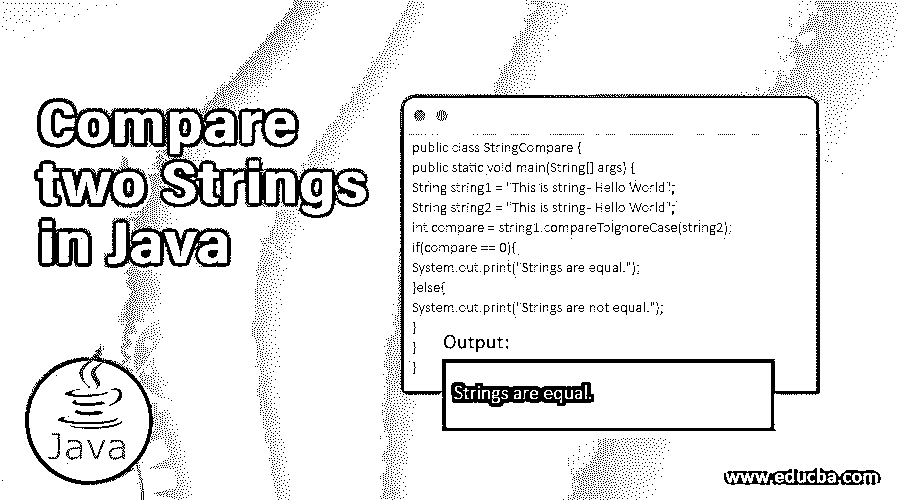

# 比较 Java 中的两个字符串

> 原文：<https://www.educba.com/compare-two-strings-in-java/>




## Java 中比较两个字符串的介绍

在任何编程语言中比较字符串都是很常见的。在 Java 编程语言中，有多种方法可以实现字符串比较。我们可以用各种方法比较两个字符串，或者使用内置函数，或者使用自定义代码。像 compareTo()、compareToIgnoreCase()和==这样的函数可以在 Java 中用于字符串比较。有几个内置函数，我们不仅可以用来比较字符串，还可以用来比较对象。我们不仅可以使用 compareTo()和 compareToIgnoreCase()进行字符串比较，还可以进行对象比较。在接下来的部分中，我们将看到字符串比较的各种例子。在这个主题中，我们将学习在 Java 中比较两个字符串。

### 它是如何工作的？

我们有两个字符串，比如字符串 1 和字符串 2。我们可以使用 Java 编程语言中各种可用的媒介来比较这个字符串。

<small>网页开发、编程语言、软件测试&其他</small>

#### 使用=运算符，

```
String string1 = "Hello";
String string2 = "Hello";
if(string1 == string2){
System.out.print("Both strings are equal.");
}
```

当两个字符串相等时，我们可以看到输出。

同样，我们可以使用 compareTo()作为区分大小写的函数，如果我们想忽略大小写比较，可以使用 compareToIgnoreCase()函数。

#### 使用 compareTo()

我们可以在不导入任何额外库的情况下使用这个函数。为此，我们将有两个字符串。让我们看看示例代码。

```
String string1 = "Hello World";
String string2 = "hello World";
int compare = string1.compareTo(string2);
if(compare == 0){
System.out.print("Strings are equal.");
}else{
System.out.print("Strings are not equal.");
}
```

这将给出“字符串不相等”因为字符串是相同的，但大小写是不同的。

#### 使用 compareToIgnoreCase()

该函数的工作原理与 compare()相同。如果情况不同，这将被忽略。

```
String string1 = "Hello World - 1";
String string2 = "hello World - 1";
int compare = string1.compareToIgnoreCase(string2);
if(compare == 0){
System.out.print("Strings are equal.");
}else{
System.out.print("Strings are not equal.");
}
```

上述函数的输出将是“字符串相等”因为我们使用的是 compareToIgnoreCase()函数。我们应该根据我们的要求使用上述技术。

### Java 中比较两个字符串的语法

下面是提到的语法

#### 1.int compareTo(字符串 str)

这个函数可以用来比较两个字符串。这个函数的返回类型是一个整数。如果字符串相等，则返回 0。compareTo 是 java 中的内置函数。str 是我们将作为参数传递的字符串。但是如果两种情况相同，这将会起作用。

#### 2.int compareTo(对象对象)

同样，我们可以使用 compareTo()函数使用对象进行比较。

#### 3.int compareToIgnoreCase(字符串 str)

这个函数与 compareTo()保持一致，但是它不会检查进程中给定字符串的大小写。

#### 4.int comparetignorecase(Object obj)

这个函数可以用来比较两个字符串。

### Java 中比较两个字符串的例子

以下是提到的例子

#### 使用=运算符的示例 1

这是我们可以用来进行字符串比较的最简单的方法之一。这是比较两个字符串的区分大小写的方式。如果我们想对两者都这样做，我们可以在指定的情况下(小写或大写)改变两者后传递字符串。

```
public class StringCompare {
public static void main(String[] args) {
String string1 = "Hello World";
String string2 = "Hello World";
if(string1 == string2){
System.out.print("Strings are equal.");
}
}
}
```

**输出**


#### 示例 2–使用=运算符(忽略大小写)

我们可以在示例中看到，字符串是相同的，但大小写不同。因此，我们首先将两个字符串的大小写都改为小写，然后使用=操作符来完成这项工作。

```
public class StringCompare {
public static void main(String[] args) {
String string1 = "Hello World";
String string2 = "hello World";
string1.toLowerCase();
string2.toLowerCase();
if(string1 == string2){
System.out.print("Strings are equal.");
}else{
System.out.print("Strings are not equal.");
}
}
}
```

**输出**


#### 示例 3–使用 compareTo(区分大小写)

字符串将具有相同的文本，使用此函数，相同的大小写将被视为相同。

```
public class StringCompare {
public static void main(String[] args) {
String string1 = "This is string - Hello World";
String string2 = "This is string - Hello World";
int compare = string1.compareTo(string2);
if(compare == 0){
System.out.print("Strings are equal.");
}else{
System.out.print("Strings are not equal.");
}
}
}
```

**输出**


#### 示例 4-使用 compareTo(区分大小写)

字符串是相同的，但是在下面的例子中大小写是不同的。

```
public class StringCompare {
public static void main(String[] args) {
String string1 = "This is String - Hello World";
String string2 = "This is string - Hello World";
int compare = string1.compareTo(string2);
if(compare == 0){
System.out.print("Strings are equal.");
}else{
System.out.print("Strings are not equal.");
}
}
}
```

**输出**


#### 示例 5-使用 compareToIgnoreCase(不检查大小写)

在比较两个字符串时，下面的程序将忽略大小写检查。

```
public class StringCompare {
public static void main(String[] args) {
String string1 = "This is string - Hello World";
String string2 = "This is string - Hello World";
int compare = string1.compareToIgnoreCase(string2);
if(compare == 0){
System.out.print("Strings are equal.");
}else{
System.out.print("Strings are not equal.");
}
}
}
```

**输出**


#### 示例 6-使用 compareToIgnoreCase(不检查大小写)

在比较两个字符串时，下面的程序将忽略大小写检查。

```
public class StringCompare {
public static void main(String[] args) {
String string1 = "This is String - Hello World-1";
String string2 = "this is string - Hello World-1";
int compare = string1.compareToIgnoreCase(string2);
if(compare == 0){
System.out.print("Strings are equal.");
}else{
System.out.print("Strings are not equal.");
}
}
}
```

**输出**


### 结论

Java 编程语言本身提供了各种特性或内置函数，我们可以用它们来比较两个字符串。我们应该使用内置函数，除非我们没有任何特定的需求。为了比较两个字符串，我们可以简单地使用等号运算符(=)。开发人员应该小心使用字符串比较函数，因为字符串大小写有时对于任何程序或项目都是错误的。

### 推荐文章

这是一个在 Java 中比较两个字符串的指南。这里我们讨论 Java 中比较两个字符串的例子，以及它是如何与语法一起工作的。您也可以看看以下文章，了解更多信息–

1.  [Java 中嵌套的 if 语句](https://www.educba.com/nested-if-statements-in-java/)
2.  [Java 中的 BinarySearch()](https://www.educba.com/binarysearch-in-java/)
3.  [Java 中的动态数组](https://www.educba.com/dynamic-array-in-java/)
4.  [Java 中的作文](https://www.educba.com/composition-in-java/)


