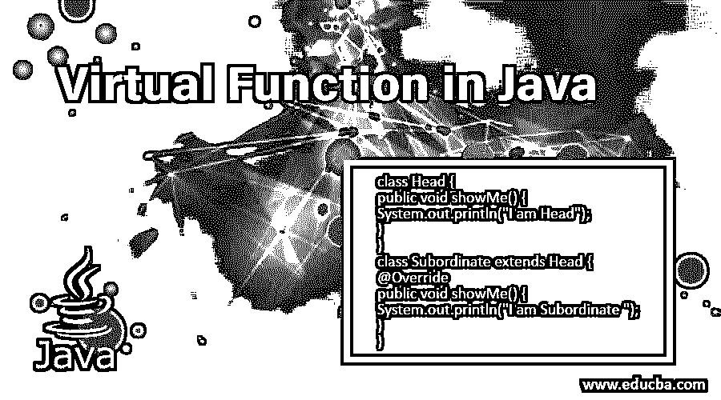
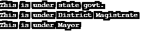
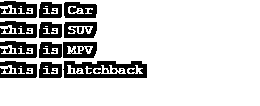

# Java 中的虚函数

> 原文：<https://www.educba.com/virtual-function-in-java/>




## Java 中的虚函数介绍

作为一种面向对象的编程语言，java 支持继承、多态、向上转换等特性。因此，Java 中的 OOPs 处理的是对象、类和函数。虚函数是 Java 中促进[运行时多态性的成员函数之一。在本文中，我们将讨论 Java 中的虚函数。](https://www.educba.com/runtime-polymorphism-in-java/)

**定义:**虚函数不是什么特殊的函数，但它是一个成员函数，便于方法覆盖机制。这意味着，在 OOPs 中，父类的虚函数是一个可以被具有相同类型但不同功能的子类覆盖的函数。

<small>网页开发、编程语言、软件测试&其他</small>

**语法:**对于 java 中的虚函数，你要遵循 Java 的基本语法加上注释。为了实现虚函数的覆盖机制，这里可以使用@Override 注释来明确指出我们想要覆盖哪个虚函数，尽管这不是强制性的。

### Java 中虚函数是如何工作的？

现在让我们看看虚函数是如何工作的。当我们通过子类的父类型引用来调用子类的重写方法时，那么对象的类型或引用指示将调用哪个方法。这个决定的结论发生在编译之后的运行时期间。因此，虚函数的功能被相同类型的继承子类覆盖。

关于虚函数的几点:

*   子类和父类的函数必须具有相同的名称和相同的参数。
*   关系是强制性的(继承)。
*   虚函数不能是私有的，因为我们不能覆盖父类的私有方法。
*   虚函数不能被声明为 Final，因为我们不能重写 Final 方法。
*   虚函数不能被声明为静态的，因为我们不能覆盖静态方法。

### Java 中虚函数的例子

我们将在这里讨论一些虚函数的代码示例。

#### 示例#1

在这个例子中，我们将展示虚拟函数 showMe()如何根据它所关联的对象的引用来显示不同的文本。当它与“Head”类型相关联时，它显示来自父类的消息。当它与“从属”类型相关联时，它显示来自子类的消息。

**代码:**

```
class Head {
public void showMe() {
System.out.println("I am Head");
}
}
class Subordinate extends Head {
@Override
public void showMe() {
System.out.println("I am Subordinate ");
}
}
public class VirtualFuntionDemo {
public static void main(String args[]) {
Head superObject = new Head();
superObject.showMe(); //method of super class or parent class is called
Head subObject = new Subordinate(); // upcasting
subObject.showMe();//method of sub class or child class is called by Parent reference, this is called "Virtual function"
Subordinate subObject2 = new Subordinate();
subObject2.showMe(); //method of sub class or child class is called
}
}
```

**输出:**


#### 实施例 2

让我们以[中的虚函数为例，说明多级继承](https://www.educba.com/multilevel-inheritance-in-java/)的情况。在这个例子中，我们考虑了两个层次的继承。在这个例子中，我们将展示虚拟函数 administration()如何根据它所关联的对象类型显示不同的消息。当它与“状态”类型相关联时，它显示来自父类的消息。当它与“地区”类型相关联时，它显示来自其子类的消息。同样，在第二级继承中，当与“自治市”类型相关联时，它显示来自其父类“地区”的子类的消息。

**代码:**

```
class State{
void administartion() {
System.out.println("This is under state govt.");
}
}
class District extends State{
void administartion(){
System.out.println("This is under District Magistrate");
}
}
class Municipality extends District{
void administartion(){
System.out.println("This is under Mayor ");
}
}
public class VirtualFunctionDemo2 {
public static void main(String args[]){
State superObject=new State ();
State subObject=new District ();
State sub2Object=new Municipality ();
superObject. administartion ();
subObject.administartion (); // run time polymorphism occurs in virtual function happening in first level of heritance
sub2Object.administartion (); // run time polymorphism occurs in virtual function happening in 2nd level of heritance
}
}
```

**输出:**




#### 实施例 3

让我们举另一个多级继承情况下的运行时多态性的例子。在这个例子中，我们考虑了三个层次的继承。在这个例子中，我们将展示虚拟函数 whoami()是如何根据它所关联的对象类型来显示不同的特性的。当它与“汽车”类型相关联时，它显示来自父类的消息。当它与“SUV”类型相关联时，它显示来自其子类的消息。同样，在第二级继承中，当与“MPV”类型相关联时，它显示来自其父类“SUV”的子类的消息。同样，在第三级继承中，当与“掀背车”类型相关联时，它显示来自其父类“MPV”的子类的消息。

**代码:**

```
class Cars{
void whoami() {
System.out.println("This is Car");
}
}
class SUV extends Cars{
void whoami(){
System.out.println("This is SUV");
}
}
class MPV extends SUV{
void whoami(){
System.out.println("This is MPV");
}
}
class Hatchback extends MPV{
void whoami(){
System.out.println("This is hatchback");
}
}
public class VirtualFunctionDemo3 {
public static void main(String args[]){
Cars superObject=new Cars();
Cars subObject=new SUV();  // object of child type : 1st level heritance
Cars sub2Object=new MPV();  // object of child type : 2nd level heritance
Cars sub3Object=new Hatchback();  // object of child type : 3rd level heritance
superObject.whoami();
subObject.whoami();  //run time polymorphism occurs in virtual function happening in first level of heritance
sub2Object.whoami(); //run time polymorphism occurs in virtual function  happening in second level of heritance
sub3Object.whoami(); //run time polymorphism occurs in virtual function  happening in third level of heritance
}
}
```

**输出:**




### 结论

我们对“Java 中的虚函数”主题的学习到此结束。在 java 编译器中自己编写上述[示例中提到的代码，并验证输出。如果你不自己写代码，对代码的学习将是不完整的。](https://www.educba.com/best-java-compilers/)

### 推荐文章

这是 Java 中虚函数的指南。这里我们讨论虚函数在 java 中是如何工作的，并给出了例子和代码实现。你也可以看看下面的文章来了解更多-

1.  [Java 中的 instance of](https://www.educba.com/instanceof-in-java/)
2.  [本关键字在 Java 中为](https://www.educba.com/this-keyword-in-java/)
3.  [c#中的这个关键字](https://www.educba.com/this-keyword-in-c-sharp/)
4.  [Java 中的方法覆盖](https://www.educba.com/method-overriding-in-java/)


