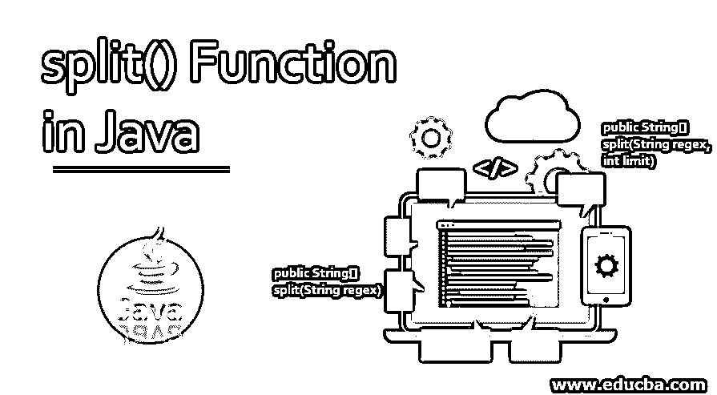
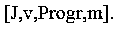
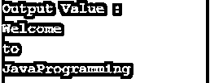
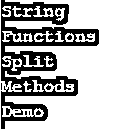
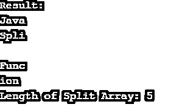
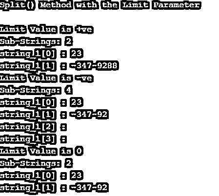

# Java 中的 split()函数

> 原文：<https://www.educba.com/split-function-in-java/>




## Java 中 split()函数介绍

Java split()函数用于根据正则表达式或给定的分隔符将字符串拆分成字符串数组。结果对象是一个包含拆分字符串的数组。在结果返回的数组中，我们可以传递对元素数量的限制。

让我们看看这个例子，

<small>网页开发、编程语言、软件测试&其他</small>

*   **字符串:** Java@SplitFunctions
*   **正则表达式:** @
*   **结果:**“Java”，“SplitFunctions”

在上面的例子中，它根据所需正则表达式的匹配来拆分字符串。

**语法:**

split 函数的语法如下:

```
public String[] split(String regex)
```

在上面的签名中，regex 为正则表达式定界[。它指定用于拆分字符串的字符。最后，结果返回值返回字符串数组，该数组根据正则表达式的匹配来拆分字符串。](https://www.educba.com/regular-expression-in-python/)

### split()函数在 Java 中是如何工作的？

在 Java Split()函数中，我们使用各种方法拆分字符串；string 类有两个方法来拆分字符串。

让我们看看下面的可用签名，

*   公共 String[] split(String regex，int limit)
*   公共字符串[]拆分(字符串正则表达式)

#### 1.公共字符串[]拆分(字符串正则表达式)

此方法通过对给定字符串使用正则表达式来拆分字符串；整个字符串拆分字符串，结果返回的形式为数组字符串。在 Java 1.4 中，引入了上述方法。让我们看看分割字符串和相应的结果输出的例子，

**代码:**

```
String string_1="JavaProgram";
System.out.println(Arrays.toString(s.split("a")));
```

**输出:**




#### 2.公共 String[] split(String regex，int limit)

当 java 字符串必须分割成有限数量的字符串时，使用此方法；为此，我们采用这种方法；让我们看看这个例子，字符串变量包含名称和地址，分隔符为逗号，后面的地址中包含逗号，所以我们采用这种方法

**代码:**

```
String s = "Spencer Plaza, New York, USA";
String[] data = s.split(",", 2);
System.out.println("Name = "+data[0]); // Spencer Plaza
System.out.println("Address = "+data[1]); //New York,USA
```

limit 参数是可选的。一个整数，指示拆分次数，拆分限制之后的项目将不包括在数组中。这里，上面的第一个方法实际上利用了第二个方法，将限制作为 0 传递。

**代码:**

```
public String[] split(String regex) {
return split(regex, 0);
}
```

### split()函数的示例

以下是一些例子:

#### 示例#1

**代码:**

```
import java.io.*;
public class Program_1
{
public static void main(String args[]) {
String string_1 = new String("Welcome-to-JavaProgramming");
System.out.println("Output Value :" );
for (String res: string_1.split("-"))
{
System.out.println(res);
}
}
}
```

**输出:**




使用 split()函数对需要提供分隔符的字符串进行分割，我们打算使用逗号(，)作为分隔符，返回的结果将是数组分割。在每个拆分操作之后，输出打印每个称为数组元素的字符串，如下所示，

#### 实施例 2

**代码:**

```
import java.io.*;
class Program_2
{
public static void main(String []args)
{
String string_1 = "String, Functions, Split, Methods, Demo";
String[] split_array = string_1.split(", ");
for (int i=0; i < split_array.length; i++)
{
System.out.println(split_array [i]);
}
}
}
```

**输出:**




在这里，我们传递 split，它作为这个函数的第二个参数。这限制了拆分字符串的数量。

#### 实施例 3

**代码:**

```
import java.io.*;
public class Program_3
{
public static void main(String[] args)
{
String string_1 = "JavatSplittFunction";
System.out.println("Result:");
String[] arrSplit = string_1.split("t", 0);
for (String a : arrSplit)
{
System.out.println(a);
}
System.out.println("Length of Split Array: "+ arrSplit.length);
}
}
```

**输出:**




**Split()方法带极限参数**

带 limit 参数的 Split()方法用于拆分数量有限的字符串。split()和带 limit 参数的 split()之间的区别在于，它限制拆分后返回的字符串数量。在这里，对于极限，我们需要给 split()函数一个输入[参数。让我们看看带 limit 参数的 split()方法的用法，](https://www.educba.com/split-function-in-javascript/)

```
public String[] split(String regex, int limit)
```

这里，参数 regex 用来限定正则表达式，而这个限制是针对结果阈值的。极限有 3 个值，它们是:

*   **limit > 0:** 如果 limit 设置为> 0，则得到的数组长度不得大于 n，最多应用 limit-1 次。最后一个条目包含带有最后一个匹配分隔符的输入。
*   **limit < 0:** 如果 limit 设为< 0，则得到任意长度的数组，我们可以尽可能多次应用该模式。
*   **limit = 0:** 如果 limit 设置为等于 0，那么得到的数组有任意个数的长度，但是空字符串会被丢弃，这个 limit 尽可能多次起作用。

这个参数的返回值将是一个字符串对象的数组，通过根据 limit 参数分割给定的字符串。如果在执行代码时给定的正则表达式语法无效，将发生 PatternSyntacException。让我们看看带 limit 参数的 string 上的 split()方法的示例程序。

#### 实施例 4

**代码:**

```
public class Program_4
{
public static void main(String args[])
{
String string_1 = "238-347-9288";
String[] stringArray = string_1.split("8",2);
System.out.println("Split() Method with the Limit Parameter");
System.out.println("\nLimit Value is +ve");
System.out.println("Sub-Strings: "+stringArray.length);
for(int i=0; i<stringArray.length; i++)
{  System.out.println("string_1["+i+"] : "+stringArray[i]);
}
String[] stringArray2 = string_1.split("8",-3);
System.out.println("Limit Value is -ve");
System.out.println("Sub-Strings: "+stringArray2.length);
for(int i=0; i<stringArray2.length; i++)
{
System.out.println("string_1["+i+"] : "+stringArray2[i]);
}
String[] stringArray3 = string_1.split("8",0);
System.out.println("Limit Value is 0");
System.out.println("Sub-Strings: "+stringArray3.length);
for(int i=0; i<stringArray3.length; i++)
{
System.out.println("string_1["+i+"] : "+stringArray3[i]);
}
}
}
```

**输出:**




上面的程序显示 split()方法通过指定的限制参数工作，如输出所示:

1.  当限制为 2 时，结果数组中子字符串的数量为 2。
2.  如果限制设置为-3，结果字符串将分成 4 个子字符串，包括尾随空格。
3.  如果这里的限制设置为 0，尾部空格将被删除，因此结果输入字符串将被拆分为 2 个子字符串。

### 结论

在“Java 中的 split()函数”这篇文章的最后，我们学习了如何在不同的 Java 方法中使用 Split()方法来拆分字符串。我希望在这篇文章中，你可以理解所有的例子。

### 推荐文章

这是 Java 中 split()函数的使用指南。这里我们讨论介绍，split()函数如何在 Java 中工作，以及相应的例子。您也可以浏览我们的其他相关文章，了解更多信息——

1.  [Java 中的正则表达式](https://www.educba.com/regular-expressions-in-java/)
2.  [JavaScript 字符串长度](https://www.educba.com/javascript-string-length/)
3.  [Java 私有](https://www.educba.com/private-in-java/)
4.  [Java 流过滤器](https://www.educba.com/java-stream-filter/)


