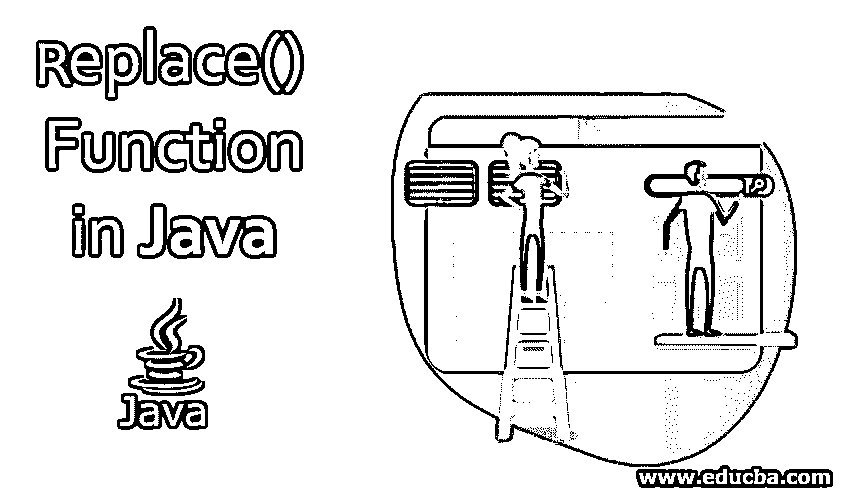
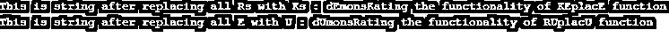

# Java 中的 Replace()函数

> 原文：<https://www.educba.com/replace-function-in-java/>




## Java 中 Replace()函数介绍

Java 中的 replace()函数用于删除特定的字母或字符序列，并在它的位置上放置另一个字母或字符序列。在引入 JDK 1.5 之后，引入了这个函数“replace()”。在这个函数之前，可以编写一个核心逻辑，通过将代码逻辑封装在名为 replace()的函数中来简化这个功能。这个函数减少了编码人员的工作，因为他们可以直接使用这个函数获取两个输入参数并返回一个新的用户修改的字符串。这可以根据业务需求来使用。

### 带参数的语法

replace 函数还有其他一些变体，比如" [replaceAll()](https://www.educba.com/replaceall-in-java/) ，" replaceFirst()"，[使用正则表达式](https://www.educba.com/regular-expression-in-python/)来操作字符串。

<small>网页开发、编程语言、软件测试&其他</small>

**语法:**

```
public String replace(char oldcharacter, char newcharacter)
```

这里这个函数有一个访问修饰符“public ”,允许它被其他函数使用。字符串类型指定此函数的返回类型为“字符串”。输入参数以名为“oldcharacter”和“newcharacter”的双字符变量的形式传递。这些变量将被用来扫描要被替换的字符，然后函数中的逻辑将工作来用来自“newcharacter”变量的新字符替换这个字符。

**参数:**

*   旧角色:这是需要替换的旧角色。
*   **newcharacter:** 这是固定的代替前一个字符的新字符。

**返回值:**该函数返回一个字符串，其中旧字符被新字符替换。

### Replace()函数在 Java 中是如何工作的？

下面给出了 replace()函数的内部代码逻辑，并给出了解释。

**Note:** This is not a running code. It is a code logic on which replace function works.

这里名为“replacefunction”的函数实际上是 Java 中的“replac”函数。仅当要替换的字符不同于应放入替换值的字符时，此功能才起作用。在字符串“abcdecd”的情况下，“d”应该由“d”本身替换；在这种情况下，将输出相同的字符串，而不是进入该函数不必要的逻辑。一旦控制进入一个功能，所有必要的检查被完成以确定需要改变的值。

变量“oldcharacter”和“newcharacter”用于获取该函数的输入参数。这些变量然后在替换值时用于进一步的函数中。变量“characterlen”用于存储字符串的长度，应该从该长度扫描出值并进行更改。Char 数组“valtobereplaced”用于存储需要更改的值。声明这个数组是为了防止一个字符序列中的多个字符被改变。数组一次存储多个字符。新的字符数组“buffer”用于存储修改后的字符串，该字符串是在用新字符替换旧字符后创建的。然后这个字符串作为这个函数的输出返回。

**代码:**

```
public String replacefunction(char oldcharacter, char newcharater) {
if (oldcharacter != newcharater) {
int characterlen = value.length;
int k = -1;
char[] valtobereplcaed = value;
while (++k < characterlen) {
if (valtobereplcaed[k] == oldcharacter) {
break;
}
}
if (k < characterlen) {
char buffer[] = new char[characterlen];
for (int j = 0; j < k; j++) {
buffer[j] = valtobereplcaed[j];
}
```

下面是用新字符替换特定字符的核心逻辑。在这里，当循环指定时，我们必须在这个循环中保持控制，直到我们没有到达字符串的末尾。在这里，要被替换的变量，从一开始就被结转，被存放在字符变量“c”中。如果字符“c”与“oldcharacter”变量匹配，那么“c”的值应该用“newcharacter”来改变；否则，应原样保留" c"。

**代码:**

```
while (k < characterlen) {
char c = valtobereplcaed[k];
buffer[k] = (c == oldcharacter) ? newcharater : c;
k++;
}
return new String(buffer, true);
}
}
```

### Java 中的 Replace()函数示例

下面的例子演示了 JAVA 语言中 replace 函数的工作原理。它有两个参数作为输入，并在替换输入字符串中的目标字符或字符序列后返回一个更改后的字符串。

**代码:**

```
public class test {
public static void main(String args[]) {
// In the below line a new string Str_new is being created. For this to implement a new string object is being introduced.
String Str_new = new String("dEmonsRating the functionality of REplacE function");
// Below code explains the use of replace function. This function returns a string as a return value.
// This returned value is being captured in print statement.
System.out.print("This is string after replacing all Rs with Ks : " );
System.out.println(Str_new.replace('R', 'K'));
// The below line will work the same as previous code line only with small changes made with input parametrs provided to this function.
System.out.print("This is string after replacing all E with U : " );
System.out.println(Str_new.replace('E', 'U'));
}
}
```

**输出:**




### 结论

因此，当我们需要一种简洁的方式来替换字符串中的任何内容时，replace()函数非常有用。在 JAVA 编程语言中，它被广泛用于逻辑构建期间的字符串操作。

### 推荐文章

这是一个在 Java 中替换()函数的指南。这里我们讨论如何在 Java 中使用 replace()函数，并给出一个例子和代码实现。您也可以浏览我们的其他相关文章，了解更多信息——

1.  [Java 中的控制语句](https://www.educba.com/control-statement-in-java/)
2.  [Java 中的不可变类](https://www.educba.com/immutable-class-in-java/)
3.  [Java 中的字符串初始化](https://www.educba.com/string-initialization-in-java/)
4.  [Java 中的滚动条](https://www.educba.com/scrollbar-in-java/)


