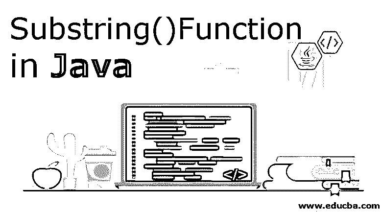
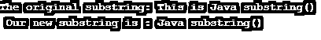

# Java 中的 substring()函数

> 原文：<https://www.educba.com/substring-function-in-java/>




## Java 中 substring()函数介绍

Java 是最广为人知和使用的编程语言之一，提供了广泛的函数和方法。任何编程语言的主要[方面之一是可用数据类型的列表。Java 将数据类型分为基本数据类型和非基本数据类型，其中 String 是非基本数据类型，因为它指的是一个对象。这个 String 对象有各种方法来对字符串执行各种操作。其中一种方法是 java 中的 substring()函数。](https://www.educba.com/what-is-a-programming-language/)

**substring():** 字符串的一部分就是子串。substring()方法返回指定字符串的一部分。substring 方法返回一个新字符串，它是该字符串的子字符串。

<small>网页开发、编程语言、软件测试&其他</small>

现在我们已经学习了什么是字符串和子字符串方法，让我们来理解子字符串方法的标准语法。

**语法:**

```
public String substring(int beginIndex)
```

这将返回一个新的字符串，它是被传递的字符串的子字符串。它采用的参数是一个 beginIndex，指定从中选取子字符串()的索引点。从指定索引的字符开始，直到字符串结束。

**异常:**如果传递了一个负索引或者任何大于字符串原始长度的索引，则抛出“IndexOutOfBoundsException”。

### substring()函数在 Java 中是如何工作的？

当调用 java 中的 substring()函数时，它会创建一个新的字符串，该字符串是基于传递的 beginIndex 参数的原始字符串的一部分，并将其返回。当传递 beginIndex 时，它在字符串中搜索指定的索引值，然后选取出现在指定索引处的字符。在一个版本中，传递 beginIndex，在 substring 方法的另一个版本中，提供 beginIndex 和 endIndex。重要的是要理解这样一个事实，即每次调用 substring 方法时，它都会创建一个新的字符串，因为 string 数据类型是不可变的。

### 实现 substring()函数的示例

让我们看看下面给出的用 java 实现 substring()函数的例子:

#### 示例#1

**代码:**

```
public class java_subs {
public static void main(String args[]) {
String sampleStr = new String("This is Java substring()");
System.out.print("The original substring: " +sampleStr);
System.out.print("\n Our new substring is : ");
System.out.println(sampleStr.substring(8));
}
}
```

**代码解释:**我们的第一个示例程序有一个简单的演示子串方法，带有起始索引参数。我们创建了我们的类，然后添加了我们的主类。声明我们的字符串数据类型及其变量名和值。首先，我们将按原样打印原始字符串。然后我们将用 substring 方法的效果打印新的字符串。我们已经将“beginIndex”指定为从第 8 个<sup>第</sup>位置开始，这意味着我们的新子串将从第 8 个<sup>第</sup>索引开始，从字符串的第 8 个<sup>第</sup>位置开始挑选字符，直到结束。在执行上述代码时，子字符串应该是“Java substring()”。参考下面附加的输出截图。

**输出:**




正如您所看到的，我们已经打印了原始字符串，首先是子字符串。

#### 实施例 2

我们现在将看到另一个例子，类似于第一个例子，但是增加了参数“endIndex”。

**代码:**

```
public class java_subs {
public static void main(String args[]) {
String sampleStr = new String("This is Java substring() and something extra.");
System.out.print("The original substring: " +sampleStr);
System.out.print("\n Our new substring: ");
System.out.println(sampleStr.substring(8, 24));
}
}
```

**代码解释:**类似于前面的代码，我们在里面有我们的类和主类。然后，我们用变量名和值声明了我们的字符串，与前面相比，这个字符串很长。接下来，我们打印了原始字符串和新字符串。使用 substring 方法，我们传递了两个参数，beginIndex 和 endIndex，8 和 24。这些索引定义了子串必须从哪一点开始，在哪里结束。在我们的例子中，从第 8 个<sup>第</sup>索引开始，substring 将选取第 8 个<sup>第</sup>索引处的任何字符，直到第 24 个<sup>第</sup>索引。因此，我们的新子串将位于第 8 个<sup>和第 24 个<sup>索引之间，在第 8 个<sup>索引之前和第 24 个<sup>索引之后。在执行上述代码时，子字符串应该是“Java substring()”。</sup></sup></sup></sup>

**输出:**


正如您在输出中看到的，第 8 个<sup>之前的</sup>和第 24 个<sup>之后的</sup>字符位置不是我们新创建的子字符串的一部分。使用最广泛的子串方法之一是从开头和结尾清除不必要的字符。

#### 实施例 3

**代码:**

```
public class java_subs {
public static void main(String args[]) {
String sampleStr = new String("This is just another example of java substring.");
System.out.print("The original substring: " +sampleStr);
int slength = sampleStr.length();
System.out.print("\n Our new substring: ");
System.out.println(sampleStr.substring(2, slength-9));
}
}
```

代码解释:在我们的第三个例子中，我们有我们的类和主类。这里我们有一个稍微不同的字符串，我们使用了长度方法。与前面的例子类似，我们打印了原始字符串，然后用 slength 声明了一个新的整数，值是字符串的长度。然后在我们最后的 print 语句中，我们的 beginIndex 是 2，这意味着子串将从 2 <sup>和</sup>索引开始，endIndex 是 slength -9，这意味着无论字符串的长度是多少，子串都将在 9 减去原始长度后结束。在我们的例子中，slength -9 将导致一个以“s”结尾的子字符串。

**输出:**


需要记住的一个重要方面是，原始字符串非常长，并且包含 1Gb 大小的数组。因此，即使子串很小，它也只有 1GB。虽然这显然会阻止原始字符串被垃圾收集，但这是一种内存泄漏的情况，这意味着即使不会使用大量内存，也会获得大量内存。

### 结论

字符串是重要的数据类型之一，substring 方法只是返回原始字符串的一部分。当调用 substring 方法时，它创建一个带有偏移量和计数的新字符串。我们已经用不同的方法演示了多个例子来学习 substring。代码及其各自的截图附后。

### 推荐文章

这是 Java 中 substring()函数的使用指南。这里我们讨论 Java 中 substring()函数的语法和工作原理，并给出例子和代码实现。您也可以浏览我们的其他相关文章，了解更多信息——

1.  [Java Swing 布局](https://www.educba.com/java-swing-layout/)
2.  [Java 中的字符串初始化](https://www.educba.com/string-initialization-in-java/)
3.  [Java AWT 控件](https://www.educba.com/java-awt-controls/)
4.  [Java 流过滤器](https://www.educba.com/java-stream-filter/)


