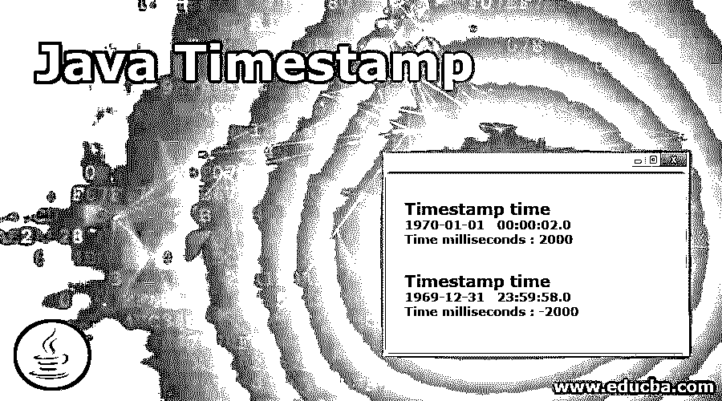

# Java 时间戳

> 原文：<https://www.educba.com/java-timestamp/>




## Java 时间戳简介

Java Timestamp 属于 java.util.Date 的瘦包装器，并允许它被 JDBC API 识别为 SQL TIMESTAMP 类型值。Timestamp 支持格式化和解析等操作，有助于避免时间戳值的 JDBC 语法。

这个 Java 时间戳的精度已知为:

<small>网页开发、编程语言、软件测试&其他</small>

*   19，这是 yyyy-mm-dd hh:mm:ss 格式的字符总数。
*   20 + s 精度，这是 yyyy-mm-dd hh:mm:ss 格式的字符总数，其中 s 表示给定时间戳的小数位数，这是秒的小数精度。

**注意:** Timestamp 属于 java.util.Date 类型的复合，并且具有单独的纳秒值。在 java.util.Date 组件中，存储的值是整数秒。纳米是分开的，属于小数秒。当传递不属于 java.sql.Timestamp 实例的对象时，Timestamp.equals(Object)方法不返回 true。这是因为 Nanos 组件在该日期是未知的。这导致 Timestamp.equals(Object)方法与 java.util.Date.equals(Object)方法相比不对称。hashcode 方法将使用底层的 java.util.Date 实现，因此 Nanos 将不包括在计算中。

**语法:**

```
Timestamp(long time)
```

使用毫秒时间值，它构造一个时间戳值。

### Java 时间戳的方法

Java 中 timestamp 函数的工作原理:timestamp 可以用在很多方法中，下面将详细解释其中的一些方法

#### 1.在...之后

显示当前时间戳对象是否晚于给定对象。

```
public boolean after(Timestamp tm)
```

其中 tm 是 Timestamp 的值，我们与这个 Timestamp 对象进行比较，这个函数返回一个布尔值；如果此时间戳值较晚，则为 true，反之亦然。

#### 2.以前

显示当前时间戳对象是否在给定对象之前。

```
public boolean before(Timestamp tm)
```

其中 tm 是时间戳的值，我们将时间戳对象与该函数进行比较，返回一个布尔值；如果此时间戳值在之前，则为 true，反之亦然。

#### 3.比较

这是一个比较函数，它将给定的时间戳对象与这个对象进行比较。

```
public int compareTo(Timestamp tm)
```

其中 tm 是要与该时间戳对象进行比较的对象，当两个对象相等时，该函数返回 0 值；当此对象在给定对象之前时，任何小于 0 的值；当时间戳对象在给定时间戳对象之后时，任何大于 0 的值。

#### 4.等于

使用这个函数，我们可以检查两个给定的时间戳对象是否相等。

```
public boolean equals(Timestamp tm)
```

其中 tm 指的是时间戳值，我们必须将它与这个时间戳对象进行比较。此函数返回布尔值；如果值相等，则返回 true，否则返回 false。

#### 第五区

该函数给出从缺省日期值 1970 年 1 月 1 日 00:00:00 GMT 开始的总毫秒数，该值由时间戳对象表示。

```
public long getTime()
```

此函数将覆盖课程日期的 getTime 函数(如果有)。它返回默认日期的毫秒数，如上所示。

#### 6.getNanos

这个函数用于获取这个时间戳对象的值，单位为毫微秒。

```
public int getNanos()
```

该函数返回对象的小数秒参数。

#### 7.瞬间

这用于将时间戳对象更改为瞬间。在这个转换过程中，会创建一个 Instant，它指示线上的点，与这个时间戳相同。

```
public Instant toInstant()
```

该函数覆盖了类日期的 toInstant 方法。它返回代表时间线上相同点的瞬间。

#### 8 .第七

该函数设置一个 Timestamp 对象，以毫秒为单位指示 1970 年 1 月 1 日 00:00:00 GMT 之后的时间。

```
public void setTime(long time)
```

这个函数覆盖了类日期中的方法 setTime。它采用输入参数 time，即毫秒数。

#### 第九区

该函数用于获取自 1970 年 1 月 1 日 00:00:00 GMT 以来的时间，以毫秒为单位，该时间戳对象表示该时间。

```
public long getTime()
```

该函数返回自上述默认时间以来的时间，单位为毫秒。

#### 10.的价值

此方法将属于 JDBC 时间戳转义格式的字符串对象转换为时间戳值类型。

```
public static Timestamp valueOf(String str)
```

str 参数是 yyyy-[m]m-[d]d hh:mm:ss 格式的时间戳，小数秒可以忽略。mm 和 dd 的前导零也可以忽略。该函数返回其各自的时间戳值。并在给定的参数不是上述格式时引发 IllegalArgumentException。

### 实现 Java 时间戳的示例

下面是 Java 时间戳的例子:

#### 示例#1

**代码:**

```
// Java program to demonstrate the
// functionalit of getTime() function
import java.sql.*;
class Demo {
public static void main(String args[])
{
// Here we are creating 2 timestamp objects
Timestamp tm = new Timestamp(2000);
// Displaying the created timestamp object
System.out.println("The Timestamp time is : "
+ tm.toString());
System.out.println("The Time in milliseconds is : "
+ tm.getTime());
}
}
```

**输出:**


在上面的例子中，我们首先创建一个时间戳对象。然后我们使用两个不同的函数 toString 和 getTime 来检查输出。

#### 实施例 2

**代码:**

```
// Below Java code is to showcase the
// functionality of getTime() function
import java.sql.*;
public class Example {
public static void main(String args[])
{
// Creating 2 timestamp objects
Timestamp tm = new Timestamp(-2000);
// Display the timestamp object
System.out.println("Timestamp time is : "
+ tm.toString());
System.out.println("Total time in milliseconds : "
+ tm.getTime());
}
}
```

**输出:**


在上面的例子中，我们首先创建两个时间戳对象，并使用 getTime()函数获取时间戳对象的时间，并将其初始化为默认时间 1970 年 1 月 1 日之前的时间。因此，给定的负 long 值起了作用。

### 在 Java 中使用时间戳的优势

*   我们可以注意到在时间戳对象的帮助下，两个不同的持续时间，尤其是 Instant 和 duration 或 fragment 相关的定义之间有一个清晰的分离。例如本地日期、本地时间。
*   与 java 相比。这个时间戳对象允许一组更好的函数来操作和计算逻辑。
*   它还包括借助于 Duration.toDays()的单位转换。
*   它还在 ZonedDateTime 的帮助下覆盖了时区地狱。

### 结论

如上所述，时间戳是 java.util 的扩展。Date 类被用作 JDBC API 中该类的包装器，以维护特定的 SQL 需求。它主要用于处理数据库，并以纳秒为单位给出输出。

### 推荐文章

这是一个 Java 时间戳指南。这里我们讨论 Java 时间戳的介绍、它的优点以及它的代码实现。您也可以浏览我们推荐的其他文章，了解更多信息——

1.  [Java 模式类](https://www.educba.com/java-pattern-class/)
2.  [Java DatagramSocket](https://www.educba.com/java-datagramsocket/)
3.  [Java 语言环境](https://www.educba.com/java-locale/)
4.  [Java 随机存取文件](https://www.educba.com/java-randomacessfile/)


