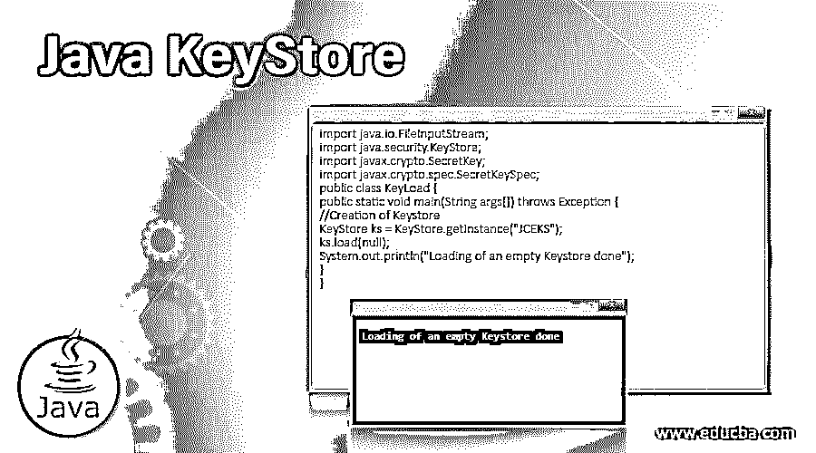
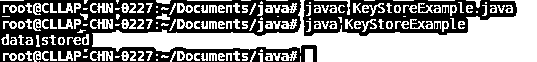

# Java 密钥库

> 原文：<https://www.educba.com/java-keystore/>




## Java 密钥库简介

Keystore 是 Java 中的数据库；它允许我们以关键格式存储数据；Keystore 是从名为 java.security.KeyStore 的 java 类扩展而来的，我们可以在磁盘上写入 KeyStore 并从磁盘上读取它，在 java 中使用 keyStore 的主要好处是它允许我们保护数据，因为它具有以密码保护的形式存储数据的功能，这些密码是它们自己的密码，因为这些存储功能最适合处理我们需要实现加密和解密机制的情况。

### 如何用 Java 创建一个 Keystore？

在创建密钥库之前，我们需要了解它的类型；有一些类型的密钥机制是可用的密钥库，它们是公钥(该密钥通常包含本质上是公共的相关证书)、私钥和公钥(用于任何非对称类型的加密)。我们可以使用 java 的 getInstance()方法来创建一个 Keystore。这个方法是在主类中定义的内置方法，我们已经超越了它。下面是一个用 java 创建默认密钥库类型的示例。我说它是默认的，因为我们没有在函数中传递任何参数。如果我们想要创建任何自定义的密钥库，那么我们可以在方法中为所需的密钥库类型传递参数。

<small>网页开发、编程语言、软件测试&其他</small>

```
KeyStore customKeyStore = KeyStore.getInstance(custom-format);
```

这里我们可以传递 custom-format = PKCS12

**Note:** A PKCS12(This is a Public-Key, and it is a Standards of Cryptography) This defines a format to store the certificates for the server. It also allows us to store private keys to a single file of encryptable.

#### 例子

**代码:**

下面是一个使用 getInstance()方法创建商店的示例:

```
import java.io.FileInputStream;
import java.security.KeyStore;
import javax.crypto.SecretKey;
import javax.crypto.spec.SecretKeySpec;
public class KeyCreate {
public static void main(String args[]) throws Exception {
//Creation of Keystore
KeyStore ks = KeyStore.getInstance("JCEKS");
System.out.println("Key Store Created");
}
}
```

**输出:**


### 如何在 Java 中加载 Keystore？

这里，如果我们讨论密钥存储库的加载部分，加载是密钥存储库的一个重要机制。我们需要小心执行这个操作，因为它应该只在需要的时候加载。加载很重要，因为如果不加载密钥库，我们就无法使用它。也可以用任何空数据加载密钥库。通常，我们可以从任何文件或任何其他存储中加载密钥库。有一个方法叫 load()；这个方法将执行加载数据的任务。我们可以向 load 方法传递两个属性；这些属性是

*   **InputStream:** 这是将从中读取数据的输入流；该流可以来自任何文件或其他来源。
*   **Char []:** 此部分为安全部分；这里，我们可以为密钥库密码传递一个字符串以进行加密。

让我们了解一下加载 KeyStore.load(数据流，密码)的基本流程。在这里，我们可以将 inputStream 作为数据流，将任何字符串作为密码。正如我们提到的，我们还可以为 KyeStore 加载空数据，这可以通过为 KeyStore.load(null，Keystore password)之类的 keyStore 的数据流传递任何 null 值来实现。一旦我们将 null 作为数据流传递，它将接受一个 null 值并为我们创建一个空的密钥库。关于 keyStore 有一点很重要，如果我们不加载 keyStore，它会为我们调用的任何方法抛出一个异常。为了更好的编码实践，在开始使用密钥库之前加载它也是非常重要的。

#### 例子

在下面的示例中，我们加载了一个空值的密钥库。

**代码:**

```
import java.io.FileInputStream;
import java.security.KeyStore;
import javax.crypto.SecretKey;
import javax.crypto.spec.SecretKeySpec;
public class KeyLoad {
public static void main(String args[]) throws Exception {
//Creation of Keystore
KeyStore ks = KeyStore.getInstance("JCEKS");
ks.load(null);
System.out.println("Loading of an empty Keystore done");
}
}
```

**输出:**


### 如何在 Java 中存储 Keystore？

我们有很多关于在 java 中加载和创建密钥库的讨论；现在让我们把注意力集中在存储上。这里的存储是指我们希望存储起来以备将来使用的数据，所以存储可以在任何地方进行，可以在数据库上，也可以在磁盘上，这取决于我们的选择。我们有一个名为 store 的方法，它将扮演将数据存储到 KeyStore 的角色。我们可以将两个属性传递给 KeyStore store()方法。下面是它的简单语法示例。

**语法**

```
keyStore.store(streamOfOutputData ,password);
```

在这里，streamOfOutputData 流可以从任何路径和文件中读取数据，而 password 是用于加密我们存储的数据的字符串密码。如果我们将来需要已经存储的数据，我们可以通过再次加载它们来从存储的位置检索它们。

#### 例子

**代码:**

```
import java.io.FileInputStream;
import java.security.KeyStore;
import javax.crypto.SecretKey;
import javax.crypto.spec.SecretKeySpec;
public class KeyStoreExample {
public static void main(String args[]) throws Exception {
//Creation of Keystore
KeyStore ks = KeyStore.getInstance("JCEKS");
//Loading the KeyStore object
char[] ps = "ranjan".toCharArray();
String filePath = "./cacerts";
java.io.FileInputStream streamInput = new FileInputStream(filePath);
ks.load(null);
KeyStore.ProtectionParameter pp = new KeyStore.PasswordProtection(ps);
//Here we are creating an secret object
SecretKey ms = new SecretKeySpec("anypassword".getBytes(), "DSA");
//Creating SecretKeyEntry object
KeyStore.SecretKeyEntry ske = new KeyStore.SecretKeyEntry(ms);
ks.setEntry("secretKeyAlias", ske, pp);
//Storing the object
java.io.FileOutputStream storeData = null;
storeData = new java.io.FileOutputStream("nameOfNewKey");
ks.store(storeData, ps);
System.out.println("data stored");
}
}
```

**输出:**




### 如何获取和设置密钥？

我们可以使用名为 getKey 和 setKey 的两种方法来获取和设置密钥。这些方法是 java 中密钥库的一部分。方法 getEntry 将允许我们获取存储的值。请注意，我们将值存储在带有密码的密钥上，因此我们需要传递密钥的别名和用于存储密钥的密码。同样，我们有一个名为 setKeyEntry 的方法。再次从密钥库中获取值后，我们可以使用各种可用的方法来访问数据，如 getPrivateKey()、getcertificate()、getPrivateKey()和 getCertificateChain()。这些方法可以用来根据我们的要求从密钥库中获取数据。

#### 例子

在下面的例子中，我们检查密钥是否可以从任何密钥库中获得。

**代码:**

```
import java.security.*;
import java.security.cert.*;
import java.util.*;
import java.io.*;
public class SetAndGetKey {
public static void main(String[] argv)
{
try {
KeyStore store = KeyStore.getInstance("JCEKS");
store.load(null);
Boolean status
= store.isKeyEntry("test");
if (status)
System.out.println("The key available");
else
System.out.println("The key is not available");
}
catch (NoSuchAlgorithmException e) {
//catch code to handle exception
}
catch (NullPointerException e) {
//catch code to handle exception
}
catch (KeyStoreException e) {
//catch code to handle exception
}
catch (FileNotFoundException e) {
//catch code to handle exception
}
catch (IOException e) {
//catch code to handle exception
}
catch (CertificateException e) {
//catch code to handle exception
}
}
}
```

**输出:**


### Java 密钥库方法

为了对密钥库执行各种操作，我们有下面给出的各种方法。

*   **load(inputStream，password):** 加载 keyStore 数据，需要两个参数，一个作为字符串的输入流(文件或任何磁盘数据)和密码
*   **store(outputStream，password):** 该方法将用于存储数据，它需要两个参数，一个是输出流，数据将从该流中读取，可以是文件或磁盘，第二个参数是密码，它将对我们存储的数据进行加密。
*   **getInstance():** 这个方法用来创建一个 keyStore 如果我们不向该方法传递任何东西，那么它将创建默认的密钥库，否则，我们可以传递 PKCS12 作为密钥库的类型。
*   **getPrivateKey():** 得到 keyStore 后，我们就可以用这个方法获取私钥了。
*   **getCertificate():** 要获得证书，我们可以使用这个方法。
*   如果我们想要得到一个证书链，我们可以使用这个方法。

### 结论

从本教程中，我们学习了 Java 中 Keystore 的基本概念，还学习了如何创建、加载和从 KeyStore 数据中获取各种类型的数据；我们学习了各种可用的方法以及它们在 java 中用于 KeyStore 的用法。

### 推荐文章

这是一个 Java 密钥库指南。在这里，我们讨论 java 中 Keystore 的介绍、语法和补充指南。您也可以浏览我们的其他相关文章，了解更多信息——

1.  [爪哇的 EJB](https://www.educba.com/ejb-in-java/)
2.  [Java 中的 copy()](https://www.educba.com/copy-in-java/)
3.  [Java max()](https://www.educba.com/java-max/)
4.  [终于在 Java 中](https://www.educba.com/finally-in-java/)


