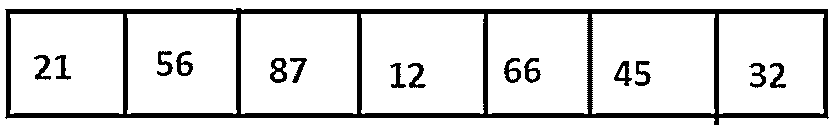
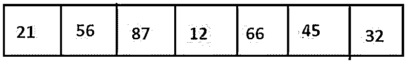
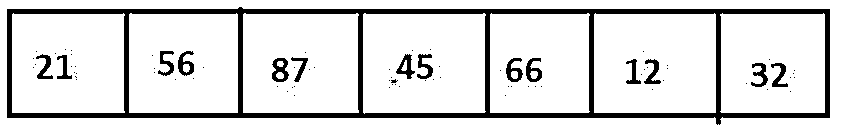
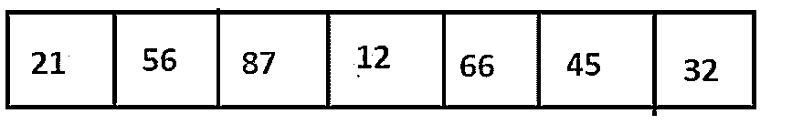
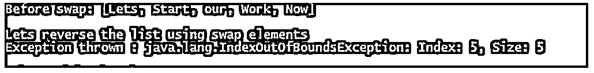

# Java 中的 swap()

> 原文：<https://www.educba.com/swap-in-java/>


## Java 中的 swap()简介

它引用 java.util.Collections 提供的方法，在调用方法和集合引用时交换作为参数给出的列表中两个不同位置的列表元素，并给出元素互换的列表，如果指定的两个位置相同，则列表保持不变，如果参数中指定的索引大于列表的长度，则抛出 IndexOutOfBoundsException。

**语法:**

<small>网页开发、编程语言、软件测试&其他</small>

```
public static void swap(List list1, int pos1, int pos2)
```

*   **list1:** 表示具有多个元素的 java.util.List 类型的引用变量。
*   **pos1:** 这个变量代表第一个元素的索引。
*   **pos2:** 这个变量代表第二个元素的索引。

### swap()在 Java 中是如何工作的？

swap 方法是提供给我们的功能，在调用函数时，在参数中提供的两个不同索引处交换列表的元素。

让我们用伪代码来看看 swap 方法的工作原理:

1.  首先，检查参数的索引是否不为空；否则，将引发编译时错误。
2.  检查列表的大小，并与给定的索引进行比较，看它们是否在列表大小的范围内；如果没有，则抛出 IndexOutOfBounds 运行时异常并退出。
3.  遍历列表，取 list1[i]，list1[j]元素并交换。

让我们考虑以下元素列表和不同的场景:




**场景 1:** 交换索引 3 和 5 处的元素。







**场景 2:** 交换索引 2 和 7 处的元素。




在这里，因为我们找不到 index =7 的元素，所以抛出了 IndexOutOfBound 异常。

### Java 中的 swap()示例

下面是提到的例子:

#### 示例#1

让我们看一下使用 swap()方法检查一个字符串是否是回文的例子。

**代码:**

```
import java.util.*;
public class Office {
public static void main(String[] args)
throws Exception
{
try {
List<String>list1 = new ArrayList<String>();
list1.add("R");
list1.add("E");
list1.add("P");
list1.add("A");
list1.add("P");
list1.add("E");
list1.add("R");
System.out.println("String Before swap: " + list1);
int n = list1.size();
for(int i=0;i<list1.size()/2;i++){
Collections.swap(list1, i, n-1-i);
}
System.out.println("\nString After swap: " + list1);
}
catch (IndexOutOfBoundsException e) {
System.out.println("\nExceptionthrown : " + e);
}
}
}
```

**输出:**


**说明:**

*   在上面的程序中，我们使用了 swap 方法来反转列表，以查看当前列表和反转列表是否相同，因此称为回文字符串。
*   这里，for 循环运行到列表的中间，并与列表中的第 n-I-1 个元素交换。我们可以看到，交换操作前后的字符串是相同的；因此，这是一个回文。

#### 实施例 2

For IndexOutOfBoundsException.

让我们看一个访问列表中索引的例子，它大于列表中元素的总数。

**代码:**

```
import java.util.*;
public class Office {
public static void main(String[] args) throws Exception
{
try {
List<String>list1 = new ArrayList<String>();
list1.add("Lets");
list1.add("Start");
list1.add("our");
list1.add("Work");
list1.add("Now");
System.out.println("Before swap: " + list1);
System.out.println("\nLets reverse the list using swap elements ");
for(int i=0;i<list1.size();i++){
Collections.swap(list1, i, list1.size());
}
System.out.println("After swap: " + list1);
}
catch (IndexOutOfBoundsException e) {
System.out.println("Exception thrown : " + e);
}
}
}
```

**输出:**




**说明:**

*   这里，当在循环中交换位置 I 和 list1.size()处的元素时，我们知道列表的索引从 0 开始，以 upt list . size()-1 结束，因此访问这些界限之外的索引最终会导致 IndexOutOfBound 异常，如输出屏幕所示。
*   要使上面的代码工作，需要做一点小小的调整，将 swap 命令改为 Collections.swap(list1，I，list.size() -1)。
*   现在索引不会超出列表大小的界限；因此，不会引发任何异常。

**代码:**

```
import java.util.*;
public class Office {
public static void main(String[] args) throws Exception
{
try {
List<String>list1 = new ArrayList<String>();
list1.add("Lets");
list1.add("Start");
list1.add("our");
list1.add("Work");
list1.add("Now");
System.out.println("List Before swap: " + list1);
System.out.println("\nLets reverse the list using swap elements ");
for(int i=0;i<list1.size()/2;i++){
Collections.swap(list1, i, list1.size()-1-i);
}
System.out.println("After swap: " + list1);
}
catch (IndexOutOfBoundsException e) {
System.out.println("Exception thrown : " + e);
}
}
}
```

**输出:**


### 结论

Swap 方法是 java.util.Collections 类提供的一项功能，用于交换列表中不同索引处的值，这些值是在调用该方法以及引用列表时在参数中指定的。如果两个索引相同，列表将保持不变。如果指定的索引大于列表的大小，此方法将引发 IndexOutOfBoundsException。

### 推荐文章

这是一个关于 Java 中 swap()的指南。这里我们讨论 swap()的介绍，Swap()在 java 中是如何工作的，并附有编程实例。您也可以看看以下文章，了解更多信息–

1.  [Java 哈希码()](https://www.educba.com/java-hashcode/)
2.  [java.net 套餐](https://www.educba.com/java-dot-net-package/)
3.  [Java min()](https://www.educba.com/java-min/)
4.  [爪哇的 EJB](https://www.educba.com/ejb-in-java/)


