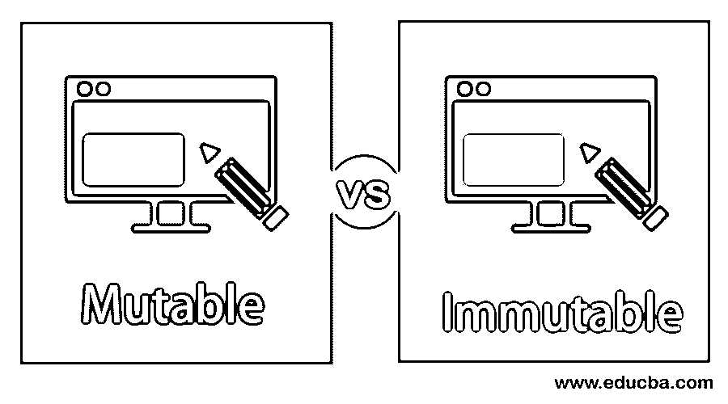
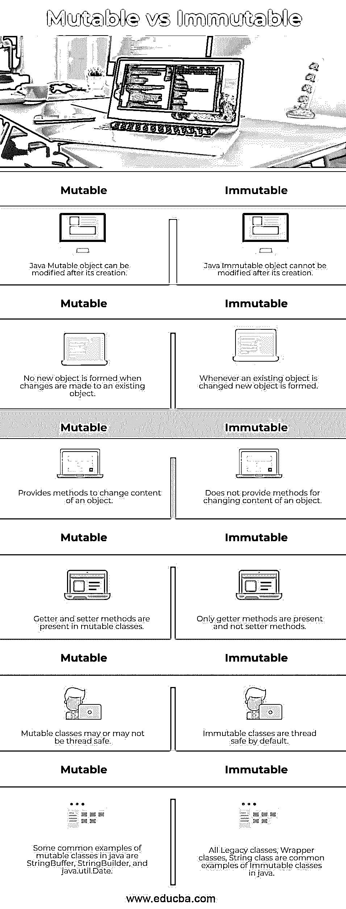

# 可变与不可变的 Java

> 原文：<https://www.educba.com/mutable-vs-immutable-java/>




## 可变和不可变 Java 的区别

可变对象有可以修改的字段；不可变对象没有可以在对象创建后更改的字段。不可变对象是在创建后状态不能改变的对象。可变和不可变是 java 中的两类对象。在本文中，我们将看到 java 中可变对象和不可变对象的区别。此外，我们将看到 java 代码示例，展示 java 中可变类和不可变类之间的差异。

### 可变与不可变 Java 的直接比较(信息图表)

以下是可变与不可变 Java 之间的 6 大区别:

<small>网页开发、编程语言、软件测试&其他</small>




### 可变与不可变 Java 的主要区别

以下是 Java 中可变对象和不可变对象之间的主要区别:

*   可变对象是这样的对象，我们可以在不创建新对象的情况下改变对象的状态。也就是说，可变对象在创建后可以被修改。在不可变对象的情况下，每当一个对象的状态改变时，我们得到一个新的对象。在处理不可变对象时，我们不允许在对象创建后改变它的状态。
*   在一般情况下，可变对象提供方法，通过这些方法可以改变对象的内容，而不可变对象不提供任何改变其内容的方法。
*   在可变的 java 类中，存在 getter 和 setter 方法，而在不可变的类中，只有 getter 方法可用，而没有 setter 方法。
*   可变类可能是线程安全的，也可能不是，而不可变类在默认情况下是线程安全的。
*   java 中可变类的例子有 java.util.Date、 [StringBuffer、StringBuilder](https://www.educba.com/stringbuffer-vs-stringbuilder/) 等。，而 java 遗留类、包装类、字符串类都是 java 中不可变类的例子。

### 可变与不可变 Java 对照表

让我们讨论一下可变 Java 和不可变 Java 之间的主要比较:

| **可变的** | **不可变** |
| Java 可变对象在创建后可以修改。 | Java 不可变对象在创建后不能修改。 |
| 对现有对象进行更改时，不会形成新对象。 | 每当现有对象发生变化时，就会形成一个新对象。 |
| 它提供了改变对象内容的方法。 | 它不提供更改对象内容的方法。 |
| Getter 和 setter 方法存在于可变类中。 | 只有 getter 方法，没有 setter 方法。 |
| 可变类可能是线程安全的，也可能不是。 | 默认情况下，不可变类是线程安全的。 |
| java 中可变类的一些常见例子有 StringBuffer、StringBuilder 和 java.util.Date。 | 所有遗留类、包装类、字符串类都是 java 中不可变类的常见例子。 |

### 可变和不可变 Java 及示例

下面给出了可变和不可变 Java 的例子:

#### 示例 1——Java 中的可变类

现在我们将看到 java 代码示例，展示在 java 中创建可变和不可变的类。

**代码:**

```
package com.edubca.mutabledemo;
public class MutableDemo {
private String studentName;
private int rollNumber;
MutableDemo (String studentName, int rollNumber) {
this.studentName = studentName;
this.rollNumber = rollNumber;
}
public String getStudentName() {
return studentName;
}
// this setter can modify the name
public void setStudentName(String studentName) {
this.studentName = studentName;
}
public int getRollNumber() {
return rollNumber;
}
// this setter can modify roll number
public void setRollNumber(int rollNumber) {
this.rollNumber = rollNumber;
}
public static void main(String[] args) {
MutableDemo obj = new MutableDemo ("John" , 100);
System.out.println("Original Name is " + obj.getStudentName());
System.out.println("Original Roll Number is " + obj.getRollNumber());
// update the name, and roll number as  is mutable
obj.setStudentName("James");
obj.setRollNumber(102);
System.out.println("Modified Name is " + obj.getStudentName());
System.out.println("Modified Roll Number is " + obj.getRollNumber());
}
}
```

**输出:**


上面的代码展示了在 java 中用 getters 和 setters 创建一个可变类。

#### 示例 2——Java 中的不可变类

现在我们将看到如何在 Java 中创建不可变的类。

**代码:**

```
package com.edubca.immutabledemo;
public final class ImmutableDemo {
final String studentName;
final int rollNumber;
public ImmutableDemo  (String studentName, int rollNumber) {
this.studentName = studentName;
this.rollNumber = rollNumber;
}
public String getStudentName() {
return studentName;
}
public int getRollNumber() {
return rollNumber;
}
public static void main(String[] args) {
ImmutableDemo obj = new ImmutableDemo  ("John" , 100);
// Since no getters are available contents cannot be modified.
// Also as variables are declared final they cannot be modified
System.out.println("Name is " + obj.getStudentName());
System.out.println("Roll Number is " + obj.getRollNumber());
}
}
```

**输出:**


上面的代码显示了 java 不可变类的创建。创建不可变类时，请记住以下几点:

*   不可变类必须是最终的，因为它不应该被继承。
*   不可变类的所有字段都应该成为 final。
*   如果任何可变对象被用作不可变类中的字段，那么必须实现特殊处理，以防止其内容被修改。
*   应该有一个公共构造函数。
*   应该为所有变量定义 Getter 方法。
*   Setter 方法不应该出现在任何变量中。

### 结论

从上面的讨论中，我们清楚地了解了 java 中可变和不可变的区别。此外，我们已经看到了显示如何创建可变和不可变类的 java 示例。值得注意的是，不可变类在默认情况下是线程安全的，而可变类可能是线程安全的，也可能不是。

### 推荐文章

这是可变与不可变 Java 的指南。在这里，我们还讨论了可变和不可变 Java 键的差异，包括信息图和比较表。您也可以看看以下文章，了解更多信息–

1.  [Java 缓冲器](https://www.educba.com/java-bufferedreader/)
2.  [Java 中的 StringBuffer 类](https://www.educba.com/stringbuffer-in-java/)
3.  [Java RuntimeException](https://www.educba.com/java-runtimeexception/)
4.  [Java newInstance()](https://www.educba.com/java-newinstance/)


