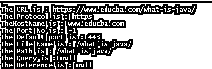
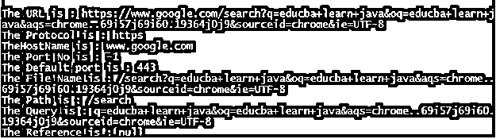

# Java URL 类

> 原文：<https://www.educba.com/java-url-class/>


## Java URL 类简介

java URL 类用于指定一个 URL。java 中的 URL 类是访问 web 或 internet 上任何可用资源的捷径。URL 是一个统一资源定位符，它指向万维网(www)上的文件、目录或图像等资源。java 中的 URL 类内置在 java 的 java.net.URL 包中。

URL 指定万维网上资源的地址。该 URL 对于访问万维网上的资源是唯一的。考虑一个 URL 的例子，如 https://www.educba.com/what-is-java/

<small>网页开发、编程语言、软件测试&其他</small>


### Java URL 类的组件

URL 包含三个或四个部分，通常很多形式的 URL 都包含三个部分，如上图所示。

1.  **协议—**URL 的协议子部分指定了协议的名称，因为这里的协议是 HTTP。
2.  **主机名—**主机名或 IP 地址或 URL 的服务器名指定计算机或服务器的名称，这里的主机名是 www.educba.com。
3.  **端口号—**URL 的端口号是可选部分，指定使用互联网进行通信的每个资源的逻辑地址。每个资源都分配了一个 16 位整数端口号，因为这里我们没有端口号。如果端口号不存在，则返回-1。
4.  **文件名—**文件名或文档名或目录名指定资源或文件在服务器上的路径名，这里的文件名是“what-is-java”。

### Java URL 类的构造函数和函数

URL 类包含构造函数和一些作为 URL 类成员函数的函数。

#### 构造器

1.  **url(字符串 URL)–**这个构造函数从给定的字符串 URL 创建一个 URL 对象。
2.  **URL(字符串协议、字符串主机、字符串文件)–**这个构造函数从指定的协议、主机和文件创建一个 URL 对象。
3.  **URL(String protocol，String host，intportno，String file)–**该构造函数根据指定的协议名、主机名、端口号和文件名创建 URL 对象。
4.  **URL(String protocol，String host，intportno，String file，URLStreamHandler handler)–**该构造函数根据指定的协议、主机、端口号、文件和处理程序创建 URL 对象。
5.  **URL(URL context，String URL)–**这个构造函数从给定上下文中的指定 URL 创建一个 URL 对象。
6.  **URL(URL context，String url，URLStreamHandler handler)–**该构造函数使用给定的处理程序从指定的上下文中创建一个 URL 对象。

#### 功能

1.  **public String get protocol()–**这个函数给出了 URL 使用的协议。
2.  **public String getHost()–**这个函数给出了 URL 使用的主机名。
3.  **public String get Port()–**这个函数给出了 URL 使用的端口号。
4.  **公共字符串 getFile()–**该函数给出文件名。
5.  **public String get authority()–**如果为空，则该函数给出 URL 的权限。
6.  **public String toString()–**这个函数给出了字符串形式的 URL 表示。
7.  **public String getQuery()–**这个函数给出了 URL 的查询。URL 中的查询部分出现在“？”之后。
8.  **public String getDefaultPort()–**这个函数给出了 URL 的默认端口。
9.  **publicURLConnectionopenConnection()–**这个函数给出了一个 URL 的 URLConnectionof 的对象。
10.  **public String getPath()–**这个函数给出了 URL 的路径，如果为空则返回 null。
11.  **public boolean equals(Object obj)–**这个函数通过给定的 URL 对象比较两个 URL 对象。
12.  **公共对象 get content()–**这个函数给出 URL 内容。
13.  **public String getRef()–**这个函数给出了 URL 的引用。URL 中的引用部分出现在“#”之后。
14.  **public URI 旅游()–**这个函数给出了 URL 的 URI。

### 例子

下面是下面提到的例子:

#### 示例#1

接下来，我们编写 java 代码来更清楚地理解 URL 类，在下面的示例中，我们使用 URL 类构造函数创建一个 URL 对象，并传递 URL，如下所示

**代码:**

```
import java.net.URL;
public class Demo
{
public static void main(String[] arg)
{   try{
URL url=new URL("https://www.educba.com/what-is-java/");
System.out.print("\nThe URL is : "+url.toString()+"\nThe Protocol is : "+url.getProtocol());
System.out.print("\nTheHostName is : "+url.getHost()+"\nThe Port No is : "+url.getPort());
System.out.print("\nThe Default port is : " +url.getDefaultPort());
System.out.print("\nThe File Name is : "+url.getFile()+"\nThe Path is : " +url.getPath());
System.out.print("\nThe Query is : " +url.getQuery()+"\nThe Reference is : " +url.getRef());
}catch(Exception e)
{
System.out.println("Error : "+e);
}
}
}
```

**输出:**




#### 实施例 2

接下来，我们编写 java 代码来理解 URL 类，其中我们创建了一个绕过查询 URL 的 URL 对象，如下所示

**代码:**

```
import java.net.URL;
public class Demo
{
public static void main(String[] arg)
{   try{
URL url=new URL("https://www.google.com/search?q=educba+learn+java&oq=educba+learn+java&aqs=chrome..69i57j69i60.19364j0j9&sourceid=chrome&ie=UTF-8");
System.out.print("\nThe URL is : "+url.toString()+"\nThe Protocol is : "+url.getProtocol());
System.out.print("\nTheHostName is : "+url.getHost()+"\nThe Port No is : "+url.getPort());
System.out.print("\nThe Default port is : " +url.getDefaultPort());
System.out.print("\nThe File Name is : "+url.getFile()+"\nThe Path is : " +url.getPath());
System.out.print("\nThe Query is : " +url.getQuery()+"\nThe Reference is : " +url.getRef());
}catch(Exception e)
{
System.out.println("Error : "+e);
}
}
}
```

**输出:**




#### 实施例 3

接下来，我们编写 java 代码来理解 URL 类，我们在其中创建一个 URL 对象并读取该 URL 中的可用数据，如下所示

**代码:**

```
import java.io.BufferedReader;
import java.io.InputStreamReader;
import java.net.URL;
public class Demo
{
public static void main(String[] arg)
{
String data;
try{
URL url=new URL("https://www.educba.com/what-is-java/");
System.out.println("The URL is : "+url.toString());
System.out.println("The Protocol is : "+url.getProtocol());
System.out.println("The HostName is : "+url.getHost());
BufferedReader br = new BufferedReader(new InputStreamReader(url.openStream()));
System.out.println("The data at this URL is : ");
while ((data = br.readLine()) != null) {
System.out.println(data);
}
br.close();
}catch(Exception e)
{
System.out.println("Error : "+e);
}
}
}
```

**输出:**


### 结论

java URL 类是 java 中的内置类，可以从 java.net.URL 包中访问。这个类用来指定一个 URL 或者创建一个 URL 对象，这个对象可以用来访问网络上的资源。

### 推荐文章

这是一个 Java URL 类的指南。这里我们讨论 Java URL 类的组件、构造函数和函数，并给出相应的例子。您也可以看看以下文章，了解更多信息–

1.  [Java 中的 JSON](https://www.educba.com/json-in-java/)
2.  [Java 中的对象类](https://www.educba.com/object-class-in-java/)
3.  [Java 引用](https://www.educba.com/java-references/)
4.  [用 Java 重画](https://www.educba.com/repaint-in-java/)


