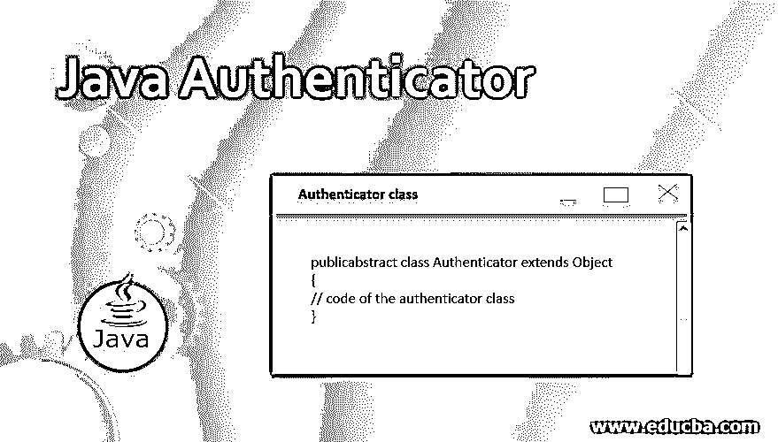
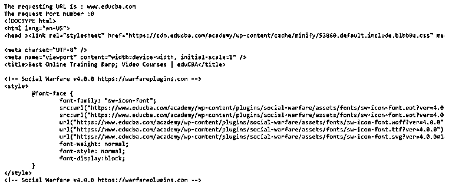
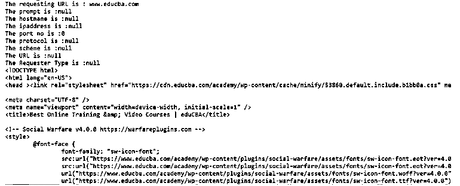

# Java 认证器

> 原文：<https://www.educba.com/java-authenticator/>




## Java 认证器简介

java authenticator 类用于执行网络连接的身份验证。java authenticator 类是 java 中的一个内置类。authenticator 类用在一个应用程序中，在该应用程序中，用户访问某些 URL 时需要进行身份验证。authenticator 类通过提示用户输入用户名和密码等凭据信息来执行身份验证。

要在应用程序中执行身份验证，应用程序需要执行一些步骤；首先，一个应用程序类扩展了 java.net.Authenticator 类，并在子类中覆盖了 java.net.Authenticator 类的 getPasswordAuthentication()函数。通常，这个函数包含 getXXX()函数，用于从用户处获取信息以进行身份验证，如用户名和密码。函数作用是:返回包含凭证信息的 PasswordAuthentication 值。

<small>网页开发、编程语言、软件测试&其他</small>

**Java 中 Authenticator 类的语法是-**

```
public abstract class Authenticator extends Object
{
// code of the authenticator class
}
```

### 验证器类成员函数

让我们看看所有 Authenticator 类成员函数的列表，这些函数可用于特定的身份验证目的。

**1。getPasswordAuthentication()–**该函数在需要密码授权时使用。默认情况下，所有子类都应该覆盖 getPasswordAuthentication()，并且该函数总是返回 null。

**语法—**

```
protected PasswordAuthentication getPasswordAuthentication();
```

**2。getRequestingHost()–**该函数用于获取请求认证的站点的主机名，如果主机名不存在，则返回 null。

**语法—**

```
protected final String getRequestingHost();
```

**3。getRequestingPort()–**该函数用于获取请求连接的端口号。

**语法—**

```
protected final int getRequestingPort();
```

**4。getRequestingPrompt()–**该函数用于提示请求者提供的字符串消息。

**语法—**

```
protected final String getRequestingPrompt();
```

**5。getRequestingProtocol()–**该函数用于获取请求连接的协议。

**语法—**

```
protected final int getRequestingProtocol();
```

**6。getRequestingScheme()–**此函数用于取消请求者站点的方案。

**语法—**

```
protected final String getRequestingScheme();
```

7 .**。getRequestingSite()–**此函数用于获取请求站点的 InetAddress，如果没有 InetAddress，则返回 null。

**语法—**

```
protected final InetAddress getRequestingSite();
```

**8。getRequestingURL()–**这个函数用于获取请求者的 URL。

**语法—**

```
protected URL getRequestingURL();
```

**9。set default(Authenticator a)–**该函数用于设置当 HTTP 服务器需要认证时网络使用的认证器。

**语法—**

```
public static void setDefault(Authenticator a);
```

10。getRequestorType()–该函数用于获取请求者是服务器还是代理。

**语法—**

```
protected Authenticator.RequestorType getRequestorType();
```

### Java 中 Authenticator 类的示例

接下来，我们编写 java 代码来更清楚地理解 Authenticator 类，在下面的示例中，我们创建 Authenticator 类的一个子类，并覆盖 getPasswordAuthentication()函数来对某些 URL 执行身份验证，如下所示

#### 示例#1

**代码:**

```
package p1;
import java.io.BufferedReader;
import java.io.IOException;
import java.net.URL;
import java.io.InputStreamReader;
import java.net.Authenticator;
import java.net.PasswordAuthentication;
import java.net.MalformedURLException;
class MyAuthenticatorclass extends Authenticator
{
protected PasswordAuthentication getPasswordAuthentication()
{
String username = "John", password = "pass123";
this.print();
return new PasswordAuthentication(username, password.toCharArray());
}
void print()
{
int hostname = getRequestingPort();
System.out.println("The request Port number :" + hostname);
}
}
public class Demo
{
public static void main(String[] arg)
{   String data;
try {
//create object of authenticator class
MyAuthenticatorclass obj =new MyAuthenticatorclass();
Authenticator.setDefault(new MyAuthenticatorclass());
URL url = new URL("https://www.educba.com/");
// reads data from the url in html form
BufferedReader br = new BufferedReader(new InputStreamReader(url.openStream()));
System.out.println("The requesting URL is : "+url.getHost());
obj.getPasswordAuthentication() ;
while ((data = br.readLine()) != null) {
System.out.println(data);
}
br.close();
} catch (MalformedURLException e) {
System.out.println("Malformed URL Exception : " + e);
} catch (IOException e) {
System.out.println("IO Exception: " + e);
}
}
}
```

**输出:**




与上面的代码一样，authenticator 类的子类被创建并覆盖 getPasswordAuthentication()函数，其中提供了身份验证的详细信息，该函数返回 PasswordAuthentication 对象。与程序中一样，URL(https://www.educba.com/)是通过执行身份验证来读取的，因为在从 URL 读取之前的代码中调用了 obj.getPasswordAuthentication()来进行身份验证，如果 obj.getPasswordAuthentication()返回空值，那么它会生成 java.lang.NullPointerException，程序执行仅在此处停止，这意味着未通过身份验证；否则，程序会进一步执行，这意味着通过了身份验证。

接下来，我们编写 java 代码来理解 Authenticator 类，其中我们尝试获取被覆盖的 getPasswordAuthentication()函数中的所有信息，如下所示

#### 实施例 2

**代码:**

```
package p1;
import java.io.BufferedReader;
import java.io.IOException;
import java.net.URL;
import java.io.InputStreamReader;
import java.net.Authenticator;
import java.net.InetAddress;
import java.net.PasswordAuthentication;
import java.net.MalformedURLException;
class MyAuthenticatorclass extends Authenticator
{
protected PasswordAuthentication getPasswordAuthentication()
{
String username = "John", password = "pass123";
this.print();
return new PasswordAuthentication(username, password.toCharArray());
}
void print()
{
// get all information
String prom = getRequestingPrompt();
URL url = getRequestingURL();
int prt = getRequestingPort();
String hostname = getRequestingHost();
InetAddress ipaddress = getRequestingSite();
String sh = getRequestingScheme();
RequestorType rt = getRequestorType();
String protocol = getRequestingProtocol();
System.out.println("The prompt is :" + prom+"\nThe hostname is :" + hostname+"\nThe ipaddress is :" + ipaddress+"\nThe port no is :" + prt);
System.out.println("The protocol is :" + protocol+"\nThe scheme is :" + sh+"\nThe URL is :" + url+"\nThe Requester Type is :" + rt);
}
}
public class Demo
{
public static void main(String[] arg)
{   String data;
try {
//create object of authenticator class
MyAuthenticatorclass obj =new MyAuthenticatorclass();
Authenticator.setDefault(new MyAuthenticatorclass());
URL url = new URL("https://www.educba.com/");
// reads data from the url in html form
BufferedReader br = new BufferedReader(new InputStreamReader(url.openStream()));
System.out.println("The requesting URL is : "+url.getHost());
obj.getPasswordAuthentication() ;
while ((data = br.readLine()) != null) {
System.out.println(data);
}
br.close();
} catch (MalformedURLException e) {
System.out.println("Malformed URL Exception : " + e);
} catch (IOException e) {
System.out.println("IO Exception: " + e);
}
}
}
```

**输出:**




上面的代码试图获取所有与身份验证相关的信息。

### 结论

java authenticator 类是 java 中的一个内置类，用于对 URL 或网络连接执行身份验证。这个内置的类有十个函数可以用于特定的目的，正如我们在上面看到的。

### 推荐文章

这是 Java 认证器的指南。这里我们讨论 Java 中 Authenticator 类的函数和例子以及语法。您也可以浏览我们推荐的其他文章，了解更多信息——

1.  [用 Java 重画](https://www.educba.com/repaint-in-java/)
2.  [Java 时区](https://www.educba.com/java-timezone/)
3.  [Java 目录](https://www.educba.com/java-directories/)
4.  [Java 中的线程组](https://www.educba.com/threadgroup-in-java/)


