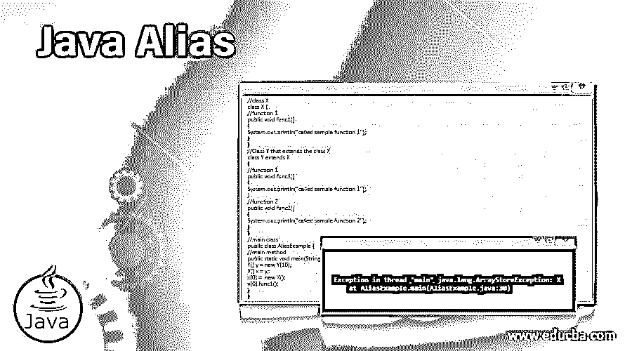
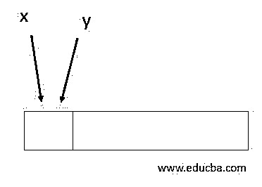
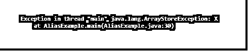

# Java 别名

> 原文：<https://www.educba.com/java-alias/>




## Java 别名介绍

在 Java 中，当不止一个引用链接到同一个对象时，使用 Alias。别名的问题是当用户写入一个特定的对象，而其他几个引用的所有者不希望该对象改变。在这里，包含别名的代码会很快变得有点混乱，调试起来也非常繁琐。总的来说，别名是一个应该尽量避免或小心使用的过程。让我们看看 Java Alias 是如何工作的。

### Java 中的 alias 是如何工作的？

正如已经讨论过的，当不止一个引用链接到同一个对象时，使用别名。这也意味着一个位置有几个可以修改的别名，这些特定的别名有几种类型。

<small>网页开发、编程语言、软件测试&其他</small>

让我们举一个例子。X 和 Y 是两个变量名，有 X 和 Y 两种类型。

```
Y[] y = new Y[10];
X[] x = y;
x[0] =  new X();
Y[0].func1();
```

在内存中，它们也指向同一个位置。




被指向的内存位置由 x 和 y 指向。然而，实际保存的对象选择在运行时调用哪个方法。

让我们看另一个例子。

```
Rectangle b1 = new Rectangle (0, 0, 50, 150);
Rectangle b2 = b1;
```

b1 和 b2 都指同一个物体，或者我们可以说给定的物体有两个名字，比如 b1 和 b2。就像一个人有两个名字一样，对象也可以有两个名字。

当存在两个别名变量时，导致一个变量的变化也会反映到另一个变量上，如下所示。

```
System.out.println (b2.width);
b1.grow (40, 40);
System.out.println (b2.width);
```

在执行代码时，您将看到在一个矩形上引起的更改也发生在第二个矩形上。对于 Java 中的 Alias，这是必须注意的主要事情之一。

### Java 别名的示例

以下是 Java Alias 上的一些示例程序。

#### 示例#1

**代码:**

```
//class X
class X {
//function 1
public void func1()
{
System.out.println("called sample function 1");
}
}
//Class Y that extends the class X
class Y extends X
{
//function 1
public void func1()
{
System.out.println("called sample function 1");
}
//function 2
public void func2()
{
System.out.println("called sample function 2");
}
}
//main class
public class AliasExample {
//main method
public static void main(String[] args) {
Y[] y = new Y[10];
X[] x = y;
x[0] =  new X();
y[0].func1();
}
}
```

**输出:**




在执行代码时，可以看到发生了一个名为 ArrayStoreException 的异常。这是如何发生的？有什么需要改变的？有可能解决这个问题吗？

是啊！！这个异常的唯一原因是 Java 在运行时管理别名。只有在运行时，它才能够知道第一个应该是 Y 的对象，而不是 x，要解决这个问题，上面的代码必须更改。

因此，只有将示例程序修改成以下代码，它才能正确运行。

```
//class X
class X {
//function 1
public void func1()
{
System.out.println("called sample function 1");
}
}
//Class Y that extends the class X
class Y extends X
{
//function 1
public void func1()
{
System.out.println("called sample function 1");
}
//function 2
public void func2()
{
System.out.println("called sample function 2");
}
}
//main class
public class AliasExample {
//main method
public static void main(String[] args) {
Y[] y = new Y[10];
X[] x = y;
x[0] =  new Y();
y[0].func1();
}
}
```

**输出:**


这个异常是在第一个程序中抛出的，这里没有发生，因为 X 的对象变成了 y 的对象。

#### 实施例 2

**代码:**

```
//main class
public class AliasExample {
//main method
public static void main(String[] args) {
//create two different arrays with same value
int a= 87;
int b=87;
//checks whether a and b are equal
System.out.println(a == b);
//assign b equal to a
b=a;
//checks whether a and b are equal
System.out.println(a == b);
}
}
```

**输出:**


在这个程序中，首先创建两个整型变量 a 和 b。然后代码检查 a 和 b 是否相等。在下一步中，将 a 分配给 b。再次检查 a 和 b 是否相似。在执行代码时，两个结果都将打印为 true。

如果用 a 和 b 两个数组代替整型变量会怎么样？

这可以用下面给出的程序来解释。

```
//main class
public class AliasExample {
//main method
public static void main(String[] args) {
//create two different arrays with same value
int []a = {81, 54, 83};
int []b = {81, 54, 83};
//checks whether a and b are equal
System.out.println(a == b);
//assign b equal to a
b=a;
//checks whether a and b are equal
System.out.println(a == b);
}
}
```

**输出:**


在这个程序中，第一步创建了两个数组 a 和 b。然后，类似于上面的程序，检查 a 和 b 是否相等。之后，将 a 赋给 b，再次检查两者是否相似。在执行代码时，可以看到第一次检查的输出为假，第二次检查的输出为真。就是因为 Java 别名管用。

### 结论

当多个对象的引用链接到同一个对象时，在 Java 中使用别名。别名的缺点是，当用户写入一个特定的对象时，其他一些引用的所有者不会猜到该对象会发生变化。在本文中，将对 Java 别名的更多细节进行详细解释。

### 推荐文章

这是一个 Java 别名的指南。在这里，我们将讨论 alias 在 java 中是如何工作的，并通过编程示例来更好地理解它。您也可以看看以下文章，了解更多信息–

1.  [Java 线程优先级](https://www.educba.com/java-thread-priority/)
2.  [Java PrintWriter](https://www.educba.com/java-printwriter/)
3.  [Java 控制台](https://www.educba.com/java-console/)
4.  [Java 模式类](https://www.educba.com/java-pattern-class/)


