# Java 收集方法

> 原文：<https://www.educba.com/java-collection-methods/>

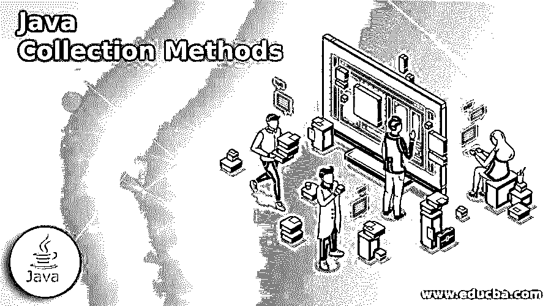


## Java 集合简介

下面的文章提供了 Java 集合方法的概要。Java Collections 框架有一个名为 Collections 类的成员。集合类包含在一个名为 java.util package 的包中。主要地，集合类与静态方法一起使用，静态方法操作返回集合或集合。每当传递给任何方法的对象或集合为空时，该类的每个方法都会抛出空指针异常。集合类中有三个字段，分别是 Empty_Map、EMPTY_LIST、EMPTY_SET，可以用来获取不可变的集合、列表和映射。

### Java 收集方法列表

下面给出了 Java 收集方法的列表:

<small>网页开发、编程语言、软件测试&其他</small>

#### 1.addAll()方法

Java.util.Collections 有一个 addAll()方法，用于将一组指定的元素添加到指定的集合中。要添加的元素可以单独指定，也可以作为一个数组完成。这个方便的方法与 c . addAll(arrays . aslist(elements))相同，但是 addAll()方法在执行大多数实现时更快。

**代码:**

```
import java.util.*;
public class EDUCBA {
public static void main(String[] course) throws Exception
{
try {
List<String> courselist = new ArrayList<String>();
courselist.add("Data Science");
courselist.add("Data Engineering");
courselist.add("Data Analyst");
courselist.add("Data Mining");
System.out.println("\n New Course List with course name : \n" + courselist);
boolean price = Collections.addAll(courselist, "22590", "23490", "34590", "54590");
System.out.println("\n Status of the courses on Website : \n" + price);
System.out.println("\n New Courses with their respective prices : \n" + courselist);
}
catch (NullPointerException upcomingcourse) {
System.out.println("Upcoming Courses are : " + upcomingcourse);
}
catch (IllegalArgumentException upcomingcourse) {
System.out.println("Upcoming Courses are : " + upcomingcourse);
}
}
}
```

**输出:**

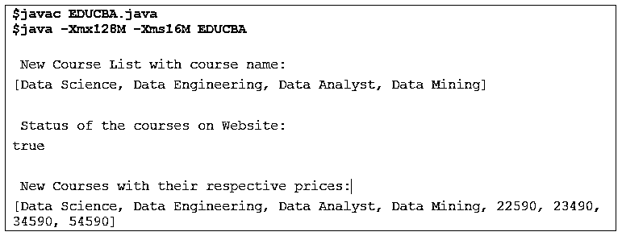


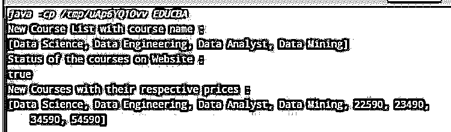


#### 2.asLifoQueue()方法

java.util.Collections 类有一个 asLifoQueue()方法，该方法用于返回一个将队列作为后进先出队列的视图。对于推送，方法 add 被映射，方法 remove 用于弹出。当我们在 Lifo 排序中需要一个队列时，这种方法非常重要。

**代码:**

```
import java.util.*;
public class EDUCBA {
public static void main(String[] course) throws Exception
{
try {
Deque<String> courselist = new ArrayDeque<String>(10);
courselist.add("Data Science");
courselist.add("Data Analysis");
courselist.add("Data Engineering");
courselist.add("Data Mining");
Queue<String> newcourses = Collections.asLifoQueue(courselist);
System.out.println("\n New courses added to website are : \n" + newcourses);
}
catch (IllegalArgumentException upcomingcourses) {
System.out.println("\n Upcoming courses are : \n" + upcomingcourses);
}
}
}
```

**输出:**

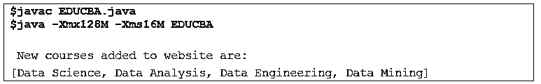


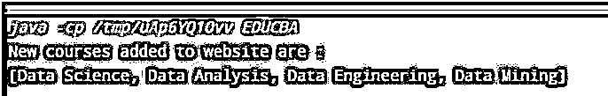


#### 3.Collections.binarySearch()方法

java.util.Collections 有一个 Java . util . collections . binary search()方法，用于返回特定对象在排序列表中的位置。当使用指定的比较器比较列表中的元素时，或者当搜索键与这些元素不可比时，方法会引发 ClassCastException。

**代码:**

```
import java.util.ArrayList;
import java.util.Collections;
import java.util.List;
public class EDUCBA {
public static void main(String[] course)
{
List<Integer> newcourseID = new ArrayList<Integer>();
newcourseID.add(112202);
newcourseID.add(230042);
newcourseID.add(340713);
newcourseID.add(104219);
newcourseID.add(628973);
int IDofCourse = Collections.binarySearch(newcourseID, 340713);
System.out.println(IDofCourse);
IDofCourse = Collections.binarySearch(newcourseID, 628974);
System.out.println(IDofCourse);
}
}
```

**输出:**

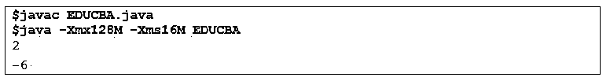


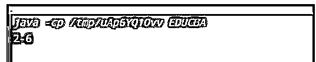


#### 4.checkedCollection()方法

java.util.Collections 类有一个 checkedCollection()方法，用于返回特定集合的动态类型安全视图。返回的集合不传递 hashCodes，而是将操作等同于后备集合。然而，它通常依赖于 hashCode 方法和对象的 equals。

**代码:**

```
import java.util.*;
public class EDUCBA {
public static void main(String[] course) throws Exception
{
try {
List<String> courselist = new ArrayList<String>();
courselist.add("Data Science");
courselist.add("Data Analysis");
courselist.add("Data Engineering");
courselist.add("Data Mining");
System.out.println("\n Best seller courses: \n" + courselist);
Collection<String>
bestseller = Collections
.checkedCollection(courselist, String.class);
System.out.println("\n List constitues of bestseller courses, as: \n" + bestseller);
}
catch (IllegalArgumentException upcomingcourses) {
System.out.println("\n Upcoming courses are : \n" + upcomingcourses);
}
}
}
```

**输出:**

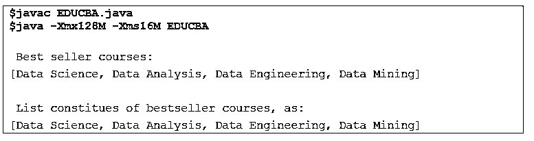


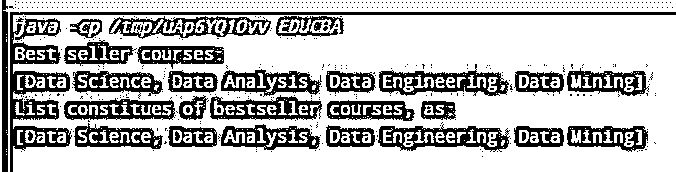


#### 5.copy()方法

java.util.Collections 类有一个 copy()方法，用于将一个列表中的元素复制到另一个列表中。

**代码:**

```
import java.util.*;
public class EDUCBA {
public static void main(String[] course)
throws Exception
{
try {
List<String> courselist = new ArrayList<String>(10);
List<String> pricelist = new ArrayList<String>(10);
courselist.add("Data Science");
courselist.add("Data Analysis");
courselist.add("Data Engineering");
courselist.add("Data Mining");
pricelist.add("11900");
pricelist.add("23450");
pricelist.add("36340");
pricelist.add("44740");
System.out.println("\n Recently added courses: \n" + courselist);
System.out.println("\n Price of respective courses: \n" + pricelist);
System.out.println("\n Merging these above lists: \n");
Collections.copy(pricelist, courselist);
System.out.println(" Recently added courses: " + courselist);
System.out.println("\n Price of respective courses, will be displayed shortly: " + pricelist);
}
catch (IllegalArgumentException upcomingcourse) {
System.out.println("\n Upcoming courses are : \n" + upcomingcourse);
}
catch (IndexOutOfBoundsException upcomingcourse) {
System.out.println("\n Upcoming courses are : \n" + upcomingcourse);
}
}
}
```

**输出:**

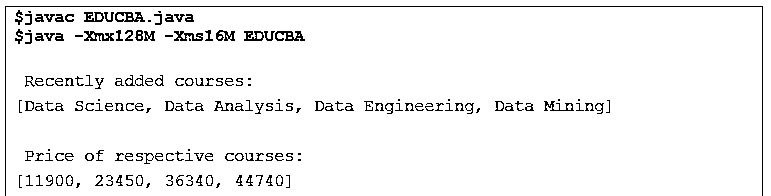


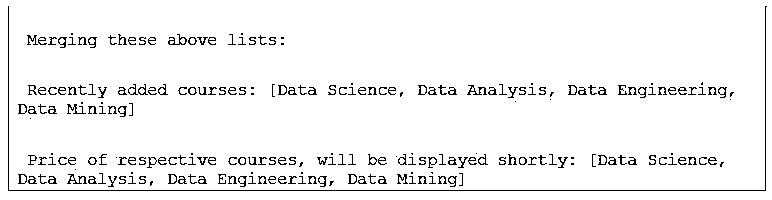


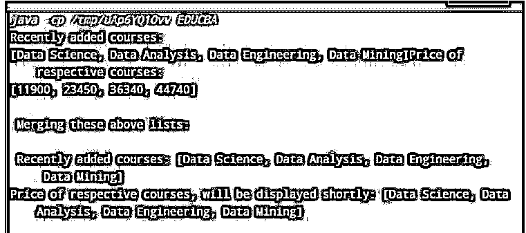


#### 6.Java.util.Collections.disjoint()方法

java.util.Collections 类具有 java.util.Collections.disjoint()方法，用于检查两个指定的集合是否不相交。不相交是指两个集合没有任何共同元素的情况。

**代码:**

```
import java.util.*;
public class EDUCBA
{
public static void main(String[] course)
{
List<String> DataCourse = new ArrayList<String>();
DataCourse.add("Data Science");
DataCourse.add("Data Analysis");
DataCourse.add("Data Engineering");
DataCourse.add("Data Mining");
List<String> ColudCourse = new Vector<String>();
ColudCourse.add("AWS");
ColudCourse.add("Google Cloud");
ColudCourse.add("Azure");
ColudCourse.add("IBM Cloud");
List UpcomingCourses = new Vector();
UpcomingCourses.add(2);
UpcomingCourses.add("Waiting List");
System.out.println("\n You can buy bundle of DataCouse and CloudCourse : \n " +
Collections.disjoint(DataCourse, ColudCourse));
System.out.println("You can get deals on bundle of DataCouse and UpcomingCourses : \n " +
Collections.disjoint(DataCourse, UpcomingCourses));
}
}
```

**输出:**

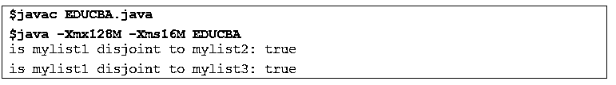


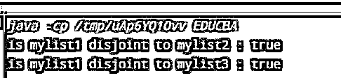


### 结论

在这篇文章的基础上，我们理解了 Java 集合方法的概念。本文用例子解释了各种收集方法。文章中提到的所有方法都有详细的解释，包括它们的定义和用法。

### 推荐文章

这是一个 Java 集合方法的指南。这里我们分别讨论 java 集合方法的介绍和列表。您也可以看看以下文章，了解更多信息–

1.  [Java 中的排序字符串](https://www.educba.com/sort-string-in-java/)
2.  [在 Java 中排序字符串数组](https://www.educba.com/sort-string-array-in-java/)
3.  [终于在 Java 中](https://www.educba.com/finally-in-java/)
4.  [Java 中的 JSON](https://www.educba.com/json-in-java/)


