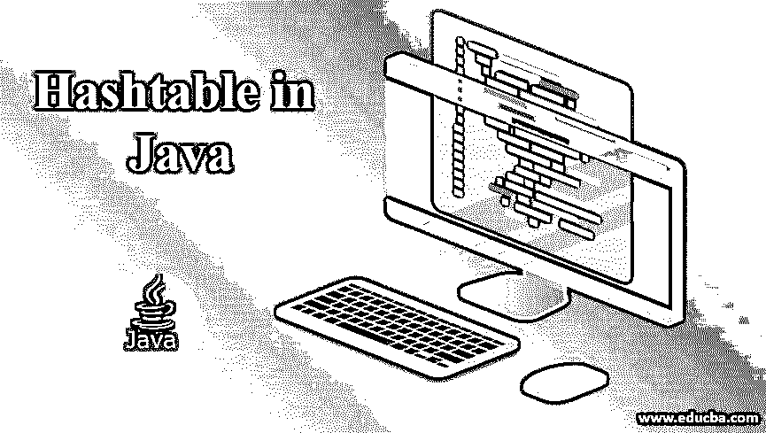
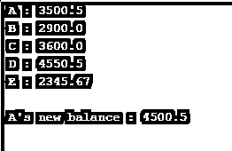
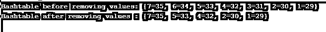
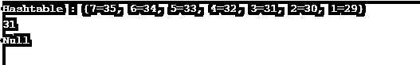

# Java 中的哈希表

> 原文：<https://www.educba.com/hashtable-in-java/>




## Java 哈希表简介

在 Java 中，Hashtable 用于存储键-值对，这些键-值对将每个键映射到特定的值。与散列表不同，它是同步的。此外，Hashtable 不允许空值或空键，并且还包含惟一的元素。如前所述，哈希表包含一个经过哈希处理并获得哈希代码的键。然后，这个代码将被用作存储特定值的索引。

**哈希表声明:**

<small>网页开发、编程语言、软件测试&其他</small>

Hashtable 类可以使用下面的语法来声明。

```
public class Hashtable<Key,Value> extends Dictionary<Key,Value> implements Map<Key,Value>, Cloneable, Serializable
```

### 哈希表的构造函数

哈希表可以使用参数化和非参数化的构造函数来创建。

*   **Hashtable():** 一个新的以及一个空的 Hashtable 将被构造为加载因子为 0.75，初始容量为 11。这里，初始容量和负载系数是默认值。
*   **Hashtable(int init capacity):**一个新的以及一个空的 Hashtable 将被构造为初始容量和负载因子为 0.75。这里，只有负载系数是默认的。
*   **Hashtable (int initCapacity，float loadfact):** 一个新的，以及一个空的 Hashtable，将使用提到的初始容量和加载因子来构造。
*   **哈希表(地图<？扩展键，扩展值>t:**一个新的哈希表将由与上述映射相同的映射构成。

### 哈希表的方法

下面是 HashTable 中常用的方法。

*   **clear():** 这个哈希表将被清除，不再保留任何键。
*   **contains(Object val ):** 这个方法测试是否有任何键映射到哈希表中的值 val。
*   **克隆** **():** 将为哈希表创建一个浅层副本。
*   **包含** **键(** **对象** **k ):** 该方法测试指定的键 k 在哈希表中是否可用。
*   **包含一个值(** **对象** **val ):** 如果哈希表将 1 个或 1 个以上的键映射到所提到的值 val，则返回 true。
*   **元素** **():** 值的枚举将被返回。
*   **Key****():**Key 的枚举将被返回。
*   **entrySet** **():** 将为地图上显示的映射返回一个集合视图。
*   **等于** **(** **对象** **o):** 一张地图会与指定的对象进行比较。
*   **get****(****Object****key):**如果指定的 key 映射成任意值，则返回。如果没有映射任何内容，将返回 null。
*   **isEmpty** **():** 该方法检查哈希表是否没有将键映射到任何值。
*   **键集** **():** 将返回地图中出现的键的集合视图。
*   **size** **():** 返回哈希表中的键的个数。
*   **hashCode** **():** 将为 map 返回 Hash 码值。
*   **放** **(** **K** **key，****V****al value):**Key K 会映射到 hashtable 中的 value val。
*   **putAll** **(** **地图** **<？扩展了**KT10】ey，？extends**V****al>t):**映射将从上述映射复制到哈希表。
*   **删除** **(** **对象** **k):** 键 k 和相应的值将从表格中删除。
*   **值** **():** 将为地图中出现的值返回一个集合视图。

### 用 Java 实现哈希表的例子

每种数据结构都有自己的特点。

下面是用 java 实现 hashtable 的例子。

#### 示例#1

[Java](https://www.educba.com/what-is-java/) 程序向哈希表添加键和值。

**代码:**

```
//Java program to add keys and values to the hashtable
import java.util.Enumeration;
import java.util.Hashtable;
//class
public class HashTableExample {
//main method
public static void main(String args[]) {
// Hashtable creation
Hashtable htbl = new Hashtable();
//create an enumeration enm
Enumeration enm;
//create sing s
String s;
//create a double variable balance
double balance;
//add keys and values to the table
htbl.put(" A ", new Double(3500.50));
htbl.put(" B ", new Double(2900.00));
htbl.put(" C ", new Double(3600.00));
htbl.put(" D ", new Double(4550.50));
htbl.put(" E ", new Double(2345.67));
// Store all the keys in the enumeration enm
enm = htbl.keys();
//if more elements are present in the enm, enter this loop
while(enm.hasMoreElements()) {
s = (String) enm.nextElement();
System.out.println(s + ": " + htbl.get(s));
}
System.out.println();
// Add 1000 to value of Key A
balance = ((Double)htbl.get(" A ")).doubleValue();
htbl.put(" A ", new Double(balance + 1000));
System.out.println(" A's new balance : " + htbl.get(" A "));
}
}
```

**输出:**

执行代码时将显示 A、B、C、D 和 E 的值。而且，A 的新余额也会显示出来，如下图。




#### 实施例 2

从哈希表中删除键和值的 Java 程序。

**代码:**

```
//Java program to remove keys and values from the hashtable
import java.util.Enumeration;
import java.util.Hashtable;
//class
public class HashTableExample {
//main method
public static void main(String args[]) {
// Hashtable creation
Hashtable<Integer,String> htbl = new Hashtable<Integer,String>();
//add keys and values to the table
htbl.put(1,"29");
htbl.put(2,"30");
htbl.put(3,"31");
htbl.put(4,"32");
htbl.put(5,"33");
htbl.put(6,"34");
htbl.put(7,"35");
System.out.println("Hashtable before removing values: "+ htbl);
// Remove 6 and 3
htbl.remove(6);
htbl.remove(3);
System.out.println("Hashtable after removing values : "+ htbl);
}
}
```

**输出:**




在该程序中，执行代码时将显示值 1、2、3、4、5、6 和 7。然后，6 和 3 的值将被删除，并显示其余的值。

#### 实施例 3

Java 程序从哈希表中获取键和值。

**代码:**

```
//Java program to get keys and values from the hashtable
import java.util.Enumeration;
import java.util.Hashtable;
//class
public class HashTableExample {
//main method
public static void main(String args[]) {
// Hashtable creation
Hashtable<Integer,String> htbl = new Hashtable<Integer,String>();
//add keys and values to the table
htbl.put(1,"29");
htbl.put(2,"30");
htbl.put(3,"31");
htbl.put(4,"32");
htbl.put(5,"33");
htbl.put(6,"34");
htbl.put(7,"35");
System.out.println("Hashtable : "+ htbl);
//if value of 3 is present, then return it else print Null
System.out.println(htbl.getOrDefault(3, "Null"));
//if value of 8 is present, then return it else print Null
System.out.println(htbl.getOrDefault(8, "Null"));
}
}
```

**输出:**




在这个程序中，1、2、3、4、5、6 和 7 将在执行代码时显示。然后，将使用 getOrDefault()方法检索键 3 和 8 的值。由于值 8 不可用，第二个 getOrDefault()方法将返回 null。

### 推荐文章

这是 Java 中散列表的指南。这里我们讨论 Hashtable 的方法和构造函数，以及不同的例子和代码实现。您也可以阅读以下文章，了解更多信息——

1.  [Java Swing 中的定时器](https://www.educba.com/timer-in-java-swing/)
2.  [Java Swing 布局](https://www.educba.com/java-swing-layout/)
3.  [Java 中的 TreeMap 是什么？](https://www.educba.com/what-is-treemap-in-java/)
4.  [Java 中的定时器](https://www.educba.com/timer-in-java/)


