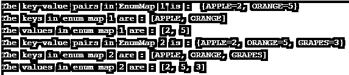

# Java 枚举文件夹

> 原文：<https://www.educba.com/java-enummap/>


## Java EnumMap 简介

一个被称为 EnumMap 的 Java 集合框架成员，它扩展了 AbstractMap，是接口映射的特定实现，主要用于枚举类型。除此之外，EnumMap 还具有其他一些特性。

它包括:

<small>网页开发、编程语言、软件测试&其他</small>

*   它不是同步的。
*   更快；与此相比，HashMap 要慢一些。
*   它以密钥的自然顺序保存。
*   高性能。
*   不允许空键。也就是说，当存在空键时，将引发 NullPointerException。
*   可以存在空值。
*   将使用枚举元素作为键。

关于 Java EnumMap 的更多细节将在下面的章节中讨论。

**语法**

可以使用下面的语法声明 Java EnumMap。

```
public class EnumMap<Key extends Enum<Key>,Value> extends AbstractMap<Key,Value> implements Serializable, Cloneable
```

### Java EnumMap 中的构造函数

以下是 Java EnumMap 中常用的构造函数:

*   **枚举映射** **(** **类****<****K****>keyType):**一个空的枚举映射将会用提到的 key type 创建。
*   **enum map****(enum map<****K****，？extends****V****>m):**如果存在任何初始映射，将使用与上述枚举映射相同的 keyType 创建枚举映射。
*   **enum Map****(****Map****<****K****，？extends****V****>m):**将从上述映射创建一个枚举映射。

### Java EnumMap 中的方法

现在，让我们看看 Java EnumMap 的一些常用方法。

*   **clear():** 调用此方法时，地图中所有可用的映射都将被删除。
*   **clone():** 将为提到的枚举映射返回一个浅层副本。
*   **contains key(****Object****k):**如果映射中有所提到的键 k 的映射，将返回 True
*   **contains value(****Object****v):**如果 map 将 1 个或 1 个以上的键映射到所提到的值 v，将返回 True
*   **entrySet** ():将为地图上可用的映射返回一个集合视图。
*   **等于(** **对象** **ob):** Map 和提到的对象 ob 会比较是否相等。
*   **get(****Object****k):**如果 map 有所提及的 key k 的映射，则返回 Value，如果 key 没有值，则返回 null。
*   **hashCode():** 将为映射返回哈希代码。
*   **keySet():** 将返回地图上出现的键的集合视图。
*   **put(** **K** **key，****V****value):**value V 会关联到地图上的 key K。
*   **putAll(** **地图** **<？延伸** **K** **，？extends****V****>m):**给定贴图中的每一个贴图都将被复制到这个贴图中。
*   **remove(****Object****k):**被提及的键 k 将被删除映射。
*   **size():** 将返回映射中可用的键值映射的计数。
*   **values():** 将返回地图上可用值的集合视图。

### 实现 Java EnumMap 的示例

为了更好地理解 Java Enum Map，让我们在一些程序中实现上述方法。

#### 示例#1

创建枚举映射并将元素复制到另一个枚举映射的示例程序。

**代码:**

```
import java.util.EnumMap;
class JavaEnumMapExample {
enum fruits {
APPLE, ORANGE, GRAPES, KIWI
}
public static void main(String[] args) {
// EnumMap creation of the fruits enum
EnumMap<fruits, Integer> fr = new EnumMap<>(fruits.class);
// add key-value to the mapping using the method put()
fr.put(fruits.APPLE, 2);
fr.put(fruits.ORANGE, 5);
System.out.println("The key-value pairs in EnumMap 1 is :  " + fr);
//create another enum map fru
EnumMap<fruits, Integer> fru = new EnumMap<>(fruits.class);
// copy all the elements from first enum map to this using the methodputAll()
fru.putAll(fr);
fru.put(fruits.GRAPES, 3);
System.out.println("The key-value pairs in EnumMap 2 is : " + fru);
}
}
```

**输出:**


**对上述程序的说明:**在上述程序中，创建了两个 enum 映射。第一个地图是用 2 个元素创建的，第二个地图是通过复制第一个地图的元素创建的。除此之外，一个额外的元素也被添加到第二个地图。这些是在 put()和 putAll()方法的帮助下完成的。

#### 实施例 2

创建枚举映射并分别获取键和值的示例程序。

**代码:**

```
import java.util.EnumMap;
class JavaEnumMapExample {
enum fruits {
APPLE, ORANGE, GRAPES, KIWI
}
public static void main(String[] args) {
// EnumMap creation of the fruits enum
EnumMap<fruits, Integer> fr = new EnumMap<>(fruits.class);
// add key-value to the mapping using the method put()
fr.put(fruits.APPLE, 2);
fr.put(fruits.ORANGE, 5);
System.out.println("The key-value pairs in EnumMap 1 is :  " + fr);
// print all the keys in the enum map using the method keySet()
System.out.println("The keys in enum map 1 are : " + fr.keySet());
// print all the values in the enum map using the method values()
System.out.println("The values in enum map 1 are : " + fr.values());
//create another enum map fru
EnumMap<fruits, Integer> fru = new EnumMap<>(fruits.class);
// copy all the elements from first enum map to this using the methodputAll()
fru.putAll(fr);
fru.put(fruits.GRAPES, 3);
System.out.println("The key-value pairs in EnumMap 2 is : " + fru);
// print all the keys in the enum map using the method keySet()
System.out.println("The keys in enum map 2 are : " + fru.keySet());
// print all the values in the enum map using the method values()
System.out.println("The values in enum map 2 are : " + fru.values());
}
}
```

**输出:**




**对上述程序的解释:**与第一个程序类似，这里有两个 enum 映射。这个程序分别使用方法 keyset()和 values()显示映射的键和值。

#### 实施例 3

从枚举映射中删除元素的示例程序

**代码:**

```
import java.util.EnumMap;
class JavaEnumMapExample {
enum fruits {
APPLE, ORANGE, GRAPES, KIWI
}
public static void main(String[] args) {
// EnumMap creation of the fruits enum
EnumMap<fruits, Integer> fr = new EnumMap<>(fruits.class);
// add key-value to the mapping using the method put()
fr.put(fruits.APPLE, 2);
fr.put(fruits.ORANGE, 5);
System.out.println("The key-value pairs in EnumMap :  " + fr);
// remove an element using the method remove()
int val = fr.remove(fruits.APPLE);
System.out.println("Removed Value: " + val);
System.out.println("The key-value pairs in EnumMap after removing apple :  " + fr);
}
}
```

**输出:**


**对上述程序的解释:**在这个程序中，使用 remove()方法从 map 中删除一个元素，并在下一步中打印结果 enum map。

### 结论

本文档详细讨论了 Java EnumMap 的声明、方法、构造函数等所有方面的详细说明。

### 推荐文章

这是一个 Java EnumMap 的指南。在这里，我们讨论语法、方法列表、构造函数以及用正确的代码和输出实现的例子。您也可以浏览我们的其他相关文章，了解更多信息——

1.  [Java 适配器类](https://www.educba.com/java-adapter-classes/)
2.  [Java 中的 StringBuffer 类](https://www.educba.com/stringbuffer-class-in-java/)
3.  [Java 中的布局管理器](https://www.educba.com/layout-manager-in-java/)
4.  [Java 线程优先级](https://www.educba.com/java-thread-priority/)


