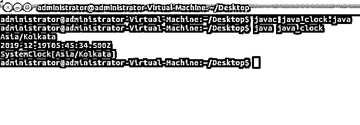
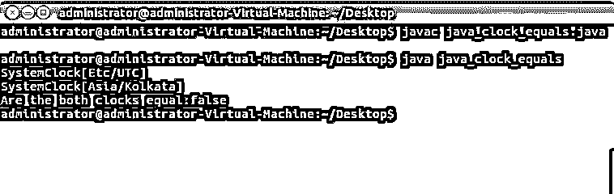

# Java 时钟

> 原文：<https://www.educba.com/java-clock/>


## Java 时钟简介

本文将学习和理解 Java 编程语言的时钟类的需求和使用。Java 时钟类是日期时间 API 的一部分。Java 日期时间 API 属于 java.time 包。在 Java 8 中，这个 Clock 类增加了一个功能，可以在一瞬间提供更好的时间。本地和分区是上述空气污染指数的主要分类。简单的数据时间 API 没有其他时区处理的复杂性，是本地的，而 Zoned 是专注于各种时区的特定日期时间 API。

这个时钟类在时区的帮助下提供对当前时刻、日期和时间的访问。它不能实例化，因为它是一个抽象类，但提供了几个可以实例化的静态方法。现在往好的方面想，这个时钟类可以实现，而不是使用另外两个方法，TimeZone.getDefault()和 currentTimeMillis()。

<small>网页开发、编程语言、软件测试&其他</small>

FixedClock、OffsetClock、SystemClock、TickClock 是 Java Clock 的四种实现；这些是静态方法，是 Java 类的一部分。更好地实现 Clock 类的最佳实践是将它传递给一个需要当前时刻的方法。不要忽视时钟的使用是可选的。既然我们已经理解了 java 中的 Clock 类，现在让我们来理解它的语法和用法。

**语法:**

```
public abstract class Clock extends Object
```

这是 Clock 类的简单标准语法，正如我们看到的，它扩展了 Object。上述声明的正确实现将产生 Clock 类的预期输出。现在我们已经理解了 Clock 类的定义和语法，让我们学习它的方法。

### Java 时钟方法

就像 Java 编程语言中的其他类一样，Clock 有各种不同的用法。以下是这些方法及其各自的描述。

#### 1.瞬间

只需返回时钟的当前时刻，而不是 null。

```
public abstract Instant instant()
```

#### 2.等于

比较该时钟是否等于任何其他时钟。如果时钟相等，则返回 true，否则返回 false。clock 类的这个方法覆盖 Object.equals 方法。

```
public boolean equals(Object obj)
```

#### 3.getZone

获取当前使用的时区从不返回 null。它获取当前时刻，并将其转换为使用时区的时间或日期。

```
public abstract ZoneId getZone()
```

#### 4.系统默认值

使用最佳可用系统时钟，此方法返回当前时刻，然后将其转换为默认时区的日期和时间。可以使用 System.currentTimeMillis()并且返回是不可变的和线程安全的。

```
public static Clock systemDefaultZone()
```

#### 5.systemUTC

类似于 systemDefaultZone，最好在不需要日期或时间时使用。Rest 一切都是一样的，从使用最好的可用系统时钟到返回不可变。

```
public static Clock systemUTC()
```

### 实现 Java 时钟的例子

除了上面提到的方法之外，Clock 类还提供了其他特定用途的方法。为了演示上述方法，我们将在示例中实现 Clock 类的这些方法。请参考下列程序，其中包括这些方法及其输出。

#### 示例#1

**代码:**

```
import java.time.Clock;
import java.time.ZoneId;
public class java_clock {
public static void main(String[] args)  {
Clock j_clock = Clock.systemDefaultZone();
System.out.println(j_clock.getZone());
System.out.println(j_clock.instant());
System.out.println(j_clock.systemDefaultZone());
}
}
```

**输出:**




**代码解释:**这个例子演示了 getZone、instant 和 systemDefaultZone 方法的实现。从导入两个 java 包开始，然后创建我们的 java_clock 类。然后我们用一个简单的时钟对象初始化我们的主类。最后，我们输出了三个打印行，分别调用了方法。第一种方法打印当前系统时钟的时区；在这里，它打印“亚洲/加尔各答”。第二种方法简单地返回时钟的当前时刻，即日期和时间；对我来说，它打印当前的日期和时间。第三种方法类似于第一种方法，它打印系统时钟的时区。

因此，通过上面的代码示例，我们已经演示了 Clock 类的三个基本方法在 Java 中的实现。两个用于区域和一个即时方法。

#### 实施例 2

**代码:**

```
import java.time.Clock;
import java.time.ZoneId;
public class java_clock_equals {
public static void main(String[] args) {
Clock java_clock1 = Clock.system(ZoneId.of("Etc/UTC"));
System.out.println(java_clock1.toString());
Clock java_clock2 = Clock.systemDefaultZone();
System.out.println(java_clock2.toString());
boolean equalResponse = java_clock1.equals(java_clock2);
System.out.println("Are the both clocks equal:" + equalResponse);
}
}
```

**输出:**




**代码解释:**在上面的代码中，我们实现了 clock 类的 equals 方法。与第一个程序类似，我们从导入两个必需的 Java 包开始。然后创建了我们的类 java_clock_equals 和我们的主类。后来，我们为我们的时钟创建了一个对象，分配了一个时区 ID“Etc/UTC ”,并打印了相同的内容以供确认。然后是另一个带有系统默认时区的 Clock 对象和一个相同的 print 语句。此外，检查我们是否使用了 toString 方法，以确保输出没有任何错误，尽管删除 toString 不会有任何影响。在倒数第二条语句中，我们声明了一个布尔变量 equal response，这就是 equals 比较发生的地方。我们已经用 equals 方法传递了两个时钟的值。Java _ clock 1 . equals(Java _ clock 2)；这是比较 clock1 和 clock2 的值的地方，然后输出返回布尔值。在最后一行，我们的输出打印语句包含了比较后接收到的值。这里的输出总是为真或假，因为它是布尔型的。

我们可以看到输出分为三个句子，第一句是分配的时区，然后是系统的当前时区，最后是比较及其输出。

### 结论

总之，我们已经知道 Java Clock 类是在 Java 8 中引入的。它提供当前系统的时间和日期。我们理解这些方法以及正确的语法和清晰的解释。我们用代码设计了两个示例来演示这些方法，一个用于与区域和即时方法相关的两个方法，另一个用于 equals 方法。最后，通过代码、解释和相应的屏幕截图，我们理解了 Java Clock 类的工作原理。

### 推荐文章

这是一个 Java 时钟指南。在这里，我们讨论 java 时钟的基本概念和方法，以及示例和代码实现。您也可以阅读以下文章，了解更多信息——

1.  [Java 中的静态构造函数](https://www.educba.com/static-constructor-in-java/)
2.  [Java 中的数字模式](https://www.educba.com/number-patterns-in-java/)
3.  [Java ZoneId](https://www.educba.com/java-zoneid/)
4.  [Java 中的字符串](https://www.educba.com/string-in-java/)


