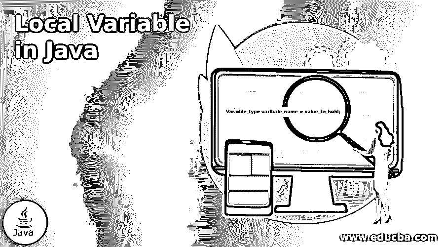
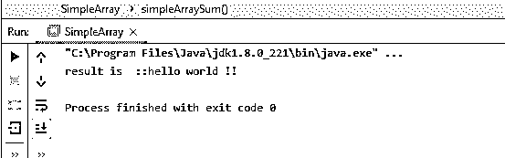
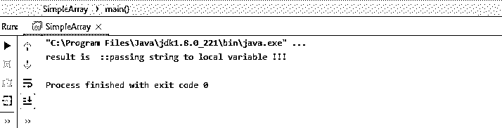
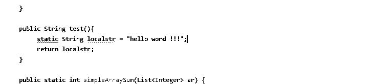

# Java 中的局部变量

> 原文：<https://www.educba.com/local-variable-in-java/>




## Java 中的局部变量介绍

在 Java 中，我们有一个只能在方法内部定义的局部变量；局部变量的作用域在定义它的块内。在程序块之外，我们甚至不能访问变量，因为我们实际上不知道它是否存在。当我们需要一些临时变量在块中保存我们的值时，局部变量是有用的，并且我们不需要这些变量用于其他方法或 java 中的整个类，那么在这种情况下，我们可以在 java 中将变量定义为局部变量来完全满足要求。在本教程的下一节，我们将看到它的内部工作、实现以及在 java 编程中如何使用它的用法。

### 句法

正如我们所知，在 java 中，局部变量是特定于块的，而不是块外的；让我们看一下声明局部变量的语法，以便更好地理解(见下文);

<small>网页开发、编程语言、软件测试&其他</small>

```
Variable_type varibale_name = value_to_hold;
```

正如你在上面的语法中看到的，我们可以这样定义局部变量；让我们仔细看看练习语法，这将使我们更清楚地理解这一点，并开始在初学者的程序中使用这一点；见下文；

例如:

```
String demo = ""my variable !!;
```

在下一节中，我们将更详细地了解它的工作原理，以及在 java 中定义局部变量以避免编译时错误的一些重要规则。

### 局部变量在 Java 中是如何工作的？

我们已经知道了 java 中的局部变量，但是在这一节中，我们将会看到一些在 java 的类方法或任何块中定义局部变量的基本规则。当我们必须在代码中非常有限的范围内使用变量时，这个变量非常有用；然后，我们应该用局部变量。它们充当临时变量，供我们使用，当某段代码停止或完成执行时，它们就会消失。在这一节中，我们首先将看到在 java 中定义和使用局部变量的规则，然后我们将看到 java 在哪里存储它们的局部变量，让我们从下面开始看；

#### 1.具有局部变量声明的方法

现在，我们将看看方法的创建，我们将在该方法中定义一个局部变量。作为参考，请参见以下代码；

例如:

```
public String getmsg(){
int temp = 0;
Syste.out.println(temp);
}
```

上面是我们可以用来定义局部变量的示例代码；这里，我们创建一个方法来声明和初始化一个局部变量。此变量的范围仅限于该方法，而不超出该方法或该类中的其他方法。

#### 2.静态局部变量

在 java 中，我们不能在非静态的方法中声明静态局部变量。因为静态变量与类级别直接相关。让我们来看一段定义这个场景代码，这段代码在创建它时会给我们带来编译时错误；见下文；

例如:

```
public void test(){
static String teststr = "hello"; // compile time error
}
```

#### 3.静态方法中的静态局部变量

在 java 中，我们甚至不能在 java 的静态方法中定义静态变量。上面也会发生同样的问题；它会给我们一个编译时错误。作为参考，请参见以下代码；

例如:

```
public static void test(){
static String teststr = "hello"; // compile time error
}
```

#### 4.最终局部变量

在 java 中，我们可以在方法内部定义最终的局部变量。我们只需要有与之相关的最后一个关键字。作为参考，请参见以下代码；

例如:

```
public void test(){
final String teststr = "hello";
}
```

**在 java 中使用局部变量时需要记住的几点:**

*   Java 将局部变量存储在堆栈内存空间中，而不是堆内存中。
*   局部变量仅特定于块，而不在方法块之外。
*   甚至类的其他方法甚至不能访问局部变量；他们甚至没有意识到。
*   我们不能创建静态局部变量，因为它们是特定于类级别的。

### Java 中局部变量的例子

下面是 Java 中局部变量的例子:

#### 示例#1

在这个例子中，我们创建了一个方法，该方法返回局部变量作为调用函数的结果。

**代码:**

```
package com.practise.tets;
public class SimpleArray {
public static void main(String[] args) {
SimpleArray simpleArray = new SimpleArray();
String result  = simpleArray.test();
System.out.println("result is  ::" + result);
}
public String test(){
String localstr = "hello world !! ";
return localstr;
}
}
```

**输出:**




#### 实施例 2

在本例中，我们通过将调用函数的值作为参数传递来给局部变量赋值，这是一个让初学者更好理解的示例。

**代码:**

```
package com.practise.tets;
public class SimpleArray {
public static void main(String[] args) {
SimpleArray simpleArray = new SimpleArray();
String result  = simpleArray.test("passing string to local variable !!!");
System.out.println("result is  ::" + result);
}
public String test(String str){
String localstr = str;
return localstr;
}
}
```

**输出:**




#### 实施例 3

在本例中，我们在尝试创建静态局部变量时会出现编译时错误。

**代码:**

```
package com.practise.tets;
import java.util.ArrayList;
import java.util.List;
public class SimpleArray {
public static void main(String[] args) {
SimpleArray simpleArray = new SimpleArray();
String result  = simpleArray.test();
System.out.println("result is  ::" + result);
}
public String test(){
static String localstr = "hello word !!!";
return localstr;
}
}
```

**输出:**




### 结论

正如我们在教程中已经看到的，局部变量很重要，我们如何在程序中使用它们，把它们当作临时变量来保存执行任务的任何值。对于开发者来说，他们也很容易起诉和处理。

### 推荐文章

这是一本关于 Java 中局部变量的指南。在这里，我们讨论它的内部工作，实现，以及在用 java 编程时如何使用它。您也可以看看以下文章，了解更多信息–

1.  [Java 中的数据类型](https://www.educba.com/data-types-in-java/)
2.  [Java 中的实例变量](https://www.educba.com/instance-variable-in-java/)
3.  [Java 中的变量](https://www.educba.com/variables-in-java/)
4.  [Java 中的异常类型](https://www.educba.com/types-of-exception-in-java/)


